# 钡铼技术 EdgeIO控制器系列BL191_说明书_V1.1

版本：V1.1
日期：2026-06-08
版权：深圳市钡铼技术有限公司
网址：https://www.bliiot.cn

EdgeIO控制器系列
BL191 OPC UA协议边缘I/O控制器

BL191
说明书

OPC UA 客户端

以太网

工作站

版权声明

本说明书之所有权由深圳市钡铼技术有限公司所有。未经本公司之书面许可，任何单位和个人无权以任何形式复制、传播和转载本手册之任何部分，否则一切后果由违者自负。

免责声明

本产品主要用于工业现场自动化测量和控制，操作人员必须是自动化或电气领域中具有经验的电气专家。请按照说明书提供的参数和技术规格使用，本公司不承担由于不正常使用或不恰当使用本产品造成的财产或人身伤害。

前言

感谢您使用深圳市钡铼技术有限公司的EdgeIO控制器系列产品，本说明书详细阐述了产品功能特性、操作规范及安全注意事项。为确保设备安全运行，请在安装、调试及使用前仔细阅读并妥善保存本文件。

修订记录

| 更新日期 | 文档版本 | 说明 | 作者 |
| --- | --- | --- | --- |
| 2025年05月21日 | V1.0 | 初版 | HYQ |
| 2026年06月08日 | V1.1 | 优化说明 优化脉冲输出和计数模块。 | HYQ |
|  |  |  |  |

## 产品简介

### 概述

OPC UA协议边缘I/O控制器是钡铼技术推出的工业级EdgeIO控制器，作为一款支持OPC UA标准规范，集数据采集、逻辑控制、远程运维于一体的多功能边缘计算设备，BL191支持 1-3 个 IO 扩展槽位，用户可根据现场需求自由组合数字量、模拟量、温度、串口等多种 I/O 模块，灵活适配各类工业4.0数字化场景。例如，BL191可以搭配3块Y11（8DI）组成24DI独立式IO模块，或者混搭不同类型的IO板，如Y11（8DI）、Y31（4AI）、Y52（2PT）即可组合成8DI+4AI+2PT独立式IO组成一个既有数字输入（DI）、模拟输入（AI）、又有热电阻输入（PT）的IO模块。它不仅可以作为 PLC 的远程 IO 扩展，更能独立完成寄存器运算、逻辑判断等控制任务，有效降低系统成本和复杂度。

一台 BL191，即可替代“PLC + I/O 模块 + 网关”的繁琐组合，并以 OPC UA 统一接口无缝连接 OT 与 IT 层。

BL191 OPC UA协议边缘I/O控制器采用电气隔离技术，通过EMC/EMI测试及-45~80℃高低温验证，内置独立硬件看门狗，确保在严苛环境下长期稳定运行。可以直接对接SCADA、MES、MOM、ERP、WMS、云平台等OPC UA客户端系统，无缝链接OT与IT层，是工业互联网、工业4.0、智能制造、数字化转型解决方案中IO系统最佳方案，广泛应用于工业4.0智慧工厂、数字化车间、能源、城市、交通、农业等自动化控制场景。

### 典型应用

典型应用案例：离散制造工厂设备数字化与 MES 集成

背景

某汽车零部件制造工厂拥有 50+ 台老旧设备（注塑机、冲床、CNC 加工中心），设备品牌繁杂，通信协议各异（Modbus RTU、自定义串口、干接点信号等）。工厂已上线 MES 系统，但设备层数据无法自动采集，仍依赖人工抄录开机率、产量、故障时间，导致 OEE 计算不准、质量追溯困难。IT 部门要求所有设备数据以统一接口开放，MES 需要实时获取设备状态、工艺参数和生产计数。

痛点总结：

老旧设备无统一通信接口，协议碎片化

现有 PLC 改造成本高，且设备点位分散

MES 需标准 OPC UA 接口，但现场设备无法直接提供

无法实现设备状态实时监控和故障预警

改造方案

采用 BL191作为边缘节点，每个 BL191 覆盖 8~16 台设备（根据 I/O 点数和现场距离）。

信号采集：

BL191 通过 DI 采集设备运行/故障/待机干接点信号

通过 AI 采集主轴电流、液压压力等模拟量

通过高速计数通道采集冲压次数、注塑周期等产量脉冲

通过 RS485 Modbus RTU 读取智能电表、温控仪等仪表数据

本地边缘计算：

内置 Web 配置实现 OEE 实时计算：开机率 = 运行时间 / 计划时间，设备综合效率 = 合格数 / 理论产能

故障报警逻辑：AI 电流超阈值持续 5 秒 → 标记故障，并记录故障开始时间

OPC UA 统一接口：

BL191 将所有采集的数据映射为 OPC UA 节点（如 NS=1;S=1000 对应设备1运行状态）

支持 OPC UA 协议，MES 系统通过 OPC UA 客户端（如 Kepware、Ignition）实时订阅数据

启用安全策略（用户名/密码 + 证书加密），符合工厂网络安全要求

远程运维：

工程师通过 BLRAT 远程工具修改报警阈值、添加新设备点位、升级固件，无需到场即可调试和维护，减少停机时间

数据流向：

现场设备 → BL191（采集+计算） → OPC UA Server → MES 系统（生产调度、质量追溯）

↓

SCADA 监控大屏

↓

工业互联网平台

案例点睛：BL191 将数十台“不会说话”的老旧设备，统一变成了可被 OPC UA 客户端访问的数字化节点，让 MES 系统真正做到了“数据自动流动”，是离散制造业低成本数字化转型的典型范本。

更多典型应用领域

| 领域 | 应用说明 | OPC UA 带来的价值 |
| --- | --- | --- |
| 智能制造 | 生产线传感器、执行器数据采集与本地逻辑控制 | 统一数据模型，MES/ERP 直接读取设备状态，无需驱动转换 |
| 数字化车间 | 设备联网、OEE 计算、故障报警 | 标准接口降低集成成本，支持历史数据访问，便于数据分析 |
| 能源管理 | 储能柜、配电房、光伏电站数据汇集 | 加密通信保障关键数据安全，可对接企业能源管理系统 |
| 楼宇自动化 | 照明、空调、门禁联动，对接 BMS | OPC UA 统一上层接口 |
| 环境监测 | 温湿度、气体传感器采集与本地报警 | 结构化数据便于云平台或 SCADA 直接解析 |
| 轨道交通 | 地铁站设备状态监测、隧道环境控制 | 高可靠性，支持冗余和断线恢复 |
| 风力发电 | 机组状态、风速、温度信号采集 | 远程加密访问，满足电力行业网络安全规范 |

### 功能特点

灵活的组合选项：用户可以根据需求自由组合1-3块Y系列IO板，支持多种配置，如24DI、16DI+8DO、8DI+4AI+2PT等，满足不同工业自动化场景的需求。

多样化的类型：支持数字量输入（DI）、数字量输出（DO）、模拟量输入（AI）、模拟量输出（AO）、热电阻输入（PT）和热电偶输入（TC）、数字量输入输出混合IO（DIDO）和脉冲输出/脉冲计数混合IO，适用于各种信号采集和控制任务。

工业级设计：通过EMC/EMI测试和-45~80℃宽温测试，能够在恶劣的环境条件下稳定运行，确保系统的可靠性。

边缘计算功能：内置逻辑控制和边缘计算，能够在本地执行一些简单的任务，减少对中央控制器的依赖。

通信接口：支持OPC UA服务端规约，2路10/100自适应以太网接口，内置交换机功能，能够轻松建立线路拓扑结构，减少对额外交换机或集线器的需求，简化网络配置。

安全通信：支持X.509证书、AES-256加密通信及角色策略，符合IEC 62443网络安全标准。

数据采集：自带1路隔离的RS485，支持Modbus RTU主站/从站双模式，可直连接智能仪表、传感器等设备，也可作为从站响应上位机指令；也可以通过网口采集Modbus TCP设备。

远程维护：集成BLRAT（Beilai Remote Access Tool），支持远程固件升级及参数配置，无需到现场调试与修改。

### 设备选型

EdgeIO控制器系列设备选型

| 编号 | 名称 | 型号 | 上行协议 |
| --- | --- | --- | --- |
| 1 | Modbus协议边缘I/O控制器 | BL190 | Modbus |
| 2 | OPC UA协议边缘I/O控制器 | BL191 | OPC UA |
| 3 | MQTT协议边缘I/O控制器 | BL192 | MQTT |
| 4 | 工业物联网边缘I/O控制器 | BL192Pro | MQTT、Modbus TCP、OPC UA |
| 5 | SNMP协议边缘I/O控制器 | BL193 | SNMP |
| 6 | EtherNet/IP  I/O模块 | BL194 | EtherNet/IP |
| 7 | BACnet/IP协议边缘I/O控制器 | BA190 | BACnet/IP |
| 8 | 智慧楼宇边缘I/O控制器 | BA190Pro | BACnet/IP、MQTT、Modbus TCP、OPC UA |

Y系列IO模块选型

| 编号 | 名称 | 型号 | 通道 | 信号类型 |
| --- | --- | --- | --- | --- |
| 1 | 8通道数字量混合模块 | Y01 | 8 | 4DI+4DO NPN |
| 2 | 8通道数字量混合模块 | Y02 | 8 | 4DI+4DO PNP |
| 3 | 8通道数字输入模块 | Y11 | 8 | NPN(低电平触发) |
| 4 | 8通道数字输入模块 | Y12 | 8 | PNP（高电平触发） |
| 5 | 8通道数字输入模块 | Y13 | 8 | 干接点 |
| 6 | 8通道数字输出模块 | Y21 | 8 | PNP |
| 7 | 8通道数字输出模块 | Y22 | 8 | NPN |
| 8 | 4通道继电器输出模块 | Y24 | 4 | Relay |
| 9 | 4通道模拟输入模块 | Y31 | 4 | 0-20mA/4-20mA输入 |
| 10 | 4通道模拟输入模块 | Y33 | 4 | 0-5V/0-10V单端输入 |
| 11 | 4通道模拟输入模块 | Y34 | 4 | 0-5V/0-10V差分输入 |
| 12 | 4通道模拟输入模块 | Y36 | 4 | ±5V/±10V差分输入 |
| 13 | 4通道模拟输出模块 | Y41 | 4 | 0-20mA/4-20mA输出 |
| 14 | 4通道模拟输出模块 | Y43 | 4 | 0-5V/0-10V输出 |
| 15 | 4通道模拟输出模块 | Y46 | 4 | ±5V/±10V 输出 |
| 16 | 2通道RTD输入模块 | Y51 | 2 | 三线制PT100 |
| 17 | 2通道RTD输入模块 | Y52 | 2 | 三线制PT1000 |
| 18 | 2通道RTD输入模块 | Y53 | 2 | 四线制PT100 |
| 19 | 2通道RTD输入模块 | Y54 | 2 | 四线制PT1000 |
| 20 | 4通道TC输入模块 | Y58 | 4 | TC（B/E/J/K/N/R/S/T） |
| 21 | 4通道串口通信模块 | Y61 | 4 | 4*RS485/RS232可选 |
| 22 | 8通道脉冲输出和脉冲计数模块 | Y95 | 8 | 4通道脉冲输+4通道脉冲计数（NPN） |
| 23 | 8通道脉冲输出和脉冲计数模块 | Y96 | 8 | 4通道脉冲输出+4通道脉冲计数（PNP） |

## 设备描述

### 尺寸

单位：mm

尺寸图

### 电源接口和指示灯

| 名称 | 描述 |  |  |
| --- | --- | --- | --- |
| DC V+ | 24V DC+ |  |  |
| GND | 0V DC |  |  |
| PGND | 接大地 |  |  |
| PWR | 电源指示灯 | 常亮 | 电源接通 |
|  |  | 灭 | 电源故障 |
| RUN | 系统运行灯 | 闪烁 | 设备正常运行 |
|  |  | 灭/常亮 | 设备故障 |

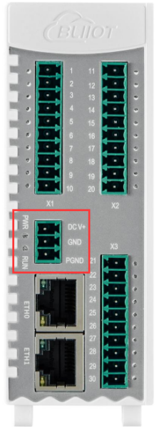

### RJ45网口

通过ETH 0网口连接到基于OPC UA的现场总线中，ETH1用于连接其他需要接入的EdgeIO控制器节点。ETH 0默认IP为：192.168.3.2。

### 信号接口

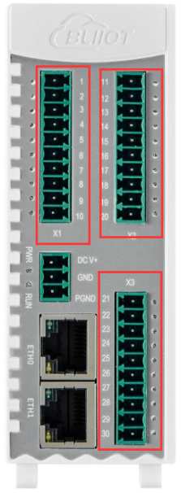

每个卡槽的信号不一样，接线就不一样，具体接线看侧面的标签说明。

### RS485接口

BL191自带一路RS485口，在网页配置中，串口COM1指的是这个RS485接口，需要增加串口请选Y61 IO版，BL191最多只能5个串口。

### 恢复出厂按钮

此按钮用于将设备配置参数恢复到出厂状态。

操作方法：在设备处于正常运行状态下，长按5秒以上，直到全部LED灯熄灭表明操作成功，然后设备会自动重启。

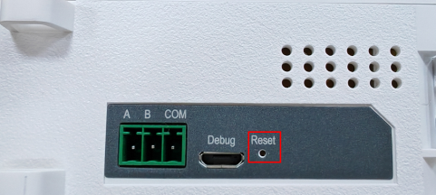

## 产品安装

支持壁挂式和导轨式安装。

## BL191 OPC UA协议边缘I/O控制器

### BL191 OPC UA协议边缘I/O控制器概述

OPC UA协议边缘I/O控制器支持OPC UA Server功能，以服务器形式对外提供数据。符合IEC 62541工业自动化统一架构通讯标准，数据可以选择加密（X.509证书）、身份验证方式传送。安全策略支持basic128rsa15、basic256、basic256sha256、aes128sha256rsaoaep，可选签名或签名和加密方式。

### 技术参数

| 名称 | 参数 | 描述 |
| --- | --- | --- |
| 电源 | 供电电源 | 24VDC |
|  | 功耗 | 55mA@24VDC |
|  | 反接防护 | 支持 |
| 以太网 | 数量 | 2 X RJ45 |
|  | 传输介质 | 双绞线，STP 100 Ω Cat 5 |
|  | 最大线缆长度 | 100m |
|  | 速率 | 10/100 Mbit/s |
|  | 隔离保护 | ESD ：±6kV（接触），±8kV（空气）； EFT：1kV，5kHz。 |
| 串口 | 串口数量 | 1x RS485+Y61可选（4xRS485/RS232可选） |
|  | 串口波特率 | 2400bps-230400bps |
|  | 数据位 | 8 |
|  | 校验位 | None，Even，Odd |
|  | 停止位 | 1，2 |
|  | 串口保护 | ESD ：±6kV（接触），±8kV（空气）； EFT：1kV，5kHz。 |
| DIDO （可选） | 数字量输出参数 |  |
|  | 通道 | 4通道 |
|  | 输出类型 | Y01：输出低电平有效，输出0VDC。 Y02：输出高电平有效，输出24VDC。 |
|  | 每个通道输出最大电流 | 100mA |
|  | 隔离保护 | 2KVrms |
|  | 数字量输入参数 |  |
|  | 通道 | 4通道 |
|  | 触发方式 | Y01：低电平触发Y02：高电平触发 |
|  | 逻辑电平 | Y01： 逻辑1：+15 ⋯+30VDC 逻辑0：-3 ⋯+5VDC 公共端：接电源+ Y02： 逻辑1：+15 ⋯+30VDC 逻辑0：-3 ⋯+5VDC 公共端：0VDC |
|  | 隔离保护 | 2KVrms |
| DI （可选） | 通道 | 8通道 |
|  | 输入类型 | 支持干接点和湿接点（NPN或PNP） |
|  | Y13干接点 | 闭合：与COM 短路 断开：断路 |
|  | Y11（NPN） | 逻辑1：+15 ⋯+30VDC 逻辑0：-3 ⋯+5VDC 公共端：接电源+ |
|  | Y12（PNP） | Y12： 逻辑1：+15 ⋯+30VDC 逻辑0：-3 ⋯+5VDC 公共端：0VDC |
|  | 隔离保护 | 2KVrms |
| DO （可选） | 通道 | 8通道 |
|  | 输出类型 | Y21：输出高电平有效，输出24VDC。 Y22：输出低电平有效，输出0VDC。 |
|  | 每个通道输出最大电流 | 100mA |
|  | 隔离保护 | 2KVrms |
| 继电器 （可选） | 通道 | 4通道 |
|  | 输出类型 | 继电器输出 |
|  | 最大开关电压 | 250VAC/30VDC |
|  | 最大开关电流 | 2A |
|  | 开关功率 | 30W |
|  | 隔离保护 | 2KVrms |
| AI （可选） | 通道 | 4通道 |
|  | 输入方式 | 单端输入/差分输入 |
|  | 输入类型 | 0 ⋯20mA / 4 ⋯20mA (4线制) 0-5V/0-10V(4线制) -5-5V/-10-10V(4线制) |
|  | 分辨率 | 16 Bit |
|  | 精确度 | ±0.1 % FSR @ 25 ℃ |
|  | 采样周期 | 300ms |
|  | 电流输入内置电阻 | 249Ω |
| AO （可选） | 通道 | 4通道 |
|  | 输出类型 | 0 ⋯20mA / 4⋯20mA 0-5V/0-10V -5-5V/-10-10V |
|  | 分辨率 | 12bit |
|  | 精确度 | ±0.1 % FSR @ 25 ℃ |
|  | 转换时间 | 20ms |
|  | 负载阻抗（电流模式） | ≤1KΩ |
|  | 负载阻抗（电压模式） | ≥5KΩ |
| RTD （可选） | 输入类型 | 3线制或4线制PT100和PT1000线制 |
|  | 测量范围 | PT100（-200~850℃）、PT1000（-50~300℃） |
|  | 分辨率 | 15 Bit |
|  | 精确度 | ±1℃ 20m以内AWG16屏蔽线 |
|  | 采集周期 | 400ms |
| TC （可选） | 传感器类型 | J、K、T、E、R、S、B、N |
|  | 分辨率 | 16 Bit |
|  | 精确度 | ±0.5% @25℃ |
|  | 采集周期 | 400ms |
| 脉冲输出和脉冲计数模块（可选） | 脉冲输出参数 |  |
|  | 通道 | 4通道 |
|  | 输出延时 | ＜1ms |
|  | 占空比 | 0~1000（0%~100%），自定义设置。 |
|  | 最大开关频率 | 40KHz |
|  | 隔离保护 | 2KVrms |
|  | 脉冲计数参数 |  |
|  | 通道 | 1路高速计数+3路低速计数 |
|  | 最大开关频率 | 高速：最大150KHz，低速：最大10KHz |
|  | 计数范围 | 32位无符号 |
|  | 隔离保护 | 2KVrms |
| 系统 | 操作系统 | Linux |
|  | 主频 | 300MHz |
|  | RAM | 64MB |
|  | Flash | 128MB |
|  | 协议 | OPC UA , HTTP , DHCP , DNS |
| 环境 | 工作温度、湿度 | -40～85℃，5～95% RH |
|  | 存储温度、湿度 | -40～85℃，5～95% RH |
| 其他 | 外壳 | 塑胶材质 |
|  | 尺寸（1*I/O模块） | 30mm×83mm×110mm(L*W*H) |
|  | 尺寸（3*I/O模块） | 40mm×83mm×110mm(L*W*H) |
|  | 净重（1*I/O模块） | 133g |
|  | 净重（3*I/O模块） | 171g |
|  | 防护等级 | IP30 |
|  | 安装方式 | 壁挂式、导轨式 |
| 安规认证 | EMC | CE、FCC |
|  | EMS | IEC 61000-4-2 (ESD) Level 3 |
|  |  | IEC 61000-4-4 (EFT) Level 3 |
|  |  | IEC 61000-4-5 (Surge)Level 3 |
|  | 振动 | IEC 60068-2-6 |

### Modbus 寄存器映射

BL191内部寄存器映射由2部分组成，一部分是数字量输入输出和模拟量输入输出模块的数据映射组成，地址范围是1000 ... 9999；另外一部分是modbus采集数据，地址范围是10000 ... 49999。

Modbus寄存器映射-本机I/O模块

| Modbus 地址 | 数据类型 | 访问 | 功能码 | 描述 |  |
| --- | --- | --- | --- | --- | --- |
| 10进制 | 16进制 |  |  |  |  |
| 1000…1999 | 0x03 E8…0x07 CF | 1 Bit | 读/写 | 0x01/05/0F | 数字输出DO |
| 2000…2999 | 0x07 D0…0x0B B7 | 1 Bit | 只读 | 0x02 | 数字输入DI |
| 3000…3999 | 0x0B B8…0x0F 9F | 32 Bit Float | 只读 | 0x04 | 模拟输入AI |
| 4000…4999 | 0x0F A0…0X13 87 | 32 Bit Float | 读/写 | 0x03/10 | 模拟输出AO |
| 5000…8999 | 0x13 88…0x23 27 | 32 Bit Unint | 读/写 | 0x03/10 | PWM输出和DI计数 |
| 50000...50015 | 0xC350…0xC35F | 32 Bit Float | 读/写 | 0x03/10 | 逻辑应用时可以存放值的寄存器 |

Modbus寄存器映射-modbus采集数据

| Modbus 地址 | 数据类型 | 访问 | 功能码 | 描述 |  |
| --- | --- | --- | --- | --- | --- |
| 10进制 | 16进制 |  |  |  |  |
| 10000…19999 | 0x27 10…0x4E 1F | 1 Bit | 读/写 | 0x01/05/0F | 数字输出DO |
| 20000…29999 | 0x4E 20…0x75 2F | 1 Bit | 只读 | 0x02 | 数字输入DI |
| 30000…39999 | 0x75 30…0x9C 3F | 16 Bit | 只读 | 0x04 | 模拟输入AI |
| 40000…49999 | 0x9C 40…0XC3 4F | 16 Bit | 读/写 | 0x03/06/10 | 模拟输出AO |

### OPC UA数据点Node Id

OPC UA的Node Id 默认是NS=1；S=I/O数据点的Modbus映射地址(如首个DO模块第一路DO：NS=1；S=1000)，具体Modbus映射地址参考4.3Modbus 寄存器映射。

### EdgeIO控制器连接

BL191有2个以太网接口，内部集成交换机功能，工作在存储转发操作模式，每个端口支持10/100 Mbit的传输速度以及全双工和半双工传输模式。

该EdgeIO控制器只能通过ETH 0接口连接到基于以太网的现场总线中，ETH1用于连接其他需要接入以太网的节点。

内部集成的交换机支持旁路模式，当EdgeIO控制器系统故障时可以自动启动旁路模式，自动维持 ETH 0 和 ETH 1的链接。

这些以太网接口的接线符合 100BaseTX 的规范，该规范规定使用 5 类双绞线电缆作为连接电缆。可以使用最大长为 100 m的电缆类型 S/UTP（屏蔽非屏蔽双绞线）和 STP（屏蔽双绞线）。

通过 ETH 0 和计算机直连方式。

通过路由器或交换机连接方式

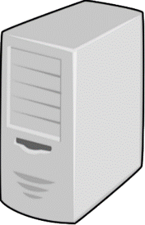

### 登录网页配置

BL191内置web服务器是一个基于浏览器的配置实用程序。当节点连接到您网络时，您可以在 Web 浏览器中输入服务器的 IP 地址以访问 Web 控制台。

#### 连接与IP配置

想要顺利的访问BL191节点，必须要将它正确的安装并且和计算机建立连接。除此之外还要给它们配置正确的IP地址，使他们保持在同一个网段内。

#### 连接计算机和EdgeIO控制器

将现场总线节点安装到DIN35导轨上。按照“产品安装”章节中的安装说明进行操作。

将 24 V 电源连接到电源端子。

计算机和总线节点可以通过2种方式建立连接，一种是两者通过以太网接口接入本地局域网的交换机设备；另一种是两者点对点直接相连。详细步骤请按照“EdgeIO控制器连接”章节中的说明进行操作。

将电源开机，开始供电。

I/O模块上电工作后被初始化，同时根据现场总线节点的 I/O 模块配置并创建过程映像。

#### 配置计算机IP地址

在 PC 端，有两种方法配置其 IP 地址；一种是在PC 的本地连接上开启自动获取 IP 地址选项，通过网络中DHCP动态分配；另一种是在PC 的本地连接上配置一个跟EdgeIO控制器节点处于同一个网段的静态 IP 地址。

下面以Windows 7 系统为例进行配置。Windows 系统的配置均相似。

单击“开始 > 控制面板 > 网络和共享中心”，在打开的窗口中单击“本地连接”。

在“本地连接状态”窗口中，单击“属性”。

在本地连接属性页面双击“Internet 协议版本 4（TCP/IPv4）

两种方法配置PC的IP地址：

自动获得IP地址（系统默认模式）

自动从DHCP 服务器获取IP 地址，选中“自动获得 IP 地址”

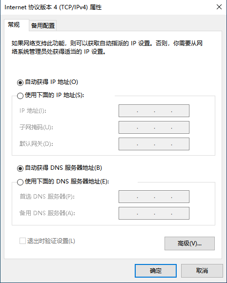

设置静态IP地址

选中 “使用下面的IP地址”，在IP地址，子网掩码和默认网关设置正确的数值。

#### 配置节点IP地址

设备默认IP地址为：192.168.3.2，进入网页配置后可以修改。通过 “设置 > 本机设置“ 页面设置IP地址，也可以设置为自动分配。

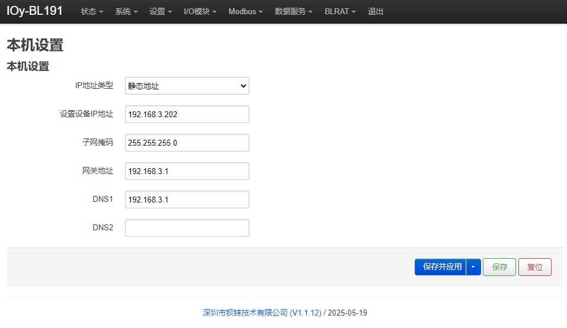

#### 出厂默认设置

登录Web配置页面前，您有必要了解以下的默认参数。

ETH0默认IP:192.168.3.2

出厂默认参数

| 项目 | 描述 |
| --- | --- |
| 用户名 | admin |
| 密码 | 无 |

#### 登录配置页面

在计算机上打开浏览器，如 IE、 Chrome、Firefox等。

在浏览器的地址栏输入EdgeIO控制器节点的 IP 地址（192.168.3.2 ）进入用户登录界面。

在登录界面输入“用户名“ 和 ”密码“，然后点击登录。默认用户名：admin，无密码。

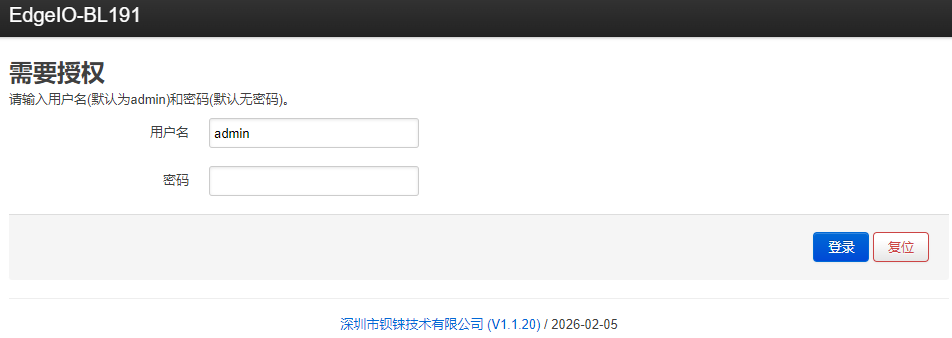

成功登录web界面显示如下

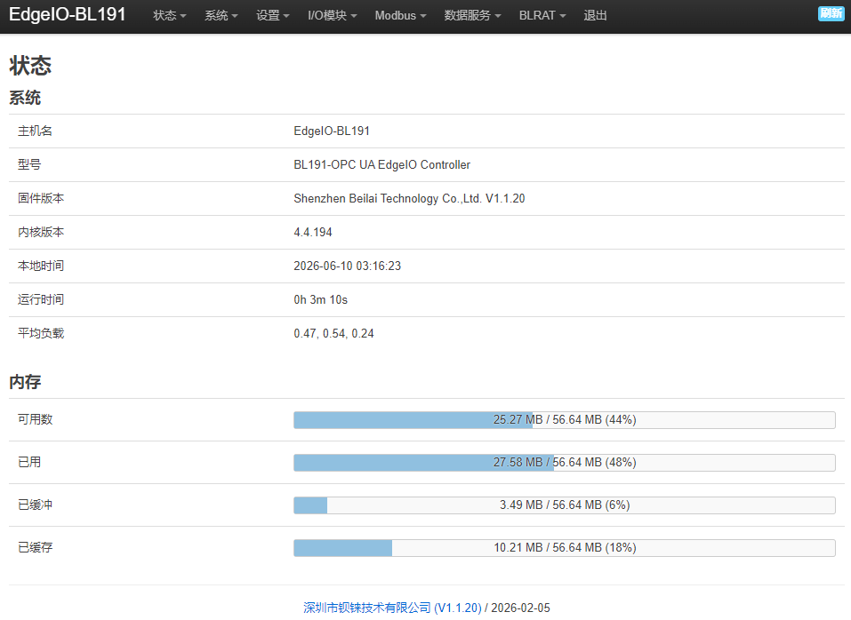

配置完参数后，需要点击页面上的 “保存并应用” 按钮才能生效。

### 网页配置页面说明

#### 状态

在状态菜单中，提供了概览、系统日志和内核日志，可以查看设备参数和设备运行状态。

状态 > 概览

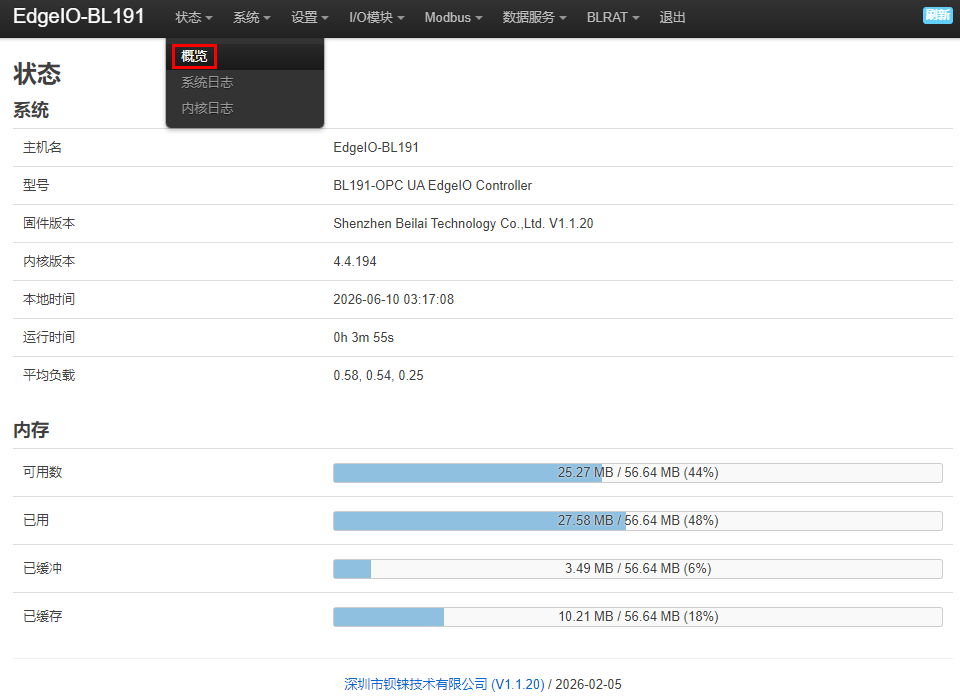

状态 > 系统日志

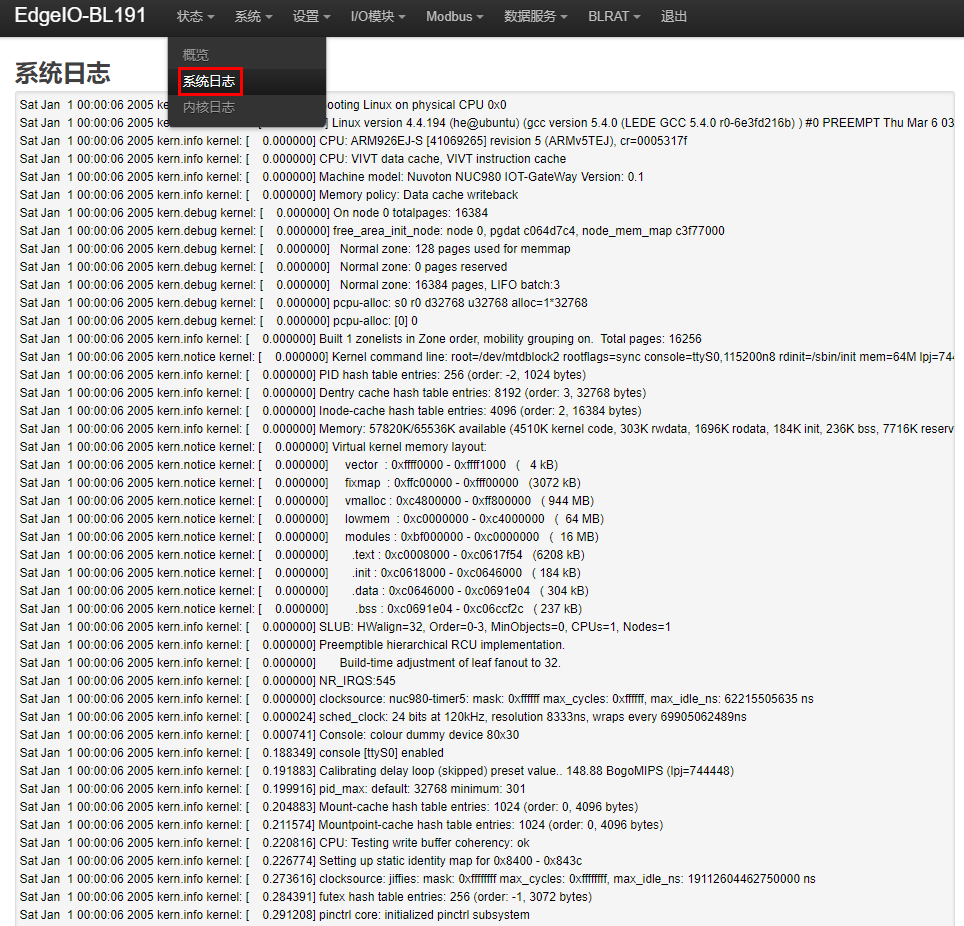

状态 > 内核日志

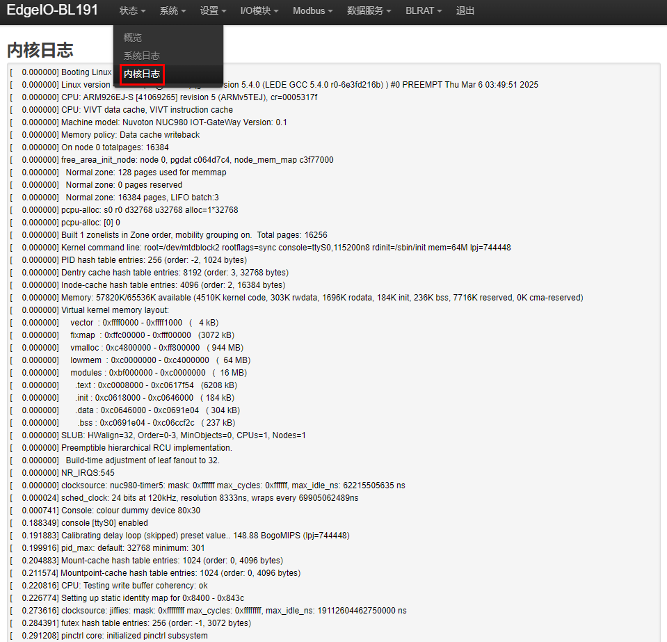

#### 系统

#### 系统

系统属性 > 常规设置

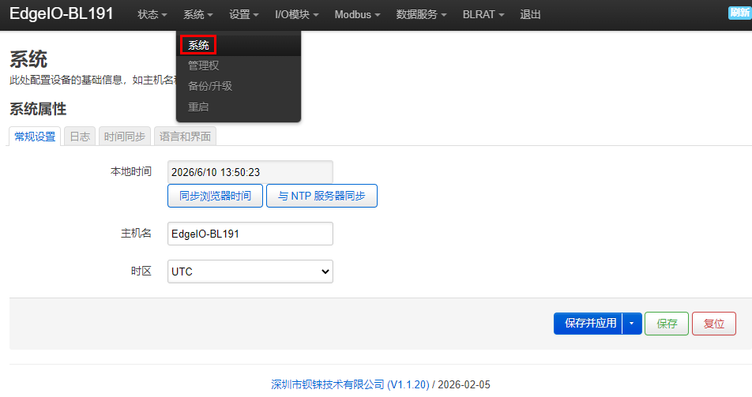

系统 > 系统属性 > 常规设置

| 项目 | 描述 | 默认 |
| --- | --- | --- |
| 本地时间 | 显示设备当前时间。可以点击“同步浏览器时间”或者“与NTP服务器同步”按钮更新设备时间。 | -- |
| 主机名 | 可以自定义设备名称，便于区分多个设备。 | EdgeIO-BL191 |
| 时区 | 可以通过下拉菜单选择时区 | UTC |

系统属性 > 日志

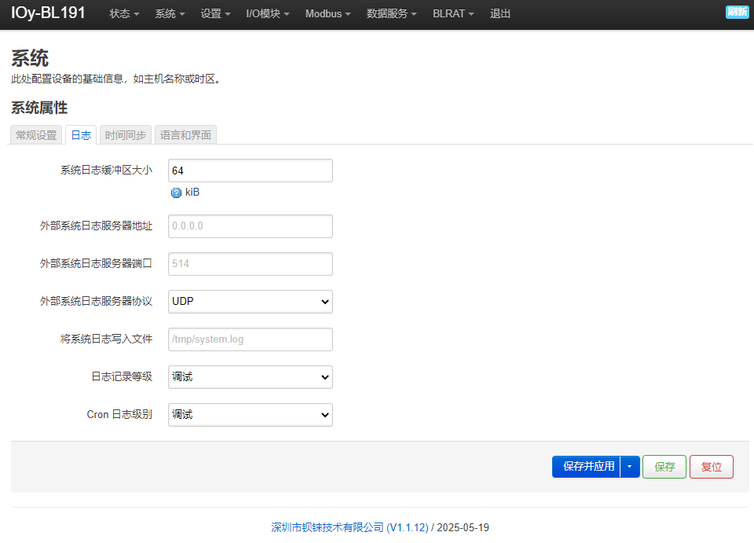

系统 > 系统属性 > 日志

| 项目 | 描述 | 默认 |
| --- | --- | --- |
| 系统日志缓冲区大小 |  | 64 |
| 外部系统日志服务器地址 |  |  |
| 外部系统日志服务器端口 |  |  |
| 外部系统日志服务器协议 |  |  |
| 将系统日志写入文件 |  |  |
| 日志记录等级 |  |  |
| Cron 日志级别 |  |  |

系统属性 > 时间同步

可以设置NTP服务器，用来同步时间。

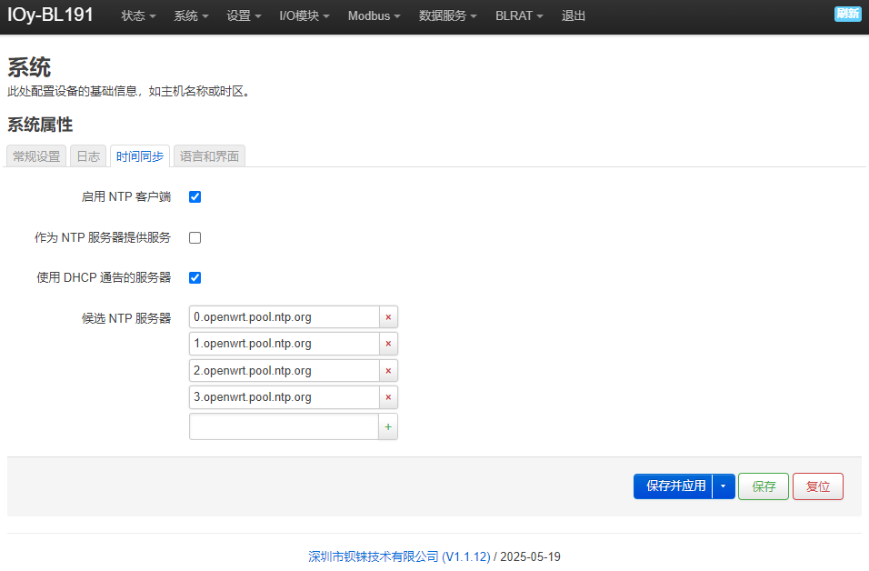

系统属性 > 语言和界面

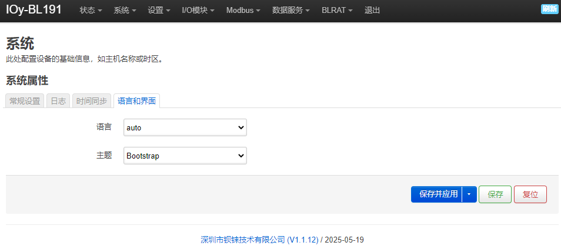

系统 > 系统属性 > 语言和界面

| 项目 | 描述 | 默认 |
| --- | --- | --- |
| 语言 | 可以在auto、 English、中文（Chinese）种选 | auto |
| 主题 | 目前只支持Bootstrap。 | Bootstrap |

#### 管理权

管理权 > 主机密码

更改访问设备的管理员密码

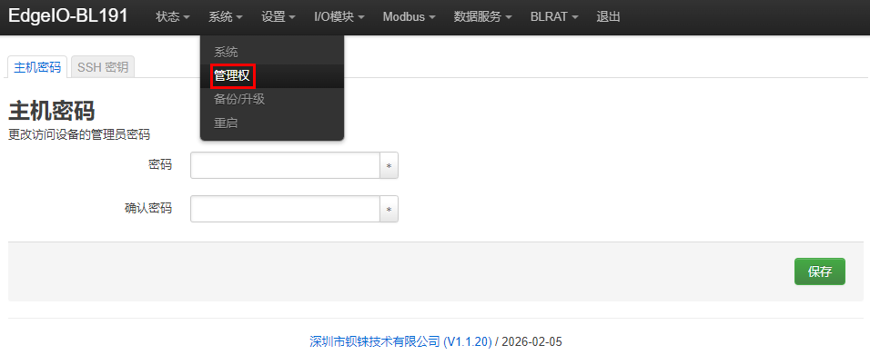

管理权 >  SSH密钥

与使用普通密码相比，公钥允许无密码 SSH 登录具有更高的安全性。要将新密钥上传到设备，请粘贴 OpenSSH 兼容的公钥行或将 .pub 文件拖到输入字段中。

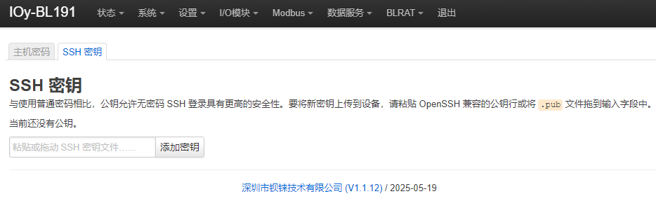

#### 备份/升级

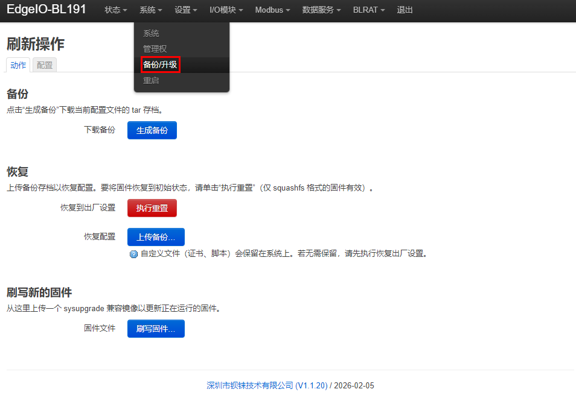

系统 > 备份/升级 > 动作

| 项目 | 描述 | 默认 |
| --- | --- | --- |
| 备份 | 点击“生成备份”下载当前配置文件的tar 存档。 | -- |
| 恢复 | 上传备份存档以恢复配置。要将固件恢复到初始状态，请单击“执行重置”（仅 squashfs 格式的固件有效）。 | -- |
| 刷写新的固件 | 从这里上传一个 sysupgrade 兼容镜像以更新正在运行的固件。 | -- |

#### 升级操作说明：

1、点击“系统”→点击“备份/升级”→“刷写固件”。

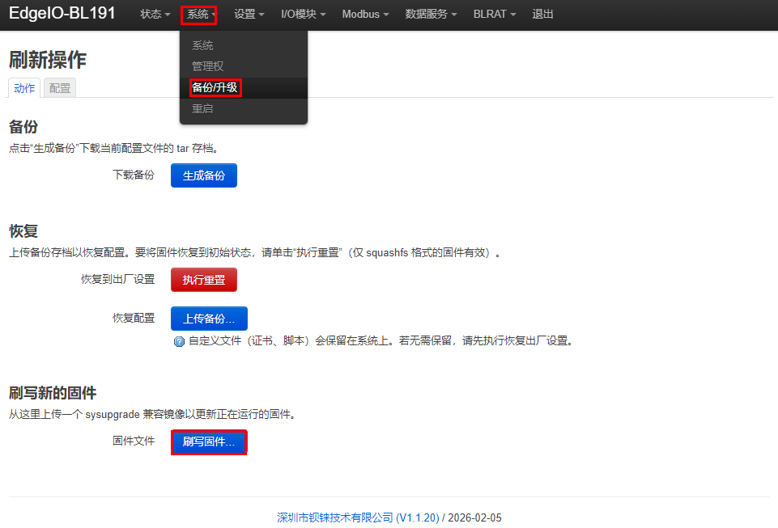

2、点击“浏览”，找到固件所在的目录，选择固件，点击“打开”。

3、点击“上传”。

4、上传完后，点击“继续”，开始烧录固件。注意烧录过程中不要断电。

5、烧录完后，重新登录，在首页状态里面可以查看固件版本是否已变更。要注意IP是否改变，如果不保存当前配置烧录，IP会变化默认IP：192.168.3.2。

#### 重启

点击“执行重启”将重启您的设备。

#### 设置

本机设置

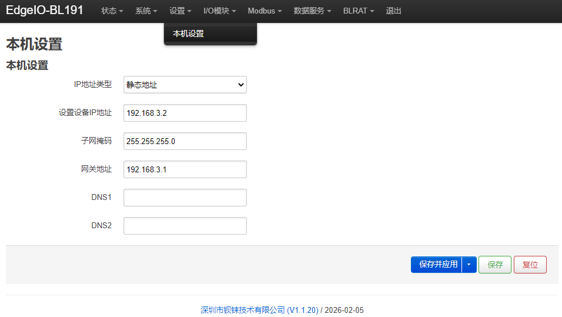

设置 > 本机设置

| 项目 | 描述 |
| --- | --- |
| IP地址类型 | 从“静态地址”、“动态地址”中选择。 |
| 设置设备IP地址 | 可以自定设置设备IP地址，设置后需要重启生效。 |
| 子网掩码 | 设置IP的子网掩码 |
| 网关地址 | 设置IP的网关地址 |
| DNS1 | 设置DNS |
| DNS2 | 设置DNS |

#### I/O模块

EdgeIO控制器最多可以有 3个Y系列 I/O 模块，包括数字量输入输出，模拟量输入输出和特殊功能模块。

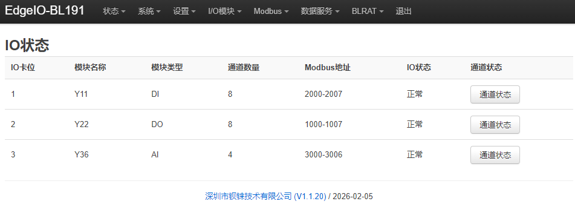

I/O模块 > I/O状态

| 项目 | 描述 |
| --- | --- |
| IO卡位 | 分别与外壳面板上X1、X2、X3对应。 |
| 模块名称 | IO模块的详细型号。 |
| 模块类型 | IO模块功能类型。 |
| 通道数量 | IO模块的数据宽度。 |
| Modbus地址 | IO模块的过程映射modbus地址。 |
| IO状态 | IO模块通信状况。 |
| 通道状态 | 点击后可以查看和设置不同类型IO模块的参数。 |

#### 数字量输入模块

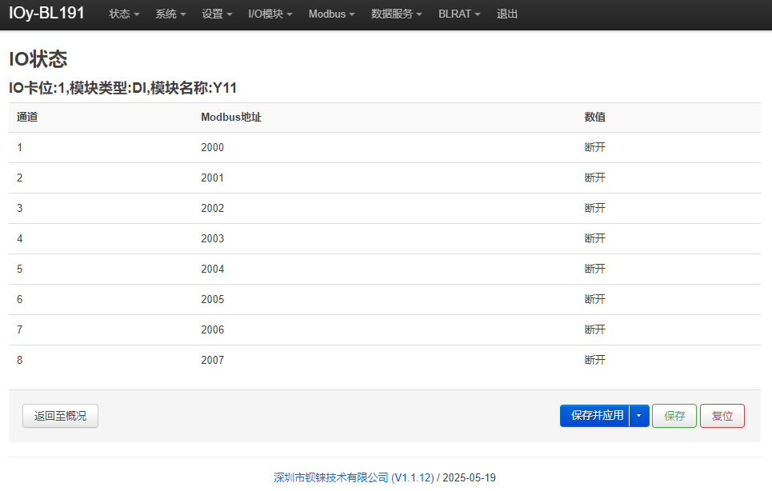

数字量输入模块 > IO状态

| 项目 | 描述 |
| --- | --- |
| 通道 | 数字量输入模块的通道编号 |
| Modbus地址 | 布尔状态数据在I/O模块内部的过程映射地址 |
| 数值 | 显示当前的输入状态，断开：逻辑0，闭合：逻辑1 |

#### 数字量输出模块

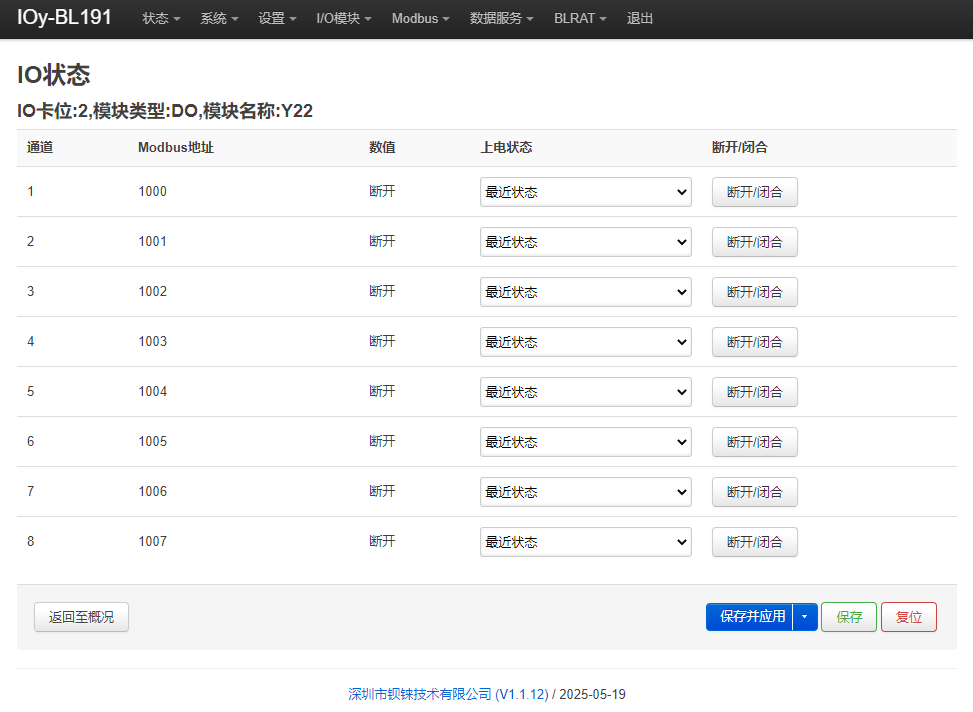

数字量输出模块

| 项目 | 描述 |
| --- | --- |
| 通道 | 数字量输出模块的通道编号。 |
| Modbus地址 | 数字量输出布尔数据在I/O模块内部的过程映射地址。 |
| 数值 | 显示当前的输出状态，断开：0，闭合：1。 |
| 上电状态 | “最近状态”，断电重新上电，DO保持上一次状态。 |
| 断开/闭合 | 可以控制当前通道输出状态。 |

#### 模拟量输入模块

模拟量输入（AI）类型模块支持通过I/O模块web页面设置参数，这样模块内部自动实现数据换算，可以直接输出与传感器对应的实际工程数值。

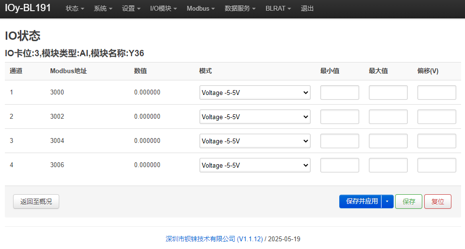

模拟量输入模块

| 项目 | 描述 |
| --- | --- |
| 通道 | 模拟量输入模块的通道编号 |
| Modbus地址 | 模拟量输入模块在I/O模块内部的过程映射地址 |
| 数值 | 显示当前通道输入的实际工程数值，32位单精度浮点型 |
| 模式 | 不同型号的模拟量输入模块有不同的选项，详细参照具体模拟量输入I/O模块手册。 |
| 最小值 | 传感器量程最小值 |
| 最大值 | 传感器量程最大值 |
| 偏移 | 通过偏移可以调整采集与实际的误差。 |

模拟量输入模块的电信号数值（一般是传感器）和实际工程数值存在线性关系，它们的公式如下（以4-20mA为例）：

实际工程数值 =（电流值 - 4）*（（最大值 – 最小值）/（20 - 4））+最小值

以 4-20mA 类型的水位传感器测量水塔深度为例：

已知水位传感器量程是0-100m，电流数据5.6mA，计算水塔深度：

代入公式：

(5.6 - 4) * ((100 - 0) / (20 - 4)) + 0 = 10

水塔深度是10m。

#### 模拟量输出模块

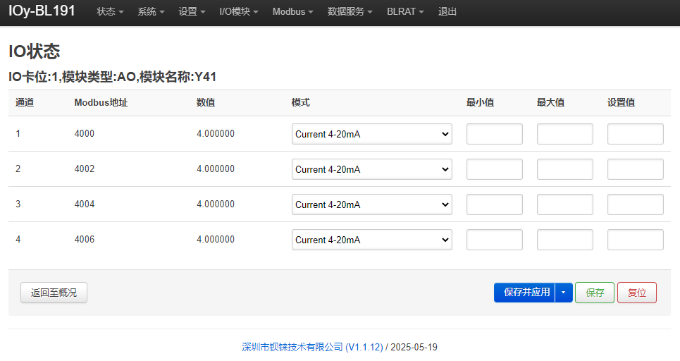

模拟量输出模块

| 项目 | 描述 |
| --- | --- |
| 通道 | 模拟量输出模块的通道编号 |
| Modbus地址 | 模拟量输出模块在I/O模块内部的过程映射地址 |
| 数值 | 显示当前通道输出的实际工程数值，32位单精度浮点型 |
| 模式 | 不同型号的模拟量输出模块有不同的选项，详细参照具体模拟量输出I/O模块手册。 |
| 最小值 | 实际工程数值最小值 |
| 最大值 | 实际工程数值最大值 |
| 设置值 | 可以设置输出所需要的实际工程数值 |

#### 热电阻输入模块

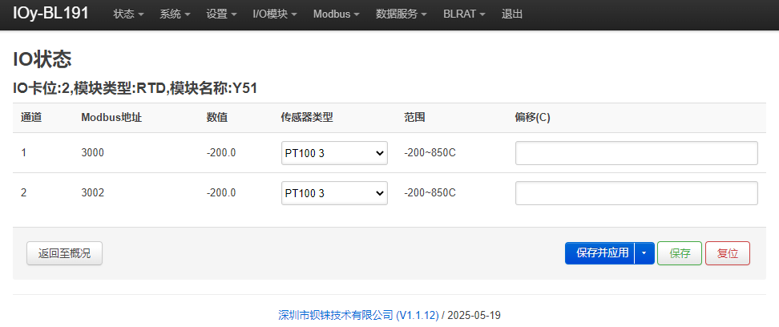

热电阻输入模块

| 项目 | 描述 |
| --- | --- |
| 通道 | 热电阻输入模块的通道编号。 |
| Modbus地址 | 热电阻输入模块在I/O模块内部的过程映射地址。 |
| 数值 | 显示当前热电阻采集到的温度值。 |
| 传感器类型 | 能接的热电阻传感器类型。 |
| 范围 | 热电阻传感器采集的温度范围。 |
| 偏移 | 可以通过偏移调整采集与实际的误差。 |

#### 热电偶输入模块

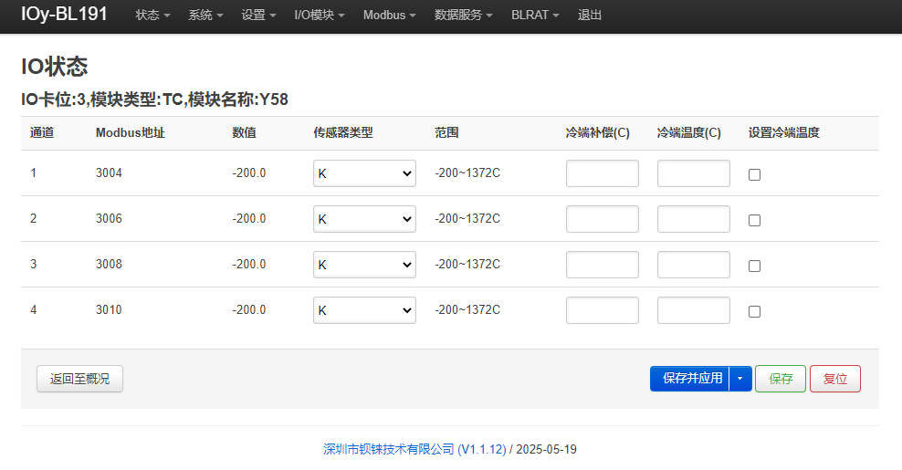

热电偶输入模块

| 项目 | 描述 |
| --- | --- |
| 通道 | 热电偶输入模块的通道编号。 |
| Modbus地址 | 热电偶输入模块在I/O模块内部的过程映射地址。 |
| 数值 | 显示当前热电偶采集到的温度值。 |
| 传感器类型 | 选择接的热电偶传感器类型。 |
| 范围 | 热电偶传感器采集的温度范围。 |
| 冷端补偿 | 设置热电偶传感器冷端补偿温度。 |
| 冷端温度 | 设置热电偶传感器冷端温度。 |
| 设置冷端温度 | 启用冷端温度设置。 |

#### DIDO混合模块

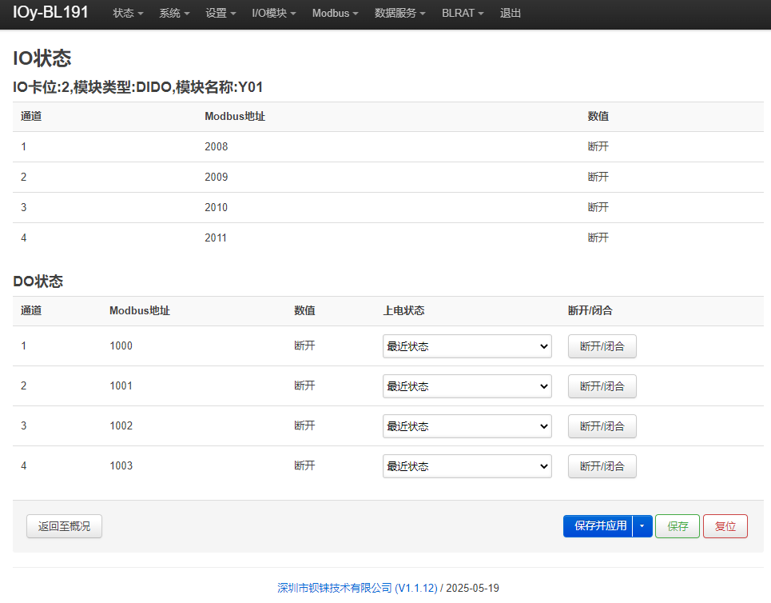

DIDO混合模块

| 项目 | 描述 |
| --- | --- |
| 通道 | 数字量输入输出模块的通道编号 |
| Modbus地址 | 布尔状态数据在I/O模块内部的过程映射地址 |
| 数值 | 显示当前的输入状态，断开：逻辑0，闭合：逻辑1 |
| 上电状态 | “最近状态”，断电重新上电，DO保持上一次状态。 |
| 断开/闭合 | 可以控制当前通道输出状态。 |

#### PWM输出和DI计数模块

PWM输出和DI计数模块

| 项目 | 描述 |  |
| --- | --- | --- |
| 通道 | PWM输出和DI计数模块的通道编号 |  |
| Modbus地址 | 模块在I/O模块内部的过程映射地址 |  |
| PWM输出 | 数值 | 显示当前占空比，32位无符号整型。 |
|  | 设置占空比 | 输入占空比的值，0~1000（0%~100%）自定义。 |
|  | 设置 | 确定占空比的设置。 |
|  | PWM频率 | modbus映射地址 |
|  |  | 填写频率（最大40KHz） |
|  |  | 设置频率 |
| DI计数 | 数值 | 显示当前的输入计数值，32位无符号整型。 |
|  | 计数模式 | 选择“上升沿”、“下降沿”、“上升沿和下降沿”触发计数方式 |
|  | 清除 | 可以清除当前通道计数器值 |

#### Modbus

可以通过自带的1路RS485或Y61串口模块（4路RS485/RS232可选）接入各种支持Modbus RTU 协议的传感器，终端等设备。串口功能可以选择“Modbus主站”、“串口透传”、“Modbus从站”、“Modbus RTU转TCP”。

#### 串口设置

对串口的“波特率”、“数据位”、“校验位”、“停止位”进行设置，从“模式”里面选择串口的作用，点击“保存并应用”，串口属性和功能才生效。

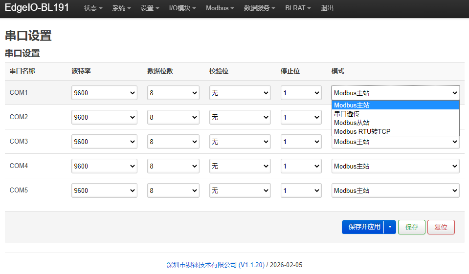

#### 串口透传

使用“串口透传”功能需要先在“串口设置”的“模式”选择透传。

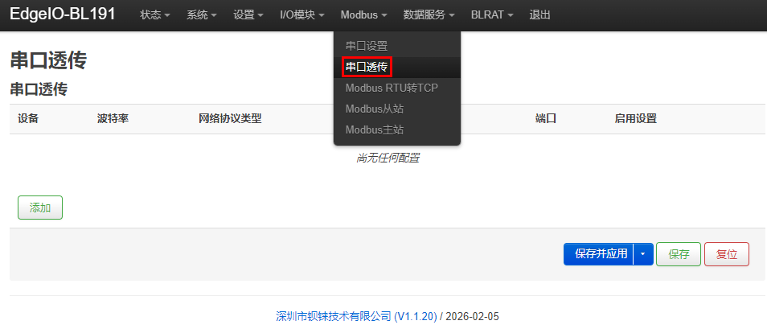

点击“添加”，弹出配置框，进行配置。

| 项目 | 描述 |
| --- | --- |
| 设备 | 选择哪路串口作透传使用 |
| 网络协议类型 | TCP客户端、TCP服务端，UDP客户端、UDP服务端 |
| 主机IP或域名 | 填写服务器IP或域名，I/O模块作客户端时填写 |
| 端口号 | 默认：“5000” |
| 注册包 | 发送端和接收端需要按照约定好的注册包格式和内容进行通信参数的协商和注册，以确保通信的稳定性和可靠性 |
| 心跳包 | 作用类似于心跳信号，用于检测通信连接是否正常，以及及时发现通信故障或断线情况 |
| 心跳响应包 | 这种机制可以用来确认心跳包的正常接收，并进一步确保通信连接的健壮性和稳定性 |
| 心跳周期（秒） | 默认“60” |
| 主机静默时间（秒） | 默认“3600” |

#### Modbus RTU转TCP

使用“Modbus RTU转TCP”功能需要先在“串口设置”的“模式”选择Modbus RTU转TCP。

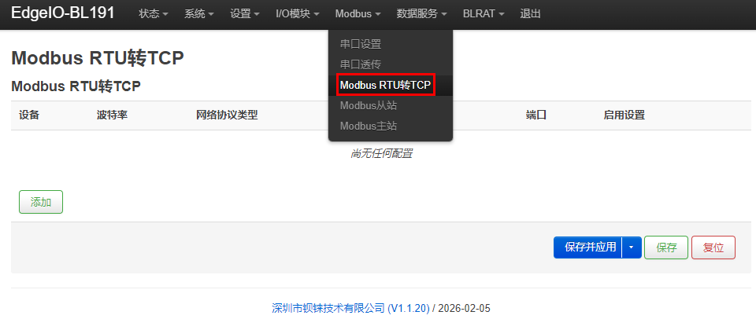

点击“添加”，弹出配置框，进行配置。

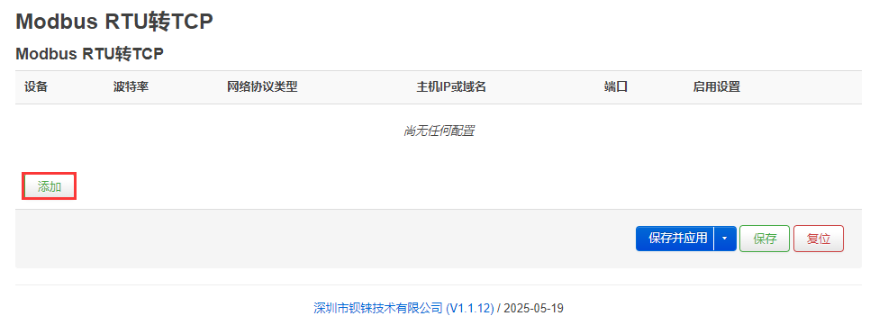

弹出配置框，进行配置

Modbus RTU转TCP 设置

| 项目 | 描述 |
| --- | --- |
| 设备 | 选择哪路串口作Modbus RTU转TCP使用 |
| 网络协议类型 | TCP客户端、TCP服务端，UDP客户端、UDP服务端 |
| 主机IP或域名 | 填写服务器IP或域名，I/O模块作客户端时填写 |
| 端口号 | 默认：“5000” |
| 注册包 | 发送端和接收端需要按照约定好的注册包格式和内容进行通信参数的协商和注册，以确保通信的稳定性和可靠性 |
| 心跳包 | 作用类似于心跳信号，用于检测通信连接是否正常，以及及时发现通信故障或断线情况 |
| 心跳响应包 | 这种机制可以用来确认心跳包的正常接收，并进一步确保通信连接的健壮性和稳定性 |
| 心跳周期（秒） | 默认“60” |
| 主机静默时间（秒） | 默认“3600” |

#### Modbus从站设置

作TCP从站，只需要配置端口号，默认是“502”，如果串口需要作从站功能，需要先在“串口设置”的“模式”选择Modbus 从站。

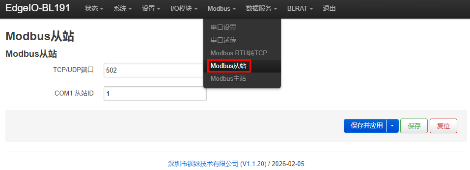

#### Modbus主站

Modbus 主站用于串口通信添加 Modbus RTU 设备，也可以通过网口采集Modbus TCP设备。

说明：最多只能创建24条modbus命令。

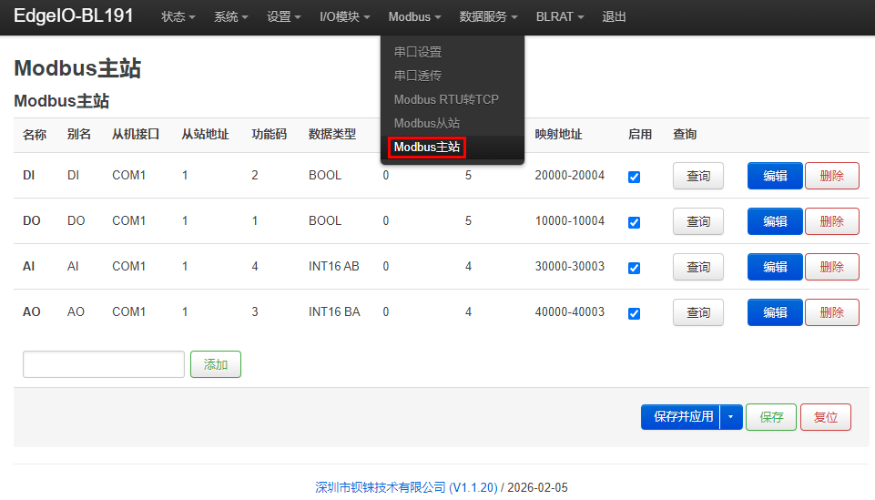

在输入框输入自定义数据名称，点击添加

弹出配置框，进行配置

Modbus 设置

| 项目 | 描述 |
| --- | --- |
| 别名 | 设备昵称可以用与区分数据 |
| 从机接口 | 选择串口通道或网口 |
| 从机地址 | 从站设备地址，范围1-247 |
| 功能码 | 根据从站数据类型选择，包括：“01”、“02”、“03”、“04” |
| 寄存器首址 | 从站数据的寄存器起始地址 |
| 数据个数 | 从机数据的个数 |
| 映射地址分配 | 支持分配方式 自动 系统按照不同的数据类型，按照映射起始地址自动依次往下分配，地址是连续的。 手动 手动分配的方式可以让映射地址跨段分配 |
| 轮询周期(秒) | 相邻两条轮询指令之间的间隔时间 |
| 响应超时时间(秒) | 发送指令给从站后，等待从站返回数据的最长时间，超过该时间，将会认为从站无应答。 |

对建好的从机，可以进行修改、删除、查看数据功能，也可以不启用采集。

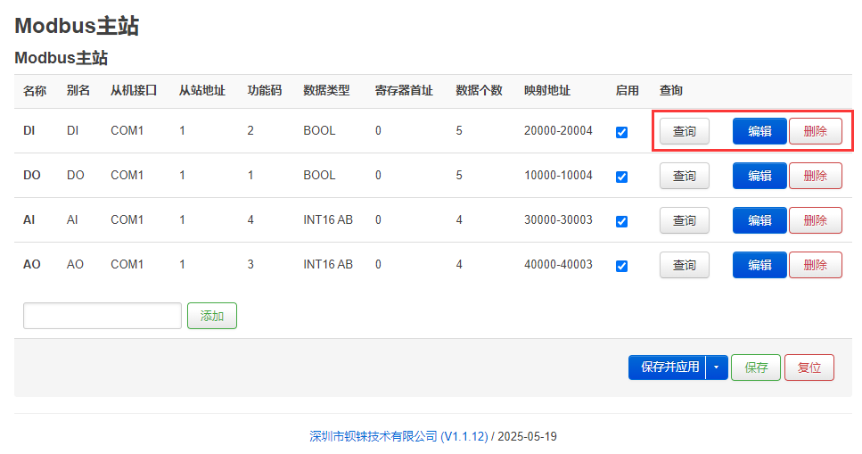

#### OPC UA

点击“数据服务”选择“OPC UA设置”，配置完OPC UA参数后点击“保存并应用”，才能生效。

OPC UA设置

| 项目 | 描述 | 默认 |
| --- | --- | --- |
| OPC UA 名称 | 自定义OPC UA 服务器名称 |  |
| 端口 | OPC UA 服务端口号 | 4840 |
| 安全策略 | 无、 basic128rsa15 basic256 basic256sha256 aes128sha256rsaoaep 全部安全策略 | 无 |
| 消息安全模式 | 签名 签名和加密 |  |
| 证书 | OPC UA证书,点击上传的证书,加载到配置页面。 |  |
| 私钥 | OPC UA密钥,点击上传的证书,加载到配置页面。 |  |
| 允许匿名 | 是否开启用户名和密码登录 |  |
| 用户名 | 填写用户名 |  |
| 密码 | 填写用户名密码 |  |
| 数据选择 | 全部数据点 选择数据点 | 全部数据 |
| 选择数据点 | 可以选择你要读的数据点。“数据选择”项选择“选择数据点”才有这项 |  |

#### 运算和控制

#### 算术运算

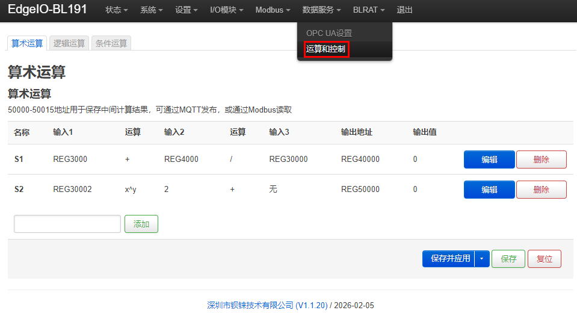

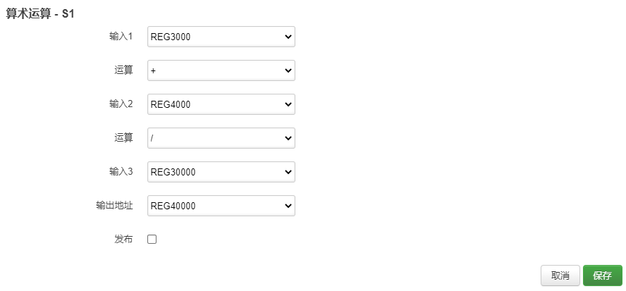

支持AI、AO或RS485从机数值类型数据之间的“加减乘除”运算，也可以“加减乘除”常数进行运算，自由搭配1个或2个条件组合输出结果。如果使用16位寄存器地址作为输出结果，则有小数的输出为整数。

注意：使用“x^y”、“ln”、“log10”时，请每一个都单独使用，不要和其他算术混合使用。

#### 逻辑运算

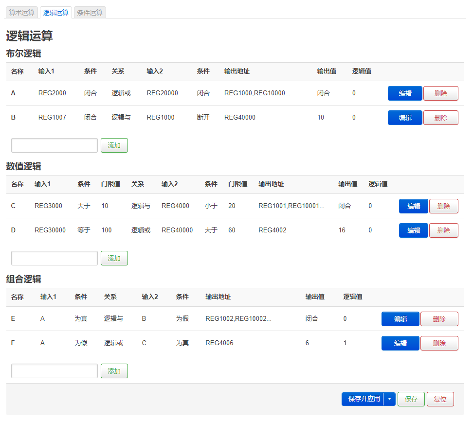

布尔量逻辑配置

数值逻辑配置

组合逻辑配置

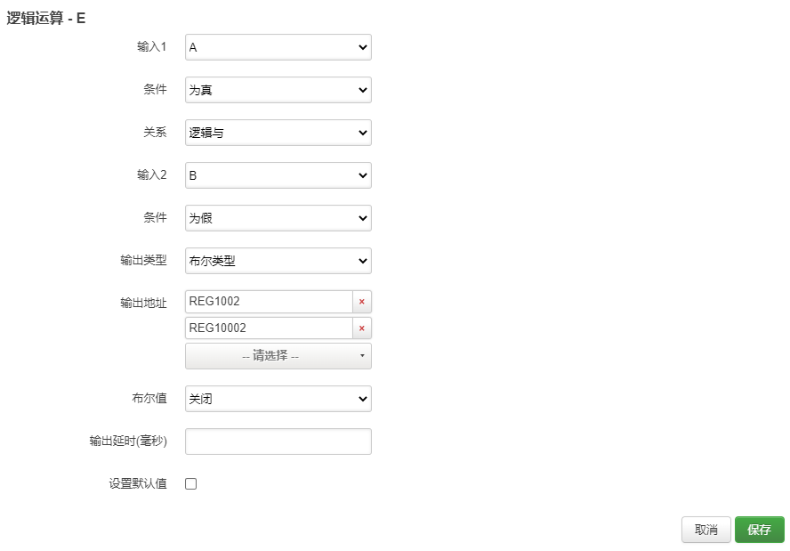

提供强大的逻辑运算功能，可根据需要自由设置I/O（数字量输入输出、模拟量输入输出）或串口模块（Modbus从机数据）之间的各种组合联动。建好的逻辑是否触发，可以根据网页逻辑值项判断，“0”代表没触发，“1”代表已触发。逻辑值项不能自动更新，要手动刷新网页。注意：因中断不足，输出延时只可以用2个。

例：逻辑1（与），输入条件A与输入条件B同时满足触发条件，输出结果Y。

逻辑2（或），输入条件C或输入条件D任何一个满足触发条件，输出结果Y。

逻辑3：逻辑1+逻辑2可以组合出逻辑3或更多组合。

#### 条件运算

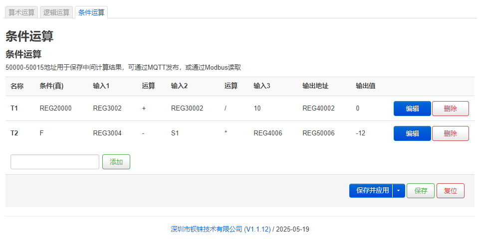

条件运算是算术运算基础上加上条件触发，既是当条件满足时，AI、AO或RS485从机数值类型数据或常数，这些数据可以自由选择1-3个条件互相“加减乘除”算术运算。

注意：使用“x^y”、“ln”、“log10”时，请每一个都单独使用，不要和其他算术混合使用。

#### 示例

以一个简单装箱系统为例

要求：（1）按下启动按钮后，传送带B先启动运行，拖动空箱前移至指定位置，达到指定位置后，由SQ2发出信号，使传送带B停止运行。

（2）传送带B停车后，传送带A启动运行，产品逐一落入箱子内，由SQ1传感器检测产品，检测到产品落入箱子，传送带A停止运行，传送带B启动运行，周而复始地进行，直到按下停止按钮，传送带A和B同时停止。

装箱系统

在S7-200SMART实现这样的功能，外围接线需要用到DI和DQ如下：

S7-200SMART接线

| 输入 | 输出 |  |  |
| --- | --- | --- | --- |
| I0.0 | 自动控制按钮 | Q0.1 | 传送带A输出 |
| I0.1 | 停止按钮 | Q0.2 | 传送带B输出 |
| I0.2 | B传送带点动 |  |  |
| I0.3 | A传送带点动 |  |  |
| I0.4 | SQ2输入 |  |  |
| I0.5 | SQ1输入 |  |  |

用BL191运算和控制模拟要实现这样的要求，接线需要用到的DI和DO如下：

BL191接线

| 输入 | 输出 |  |  |
| --- | --- | --- | --- |
| DI1 | A传送带点动 | DO1 | 传送带A输出 |
| DI2 | B传送带点动 | DO2 | 传送带B输出 |
| DI3 | 停止按钮 |  |  |
| DI4 | 自动控制按钮 |  |  |
| DI5 | 检测空箱子传感器, SQ2输入 |  |  |
| DI6 | 检测产品SQ1输入 |  |  |

#### 布尔逻辑配置举例说明

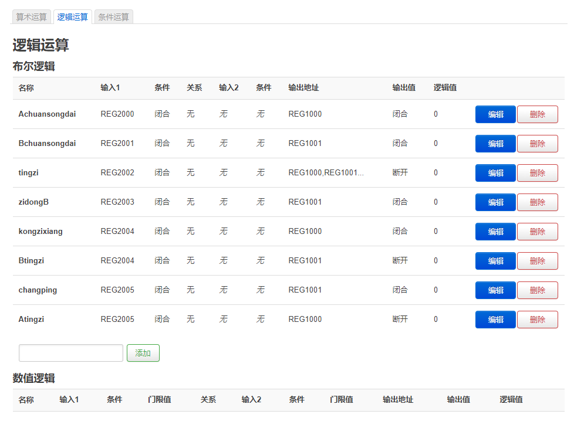

步骤说明：（1）输入Achuansongdai,点击添加，弹出配置框。（2）输入1：选择DI1寄存器REG2000。（3）条件：选择闭合。（4）关系：选择“无”，因是DI1直接控制A传送带运行，所以没有其他条件故选择“无”。（5）输出类型：选择布尔类型，因DO1控制是布尔量，所以选择布尔类型。（6）输出地址：REG1000，DI1只控制一个DO1，所以只选择DO1寄存器地址，如果DI控制多个，可以选择多个寄存器。如第三条逻辑“tingzi”,按下停止按钮,传送带A和B都停止。（7）布尔值：关闭，DI1控制DO1闭合，所以选择关闭。（8）输出延时（毫秒）：因是及时响应，不需要延时，故不填。（9）设置默认值：选择逻辑不成立时，DO1是否恢复默认状态，根据需求选择。（10）点击“保存”。（11）按同样的操作方法，把其他逻辑建好。（12）点击“保存并应用”写进BL191。

#### 数值逻辑配置举例说明

AI1寄存器REG3000接温度传感器，监控电机的温度，当采集到的温度大于50时，风扇打开，风扇由DO3寄存器REG1002控制。

示例数值逻辑配置

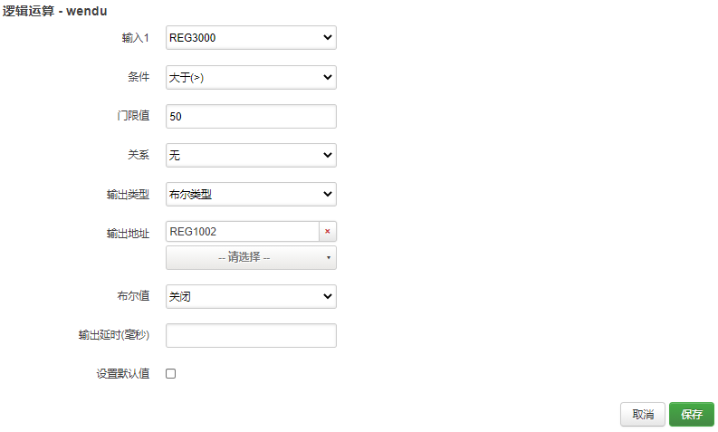

示例数值逻辑配置说明

同理数值逻辑和布尔逻辑，逻辑原理一样，数值逻辑只是判断条件为“大于”、“小于”或“等于”某个数值，作为联动条件。

#### 组合逻辑举例说明

传送带没有运行，电机的温度超过50度，风扇开启，触发报警器DO4 寄存器REG1003。

示例组合逻辑配置

示例组合逻辑配置说明

步骤说明：（1）在组合逻辑项，输入名称“bj”，点击添加，弹出配置框。（2）输入1：选择之前在布尔逻辑建的逻辑名称“zidongB”，这里可以根据需求选择，不规定是布尔逻辑或数值逻辑。（3）条件：选择“为假”，根据需求选择，输入1选择的逻辑是否触发作为条件。（4）关系：选择“逻辑与”，根据需求选择，条件1与条件2的逻辑关系。也可选择“无”条件2。（5）输入2：选择逻辑名称“wendu”，根据需求选择，不规定是布尔逻辑或数值逻辑。（6）条件：选择“为真”，根据需求选择，输入2选择的逻辑是否触发作为条件。（7）输出类型：选择“布尔类型”，根据“输出地址”是布尔或数值数据选择。（8）输出地址：选择要操作的寄存器地址。DO4寄存器REG1003。（9）布尔值：关闭，DO4闭合控制报警器（10）输出延时（毫秒）：因是及时响应，不需要延时，故不填。（11）设置默认值：选择逻辑不成立时，DO4是否恢复默认状态，根据需求选择。（12）点击“保存”。（（13）点击“保存并应用”写进BL191。

#### 算术运算配置举例说明

传感器采集一天生产的数量存放到寄存器REG40002，通过算术运算功能计算一天8小时，每小时生产的数量存放到寄存器REG40004，这个寄存器REG40004的数据可以通过MQTT、OPC UA或Modbus 发送到你的平台或服务器。

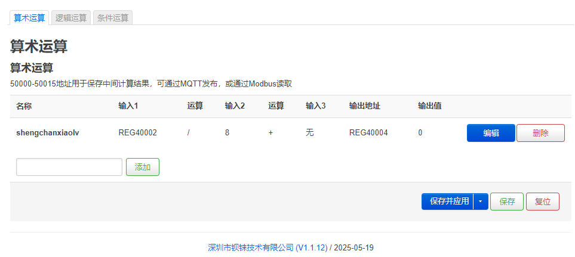

示例算术运算配置

示例算术运算配置说明

步骤说明：（1）输入名称“shengchanxiaolv”，点击添加，弹出配置框。（2）输入1：选择产量寄存器REG40002。（3）运算：选择“/”，根据需求选择，这里可以选择“加减乘除”。（4）输入2：选择常数，根据需求选择，这可以选择其他寄存器地址。（5）输入2：因选择常数，故要填写常数，如果选择的是寄存器，没有这项。（6）运算：根据是否还有条件3选择，没有则随意。（7）输入3：选择“无”，因不需要这个条件选项，故选择“无”，这根据需求选择，可以选择寄存器、常数、无。（8）输出地址：选择运算结果存储到寄存器地址。（9）点击“保存”。（10）点击“保存并应用”写进BL191。

#### BLRAT

BLRAT（Beilai Remote Access Tool）是钡铼技术自主研发的一款专门为远程访问的工具，是钡铼技术BLRMS远程平台下的一个子服务。在EdgeIO控制器中BLRAT可以远程固件升级及参数配置。在EdgeIO控制器配置端只需点击启用，填写设备密钥。设备密钥是在BLRMS远程平台的通讯秘钥token码，每个注册用户的token码是唯一的。BLRAT使用操作请参考BLRAT使用说明书。

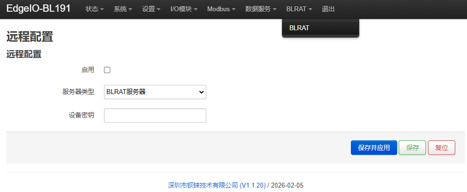

## BL191 EdgeIO控制器通信示例

### UaExpert与BL191通信示例

以BL191搭配Y01+Y31+Y41（4DIDO+4AI+4AO），自带RS485采集01、02、03、04功能码数据为例。RS485配置参考Modbus主站。

#### OPC UA网页配置

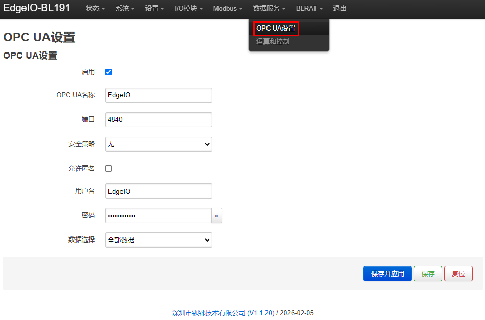

步骤：（1）点击“数据服务”选择“OPC UA设置”。（2）点击“启用”。（3）填写OPC UA服务端名称，可以自定义，方便OPC UA客户端搜索区分不同的OPC UA服务器。如：填写“EdgeIO”。（4）OPC UA 服务端的端口号，默认：4840。（5）安全策略选择。如选择“无”。（6）是否允许匿名，因使用签名方式，则允许匿名不打钩。（7）填写用户名和密码，客户端连接时需要填写这个用户名和密码。（8）选择数据，可以选择需要上传的数据，默认选择全部数据上传。（9）点击“保存并应用”。

#### 用UaExpert客户端连接收发数据

打开UaExpert（OPC UA客户端），输入OPC UA服务器IP和端口。

点击搜索，点击搜索到的OPC UA服务器，输入设置的用户名和密码，点击OK。

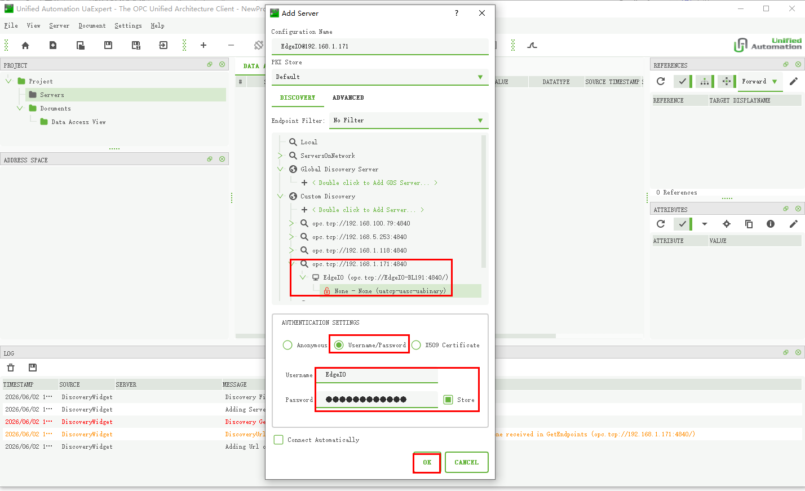

点击连接，连接成功后可以查看到数据节点。

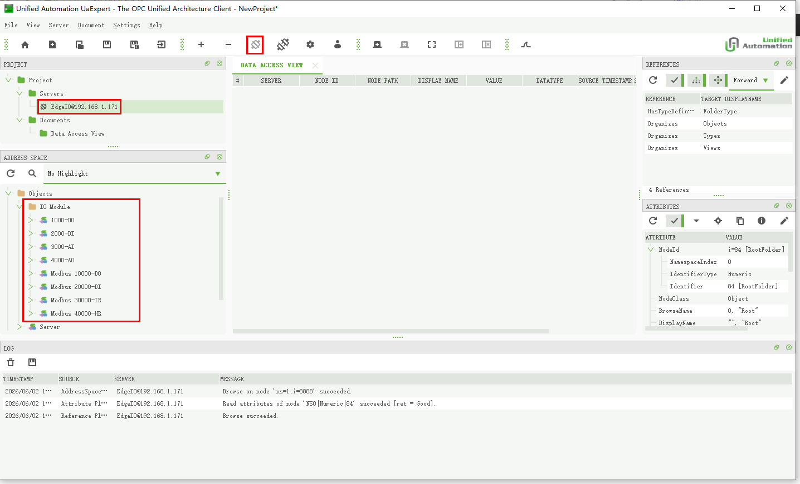

把数据拖到显示框查看采集到的数据如下：上面部分是串口数据，下面部分是Y版I/O模块数据。具体对应可以看名称或Node ID。

OPC UA客服端数据下发

以下发Y01的DO1这个数据点为例。在网页和OPC UA查看到DO1为断开状态。

点击REG1000数据点的值，原来是false，点击一下，在空白的地方点击鼠标左键或按键盘上的【Enter】键。同理数值类型的数据下发是双击原来的值，填写下发的数值，确定就可以。

OPC UA客户端下发成功会有报文，因服务器响应也很快，可以在上面看到值已经变为“true”。

在BL191的网页配置查看DO的状态。DO1也是由原来的断开变成闭口。

## 保修条款

1) 此设备从购买之日算起，为期一年内有任何材料或质量问题，免费维修。

2) 此一年保修不包括任何人为损坏、操作不当等造成的产品故障问题。

## 技术支持

深圳市钡铼技术有限公司

电话：0755-29451836

网址：http:// www.bliiot.cn
