

# 钡铼技术 EdgeIO控制器系列BL192Pro_说明书_V1.1

版本：V1.1
日期：2026-5-27
版权：深圳市钡铼技术有限公司
网址：https://www.bliiot.cn

EdgeIO控制器系列
BL192Pro工业物联网边缘I/O控制器

BL192Pro
说明书

自定义MQTT云、阿里云、华为云、亚马逊云、Thingsboard云等MQTT云平台或服务器

以太网

工作站

版权声明

本说明书之所有权由深圳市钡铼技术有限公司所有。未经本公司之书面许可，任何单位和个人无权以任何形式复制、传播和转载本手册之任何部分，否则一切后果由违者自负。

免责声明

本产品主要用于工业现场自动化测量和控制，操作人员必须是自动化或电气领域中具有经验的电气专家。请按照说明书提供的参数和技术规格使用，本公司不承担由于不正常使用或不恰当使用本产品造成的财产或人身伤害。

前言

感谢您使用深圳市钡铼技术有限公司的EdgeIO控制器系列产品，本说明书详细阐述了产品功能特性、操作规范及安全注意事项。为确保设备安全运行，请在安装、调试及使用前仔细阅读并妥善保存本文件。

修订记录

| 更新日期 | 文档版本 | 说明 | 作者 |
| --- | --- | --- | --- |
| 2025年06月20日 | V1.0 | 初版 | HYQ |
| 2026年05月27日 | V1.1 | 优化说明。 优化脉冲输出和计数模块。 增加Thingsboard下发控制本机I/O。 | HYQ |
|  |  |  |  |

目录

1 产品简介6

1.1 概述6

1.2 典型应用7

1.3 功能特点8

1.4 设备选型9

2 设备描述10

2.1 尺寸10

2.2 电源接口和指示灯10

2.3 RJ45网口11

2.4 信号接口11

2.5 RS485接口11

2.6 恢复出厂按钮12

3 产品安装12

4 BL192Pro工业物联网边缘I/O控制器12

4.1 BL192Pro工业物联网边缘I/O控制器概述12

4.2 技术参数13

4.3 Modbus 寄存器映射16

4.4 OPC UA数据点Node Id16

4.5 MQTT标识符16

4.6 EdgeIO控制器连接16

4.7 登录网页配置17

4.7.1 连接与IP配置18

4.7.1.1 连接计算机和EdgeIO控制器18

4.7.1.2 配置计算机IP地址18

4.7.1.3 配置节点IP地址20

4.7.1.4 出厂默认设置21

4.7.2 登录配置页面21

4.8 网页配置页面说明23

4.8.1 状态23

4.8.2 系统26

4.8.2.1 系统26

4.8.2.2 管理权29

4.8.2.3 备份/升级30

4.8.2.4 重启33

4.8.3 设置34

4.8.4 I/O模块34

4.8.4.1 数字量输入模块35

4.8.4.2 数字量输出模块36

4.8.4.3 模拟量输入模块36

4.8.4.4 模拟量输出模块38

4.8.4.5 热电阻输入模块38

4.8.4.6 热电偶输入模块39

4.8.4.7 DIDO混合模块40

4.8.4.8 PWM输出和DI计数模块41

4.8.5 Modbus42

4.8.5.1 串口设置42

4.8.5.2 串口透传42

4.8.5.3 Modbus RTU转TCP44

4.8.5.4 Modbus从站设置45

4.8.5.5 Modbus主站45

4.8.6 OPC UA47

4.8.7 运算和控制49

4.8.7.1 算术运算49

4.8.7.2 逻辑运算50

4.8.7.3 条件运算52

4.8.7.4 示例53

4.8.8 云平台59

4.8.8.1 私有云(钡铼云和自定义云)59

4.8.8.2 阿里云63

4.8.8.3 亚马逊云64

4.8.8.4 华为云65

4.8.8.5 Thingsboard66

4.8.9 BLRAT67

5 EdgeIO控制器通信示例68

5.1 BL192 MQTT协议边缘I/O控制器示例68

5.1.1 连接自定义MQTT云配置68

5.1.2 用MQTT.fx查看和下发数据69

5.1.3 连接阿里云配置72

5.1.4 阿里云平台查看和下发数据73

5.1.5 连接亚马逊云配置77

5.1.6 亚马逊云平台查看和下发数据78

5.1.7 连接华为云配置80

5.1.8 华为云平台查看和下发数据80

5.1.9 连接thingsboard配置82

5.1.10 Thingsboard平台查看和下发数据83

5.1.11 钡铼MQTT报文格式86

5.1.11.1 设备发布数据格式86

5.1.11.2 设备订阅数据格式87

5.2 BL192Pro工业物联网边缘I/O控制器通信示例87

5.2.1 Modbus TCP通信示例87

5.2.1.1 概述87

5.2.1.2 Modbus 功能码描述89

5.2.2 OPC UA通信示例101

5.2.2.1 UaExpert与BL191通信示例101

6 保修条款107

7 技术支持107

# 产品简介

## 概述

工业物联网边缘I/O控制器是钡铼技术推出的工业级EdgeIO控制器，作为一款支持MQTT、Modbus TCP、OPC UA三大主流协议，集数据采集、跨协议转换、逻辑控制、远程运维于一体的多功能边缘计算设备，BL192Pro支持 1-3 个 IO 扩展槽位，用户可根据现场需求自由组合数字量、模拟量、温度、串口等多种 I/O 模块，灵活适配各类工业自动化场景。例如，BL192Pro可以搭配3块Y11（8DI）组成24DI独立式IO模块，或者混搭不同类型的IO板，如Y11（8DI）、Y31（4AI）、Y52（2PT）即可组合成8DI+4AI+2PT独立式IO组成一个既有数字输入（DI）、模拟输入（AI）、又有热电阻输入（PT）的IO模块。它无需额外网关就可以同时对接物联网平台、PLC控制系统和企业管理系统，实现从现场设备到云端/上层平台的无缝数据互通；同时可独立完成寄存器运算、条件判断等本地逻辑控制任务，有效降低系统部署成本和复杂度。

一台BL192Pro设备即可完成：

采集现场传感器、仪表信号，并执行本地逻辑控制。

作为 Modbus RTU 从站，接入现有 HMI、触摸屏，保留原有操作习惯。

通过 MQTT 将数据上传至公有云或私有云平台，实现远程监控。

通过 OPC UA 将数据开放给 MES、ERP、SCADA 等上层管理系统。

一台 BL192Pro，替代“PLC + I/O 模块 + 协议转换网关 + 云网关”的繁琐组合，实现从现场到云端的全链路数据贯通。

BL192Pro工业物联网边缘I/O控制器采用电气隔离技术，通过EMC/EMI测试及-45~80℃高低温验证，内置独立硬件看门狗，确保在严苛环境下长期稳定运行。广泛应用于分布式物联网监测、智慧农业、智慧水务、储能系统、远程设备管理等领域，为多协议并存的复杂工业场景提供可靠、易部署、易维护的边缘层解决方案。

## 典型应用

典型应用案例：老旧生产线智能化改造

背景

某汽配工厂有一条 10 年前建成的冲压生产线，原有控制系统由 PLC 加普通 I/O 组成，但 PLC 品牌已停产，故障频发。现场有一台 HMI（触摸屏）通过 Modbus RTU 与 PLC 通信，用于显示设备状态和手动启停。

工厂希望实现以下目标：

保留原有 HMI 的操作界面，避免重新培训工人。

采集生产线能耗数据、冲压次数（OEE），上传至工厂云平台。

实现远程故障诊断和参数调整，减少停机时间。

改造方案

采用 BL192Pro 替换原有 PLC 和 I/O 模块，完全保留原有 HMI。

I/O 采集：BL192Pro 通过 DI 采集冲床运行/故障信号，通过 AI 采集电流/压力信号，通过高速计数通道采集冲压次数。

本地逻辑控制：内置 Web 配置实现 急停信号触发 → DO 切断运行、冲压次数每日自动清零等逻辑。

Modbus RTU 从站：BL192Pro 模拟原 PLC 的 Modbus 地址映射，原有 HMI 无需任何修改即可读写设备状态（读取 DI 状态、写入 DO 控制命令）。

MQTT 上云：将冲压次数、电流峰值、运行时长等数据通过 MQTT 上传至工厂私有云平台，生产看板实时显示 OEE。

OPC UA 开放：将关键数据以 OPC UA 接口提供给 MES 系统，用于质量追溯和分析。

远程运维：工程师通过 BLRAT 远程工具修改计数清零时间、报警阈值，排查故障，无需到车间现场。

收益

| 项目 | 改造前 | 改造后 |
| --- | --- | --- |
| 硬件设备 | PLC + 普通 I/O（停产） | 一台 BL192Pro |
| HMI 改造 | 需重新编程，周期长 | 零改动，直接兼容 |
| 数据上云 | 不支持 | MQTT 直连云平台，实时监控 |
| MES 对接 | 无接口 | OPC UA 标准接口，即连即用 |
| 现场维护频率 | 每周至少 1 次 | 远程诊断，现场次数减少 80% |
| 年停机时间 | 约 40 小时 | 降低至 10 小时以内 |

结论：BL192Pro 以一台设备同时实现了 IO 采集、HMI 接入、云端上报和 MES 对接，保留了客户原有 HMI 资产，每年节省运维成本超 5 万元。

更多典型工业应用场景

| 领域 | 应用说明 | 多协议带来的价值 |
| --- | --- | --- |
| 设备制造商配套 | 为出厂设备配套 BL192Pro，实现远程运维 | Modbus 从站兼容原有触摸屏；MQTT 让设备制造商远程监控设备健康度 |
| 分布式泵站/空压站 | 多个站点数据采集，本地自动控制 | Modbus 从站供现场触摸屏使用；MQTT 汇集至中心平台；OPC UA 给能源管理系统 |
| 产线数据采集（OEE） | 采集设备运行状态、计数、报警 | Modbus 从站对接已有 SCADA；MQTT 上报云端看板；OPC UA 供 MES 系统分析 |
| 老旧设备联网 | 采集继电器信号，替代 PLC 实现简单控制 | 保留原有 HMI（Modbus 从站），同时将数据上云，低成本实现设备联网 |
| 实验室环境监控 | 温湿度、设备状态采集与报警 | MQTT 推送报警至手机；OPC UA 对接实验室信息管理系统（LIMS） |

## 功能特点

灵活的组合选项：用户可以根据需求自由组合1-3块Y系列IO板，支持多种配置，如24DI、16DI+8DO、8DI+4AI+2PT等，满足不同工业自动化场景的需求。

多样化的类型：支持数字量输入（DI）、数字量输出（DO）、模拟量输入（AI）、模拟量输出（AO）、热电阻输入（PT）和热电偶输入（TC）、数字量输入输出混合IO（DIDO）和脉冲输出/脉冲计数混合IO，适用于各种信号采集和控制任务。

工业级设计：通过EMC/EMI测试和-45~80℃宽温测试，能够在恶劣的环境条件下稳定运行，确保系统的可靠性。

多协议：支持MQTT、Modbus、OPC UA三大主流协议，支持阿里云、华为云、AWS IoT、Thingsboard平台连接。

边缘计算功能：内置逻辑控制和边缘计算，能够在本地执行一些简单的任务，减少对中央控制器的依赖。

交换机功能：配置2个RJ45接口，内置交换机功能，能够轻松建立线路拓扑结构，减少对额外交换机或集线器的需求，简化网络配置。

数据采集：自带1路隔离的RS485，支持Modbus RTU主站/从站双模式，可直连接智能仪表、传感器等设备，也可作为从站响应上位机指令；也可以通过网口采集Modbus TCP设备数据。。

远程维护：集成BLRAT（Beilai Remote Access Tool），支持远程固件升级及参数配置，无需到现场调试与修改。

## 设备选型

EdgeIO控制器系列设备选型

| 编号 | 名称 | 型号 | 上行协议 |
| --- | --- | --- | --- |
| 1 | Modbus协议边缘I/O控制器 | BL190 | Modbus |
| 2 | OPC UA协议边缘I/O控制器 | BL191 | OPC UA |
| 3 | MQTT协议边缘I/O控制器 | BL192 | MQTT |
| 4 | 工业物联网边缘I/O控制器 | BL192Pro | MQTT、Modbus TCP、OPC UA |
| 5 | SNMP协议边缘I/O控制器 | BL193 | SNMP |
| 6 | EtherNet/IP  I/O模块 | BL194 | EtherNet/IP |
| 7 | BACnet/IP协议边缘I/O控制器 | BA190 | BACnet/IP |
| 8 | 智慧楼宇边缘I/O控制器 | BA190Pro | BACnet/IP、MQTT、Modbus TCP、OPC UA |

Y系列IO模块选型

| 编号 | 名称 | 型号 | 通道 | 信号类型 |
| --- | --- | --- | --- | --- |
| 1 | 8通道数字量混合模块 | Y01 | 8 | 4DI+4DO NPN |
| 2 | 8通道数字量混合模块 | Y02 | 8 | 4DI+4DO PNP |
| 3 | 8通道数字输入模块 | Y11 | 8 | NPN(低电平触发) |
| 4 | 8通道数字输入模块 | Y12 | 8 | PNP（高电平触发） |
| 5 | 8通道数字输入模块 | Y13 | 8 | 干接点 |
| 6 | 8通道数字输出模块 | Y21 | 8 | PNP |
| 7 | 8通道数字输出模块 | Y22 | 8 | NPN |
| 8 | 4通道继电器输出模块 | Y24 | 4 | Relay |
| 9 | 4通道模拟输入模块 | Y31 | 4 | 0-20mA/4-20mA输入 |
| 10 | 4通道模拟输入模块 | Y33 | 4 | 0-5V/0-10V单端输入 |
| 11 | 4通道模拟输入模块 | Y34 | 4 | 0-5V/0-10V差分输入 |
| 12 | 4通道模拟输入模块 | Y36 | 4 | ±5V/±10V差分输入 |
| 13 | 4通道模拟输出模块 | Y41 | 4 | 0-20mA/4-20mA输出 |
| 14 | 4通道模拟输出模块 | Y43 | 4 | 0-5V/0-10V输出 |
| 15 | 4通道模拟输出模块 | Y46 | 4 | ±5V/±10V 输出 |
| 16 | 2通道RTD输入模块 | Y51 | 2 | 三线制PT100 |
| 17 | 2通道RTD输入模块 | Y52 | 2 | 三线制PT1000 |
| 18 | 2通道RTD输入模块 | Y53 | 2 | 四线制PT100 |
| 19 | 2通道RTD输入模块 | Y54 | 2 | 四线制PT1000 |
| 20 | 4通道TC输入模块 | Y58 | 4 | TC（B/E/J/K/N/R/S/T） |
| 21 | 4通道串口通信模块 | Y61 | 4 | 4*RS485/RS232可选 |
| 22 | 8通道脉冲输出和脉冲计数模块 | Y95 | 8 | 4通道脉冲输+4通道脉冲计数（NPN） |
| 23 | 8通道脉冲输出和脉冲计数模块 | Y96 | 8 | 4通道脉冲输出+4通道脉冲计数（PNP） |

# 设备描述

## 尺寸

单位：mm

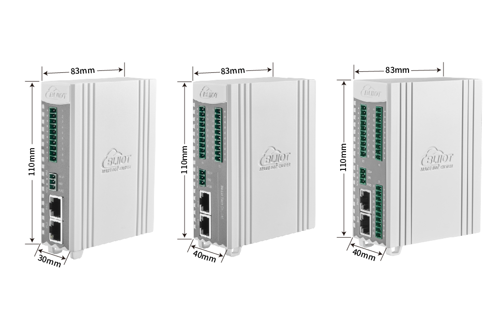

尺寸图

## 电源接口和指示灯

| 名称 | 描述 |  |  |
| --- | --- | --- | --- |
| DC V+ | 24V DC+ |  |  |
| GND | 0V DC |  |  |
| PGND | 接大地 |  |  |
| PWR | 电源指示灯 | 常亮 | 电源接通 |
|  |  | 灭 | 电源故障 |
| RUN | 系统运行灯 | 闪烁 | 设备正常运行 |
|  |  | 灭/常亮 | 设备故障 |

## RJ45网口

通过ETH 0网口连接云平台或服务器，ETH1用于连接其他需要接入的EdgeIO控制器节点。ETH 0默认IP为：192.168.3.2。

## 信号接口

每个卡槽的信号不一样，接线就不一样，具体接线看侧面的标签说明。

## RS485接口

BL192Pro自带一路RS485口，在网页配置中，串口COM1指的是这个RS485接口，需要增加串口请选Y61 IO版，BL192Pro最多只能5个串口。

## 恢复出厂按钮

此按钮用于将设备配置参数恢复到出厂状态。

操作方法：在设备处于正常运行状态下，长按5秒以上，直到全部LED灯熄灭表明操作成功，然后设备会自动重启。

# 产品安装

支持壁挂式和导轨式安装。

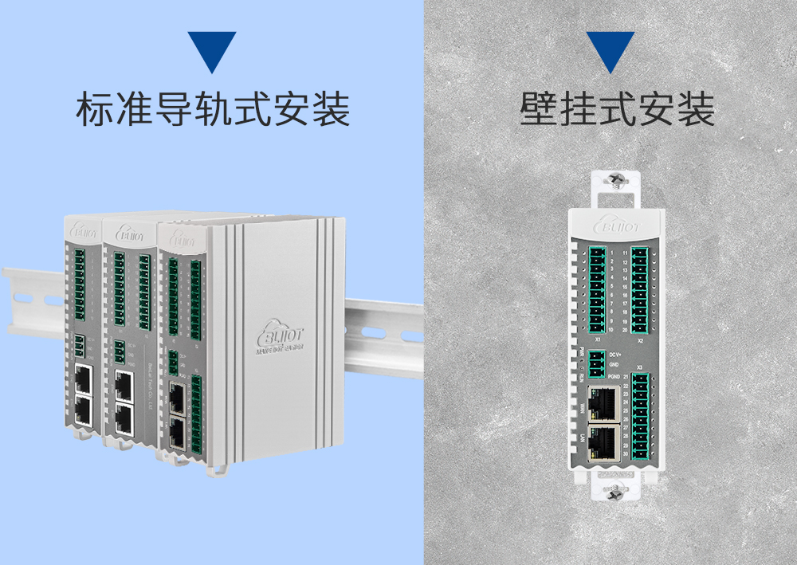

# BL192Pro工业物联网边缘I/O控制器

## BL192Pro工业物联网边缘I/O控制器概述

BL192Pro是BL192 MQTT协议边缘I/O控制器的增强版。

BL192 支持MQTT协议，支持阿里云、华为云、AWS IoT、Thingsboard平台连接。

BL192Pro EdgeIO控制器包含MQTT、Modbus TCP、OPC UA三大主流协议。

## 技术参数

| 名称 | 参数 | 描述 |
| --- | --- | --- |
| 电源 | 供电电源 | 24VDC |
|  | 功耗 | 55mA@24VDC |
|  | 反接防护 | 支持 |
| 以太网 | 数量 | 2 X RJ45 |
|  | 传输介质 | 双绞线，STP 100 Ω Cat 5 |
|  | 最大线缆长度 | 100m |
|  | 速率 | 10/100 Mbit/s |
|  | 隔离保护 | ESD ：±6kV（接触），±8kV（空气）； EFT：1kV，5kHz。 |
| 串口 | 串口数量 | 1x RS485+Y61可选（4xRS485/RS232可选） |
|  | 串口波特率 | 2400bps-230400bps |
|  | 数据位 | 8 |
|  | 校验位 | None，Even，Odd |
|  | 停止位 | 1，2 |
|  | 串口保护 | ESD ：±6kV（接触），±8kV（空气）； EFT：1kV，5kHz。 |
| DIDO （可选） | 数字量输出参数 |  |
|  | 通道 | 4通道 |
|  | 输出类型 | Y01：输出低电平有效，输出0VDC。 Y02：输出高电平有效，输出24VDC。 |
|  | 每个通道输出最大电流 | 100mA |
|  | 隔离保护 | 2KVrms |
|  | 数字量输入参数 |  |
|  | 通道 | 4通道 |
|  | 触发方式 | Y01：低电平触发Y02：高电平触发 |
|  | 逻辑电平 | Y01： 逻辑1：+15 ⋯+30VDC 逻辑0：-3 ⋯+5VDC 公共端：接电源+ Y02： 逻辑1：+15 ⋯+30VDC 逻辑0：-3 ⋯+5VDC 公共端：0VDC |
|  | 隔离保护 | 2KVrms |
| DI （可选） | 通道 | 8通道 |
|  | 输入类型 | 支持干接点和湿接点（NPN或PNP） |
|  | Y13干接点 | 闭合：与COM 短路 断开：断路 |
|  | Y11（NPN） | 逻辑1：+15 ⋯+30VDC 逻辑0：-3 ⋯+5VDC 公共端：接电源+ |
|  | Y12（PNP） | Y12： 逻辑1：+15 ⋯+30VDC 逻辑0：-3 ⋯+5VDC 公共端：0VDC |
|  | 隔离保护 | 2KVrms |
| DO （可选） | 通道 | 8通道 |
|  | 输出类型 | Y21：输出高电平有效，输出24VDC。 Y22：输出低电平有效，输出0VDC。 |
|  | 每个通道输出最大电流 | 100mA |
|  | 隔离保护 | 2KVrms |
| 继电器 （可选） | 通道 | 4通道 |
|  | 输出类型 | 继电器输出 |
|  | 最大开关电压 | 250VAC/30VDC |
|  | 最大开关电流 | 2A |
|  | 开关功率 | 30W |
|  | 隔离保护 | 2KVrms |
| AI （可选） | 通道 | 4通道 |
|  | 输入方式 | 单端输入/差分输入 |
|  | 输入类型 | 0 ⋯20mA / 4 ⋯20mA (4线制) 0-5V/0-10V(4线制) -5-5V/-10-10V(4线制) |
|  | 分辨率 | 16 Bit |
|  | 精确度 | ±0.1 % FSR @ 25 ℃ |
|  | 采样周期 | 300ms |
|  | 电流输入内置电阻 | 249Ω |
| AO （可选） | 通道 | 4通道 |
|  | 输出类型 | 0 ⋯20mA / 4⋯20mA 0-5V/0-10V -5-5V/-10-10V |
|  | 分辨率 | 12bit |
|  | 精确度 | ±0.1 % FSR @ 25 ℃ |
|  | 转换时间 | 20ms |
|  | 负载阻抗（电流模式） | ≤1KΩ |
|  | 负载阻抗（电压模式） | ≥5KΩ |
| RTD （可选） | 输入类型 | 3线制或4线制PT100和PT1000线制 |
|  | 测量范围 | PT100（-200~850℃）、PT1000（-50~300℃） |
|  | 分辨率 | 15 Bit |
|  | 精确度 | ±1℃ 20m以内AWG16屏蔽线 |
|  | 采集周期 | 400ms |
| TC （可选） | 传感器类型 | J、K、T、E、R、S、B、N |
|  | 分辨率 | 16 Bit |
|  | 精确度 | ±0.5% @25℃ |
|  | 采集周期 | 400ms |
| 脉冲输出和脉冲计数模块（可选） | 脉冲输出参数 |  |
|  | 通道 | 4通道 |
|  | 输出延时 | ＜1ms |
|  | 占空比 | 0~1000（0%~100%），自定义设置。 |
|  | 最大开关频率 | 40KHz |
|  | 隔离保护 | 2KVrms |
|  | 脉冲计数参数 |  |
|  | 通道 | 1路高速计数+3路低速计数 |
|  | 最大开关频率 | 高速：最大150KHz，低速：最大10KHz |
|  | 计数范围 | 32位无符号 |
|  | 隔离保护 | 2KVrms |
| 系统 | 操作系统 | Linux |
|  | 主频 | 300MHz |
|  | RAM | 64MB |
|  | Flash | 128MB |
|  | 协议 | MQTT，OPC UA，Modbus，HTTP，DHCP， DNS |
| 环境 | 工作温度、湿度 | -40～85℃，5～95% RH |
|  | 存储温度、湿度 | -40～85℃，5～95% RH |
| 其他 | 外壳 | 塑胶材质 |
|  | 尺寸（1*I/O模块） | 30mm×83mm×110mm(L*W*H) |
|  | 尺寸（3*I/O模块） | 40mm×83mm×110mm(L*W*H) |
|  | 净重（1*I/O模块） | 133g |
|  | 净重（3*I/O模块） | 171g |
|  | 防护等级 | IP30 |
|  | 安装方式 | 壁挂式、导轨式 |
| 安规认证 | EMC | CE、FCC |
|  | EMS | IEC 61000-4-2 (ESD) Level 3 |
|  |  | IEC 61000-4-4 (EFT) Level 3 |
|  |  | IEC 61000-4-5 (Surge)Level 3 |
|  | 振动 | IEC 60068-2-6 |

## Modbus 寄存器映射

BL192Pro支持Modbus TCP 服务端向外提供数据。

BL192Pro现场I/O模块节点内部寄存器映射由2部分组成，一部分是数字输入输出和模拟输入输出模块的数据映射组成，地址范围是1000 ... 9999；另外一部分是modbus采集数据，地址范围是10000 ... 49999。

Modbus寄存器映射-本机I/O模块

| Modbus 地址 | 数据类型 | 访问 | 功能码 | 描述 |  |
| --- | --- | --- | --- | --- | --- |
| 10进制 | 16进制 |  |  |  |  |
| 1000…1999 | 0x03 E8…0x07 CF | 1 Bit | 读/写 | 0x01/05/0F | 数字输出DO |
| 2000…2999 | 0x07 D0…0x0B B7 | 1 Bit | 只读 | 0x02 | 数字输入DI |
| 3000…3999 | 0x0B B8…0x0F 9F | 32 Bit Float | 只读 | 0x04 | 模拟输入AI |
| 4000…4999 | 0x0F A0…0X13 87 | 32 Bit Float | 读/写 | 0x03/10 | 模拟输出AO |
| 5000…8999 | 0x13 88…0x23 27 | 32 Bit Unint | 读/写 | 0x03/10 | PWM输出和DI计数 |
| 50000...50015 | 0xC350…0xC35F | 32 Bit Float | 读/写 | 0x03/10 | 逻辑应用时可以存放值的寄存器 |

Modbus寄存器映射-modbus采集数据

| Modbus 地址 | 数据类型 | 访问 | 功能码 | 描述 |  |
| --- | --- | --- | --- | --- | --- |
| 10进制 | 16进制 |  |  |  |  |
| 10000…19999 | 0x27 10…0x4E 1F | 1 Bit | 读/写 | 0x01/05/0F | 数字输出DO |
| 20000…29999 | 0x4E 20…0x75 2F | 1 Bit | 只读 | 0x02 | 数字输入DI |
| 30000…39999 | 0x75 30…0x9C 3F | 16 Bit | 只读 | 0x04 | 模拟输入AI |
| 40000…49999 | 0x9C 40…0XC3 4F | 16 Bit | 读/写 | 0x03/06/10 | 模拟输出AO |

## OPC UA数据点Node Id

BL192Pro支持OPC UA Server功能，以服务器形式对外提供数据。

OPC UA的Node Id 默认是NS=1；S=I/O数据点的Modbus映射地址(如首个DO模块第一路DO：NS=1；S=1000)，具体Modbus映射地址参考4.3Modbus 寄存器映射。

## MQTT标识符

MQTT标识符是REG+Modbus映射地址(如首个DO模块第一路DO：REG1000)，具体Modbus映射地址参考4.3Modbus 寄存器映射。

## EdgeIO控制器连接

BL192Pro 有2个以太网接口，内部集成交换机功能，工作在存储转发操作模式，每个端口支持10/100 Mbit的传输速度以及全双工和半双工传输模式。

该EdgeIO控制器只能通过ETH 0接口连接到基于以太网的现场总线中，ETH1用于连接其他需要接入以太网的节点。

内部集成的交换机支持旁路模式，当EdgeIO控制器系统故障时可以自动启动旁路模式，自动维持 ETH 0 和 ETH 1的链接。

这些以太网接口的接线符合 100BaseTX 的规范，该规范规定使用 5 类双绞线电缆作为连接电缆。可以使用最大长为 100 m的电缆类型 S/UTP（屏蔽非屏蔽双绞线）和 STP（屏蔽双绞线）。

还可以通过 ETH 0 和计算机直连。

## 登录网页配置

BL192Pro 内置web服务器是一个基于浏览器的配置实用程序。当节点连接到您网络时，您可以在 Web 浏览器中输入服务器的 IP 地址以访问 Web 控制台。

### 连接与IP配置

想要顺利的访问BL192Pro节点，必须要将它正确的安装并且和计算机建立连接。除此之外还要给它们配置正确的IP地址，使他们保持在同一个网段内。

#### 连接计算机和EdgeIO控制器

将现场总线节点安装到DIN35导轨上。按照“产品安装”章节中的安装说明进行操作。

将 24 V 电源连接到电源端子。

计算机和总线节点可以通过2种方式建立连接，一种是两者通过以太网接口接入本地局域网的交换机设备；另一种是两者点对点直接相连。详细步骤请按照“EdgeIO控制器连接”章节中的说明进行操作。

将电源开机，开始供电。

I/O模块上电工作后被初始化，同时根据现场总线节点的 I/O 模块配置并创建过程映像。

#### 配置计算机IP地址

在 PC 端，有两种方法配置其 IP 地址；一种是在PC 的本地连接上开启自动获取 IP 地址选项，通过网络中DHCP动态分配；另一种是在PC 的本地连接上配置一个跟EdgeIO控制器节点处于同一个网段的静态 IP 地址。

下面以Windows 7 系统为例进行配置。Windows 系统的配置均相似。

单击“开始 > 控制面板 > 网络和共享中心”，在打开的窗口中单击“本地连接”。

在“本地连接状态”窗口中，单击“属性”。

在本地连接属性页面双击“Internet 协议版本 4（TCP/IPv4）

两种方法配置PC的IP地址：

自动获得IP地址（系统默认模式）

自动从DHCP 服务器获取IP 地址，选中“自动获得 IP 地址”

设置静态IP地址

选中 “使用下面的IP地址”，在IP地址，子网掩码和默认网关设置正确的数值。

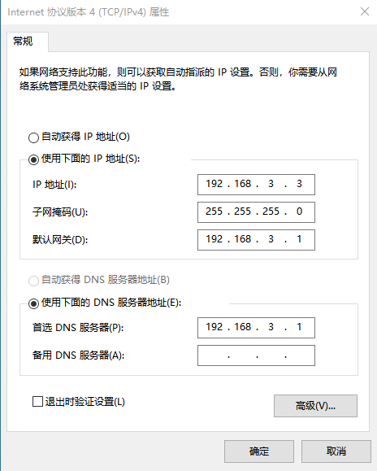

#### 配置节点IP地址

设备默认IP地址为：192.168.3.2，进入网页配置后可以修改。通过 “设置 > 本机设置“ 页面设置IP地址，也可以设置为自动分配。

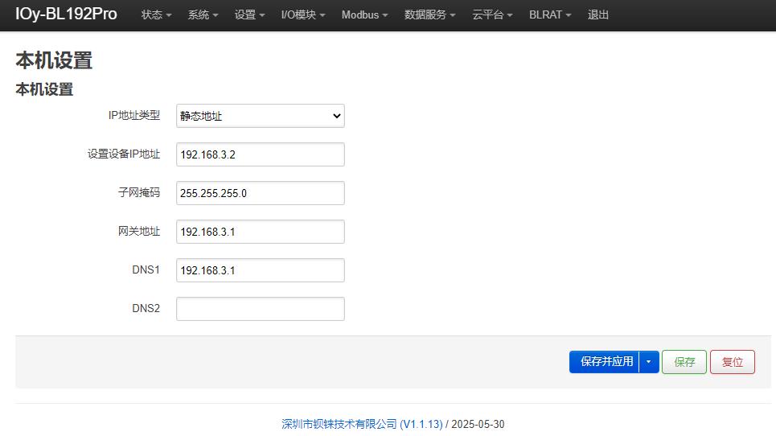

#### 出厂默认设置

登录Web配置页面前，您有必要了解以下的默认参数。

ETH0默认IP:192.168.3.2

Modbus TCP Server 端口:502，Modbus ID：1

出厂默认参数

| 项目 | 描述 |
| --- | --- |
| 用户名 | admin |
| 密码 | 无 |

### 登录配置页面

在计算机上打开浏览器，如 IE、 Chrome、Firefox等。

在浏览器的地址栏输入I/O模块节点的 IP 地址（192.168.3.2 ）进入用户登录界面。

在登录界面输入“用户名“ 和 ”密码“，然后点击登录。默认用户名：admin，无密码。

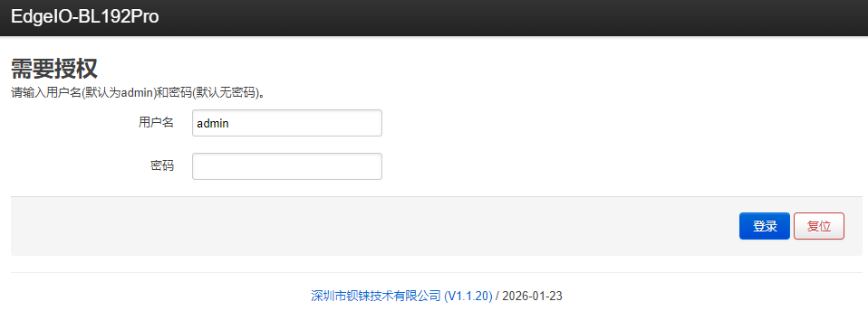

成功登录web界面显示如下

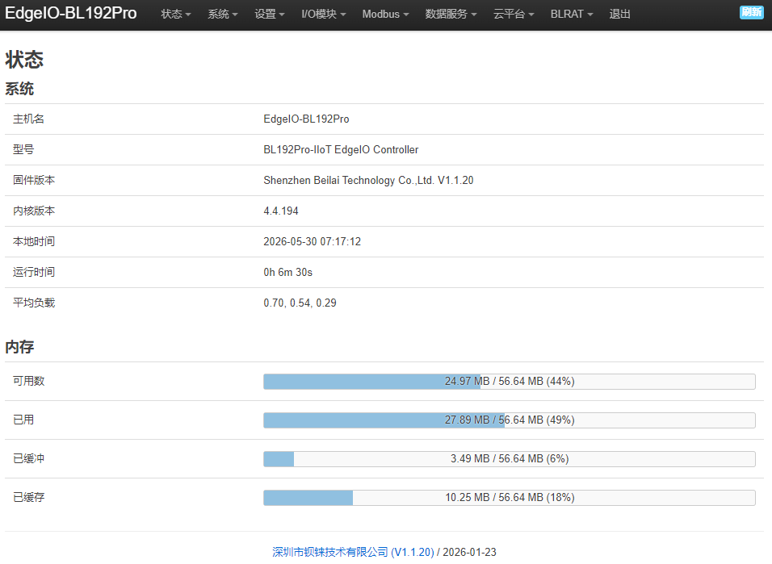

配置完参数后，需要点击页面上的 “保存并应用” 按钮才能生效。

## 网页配置页面说明

### 状态

在状态菜单中，提供了概览、系统日志和内核日志，可以查看设备参数和设备运行状态。

状态 > 概览

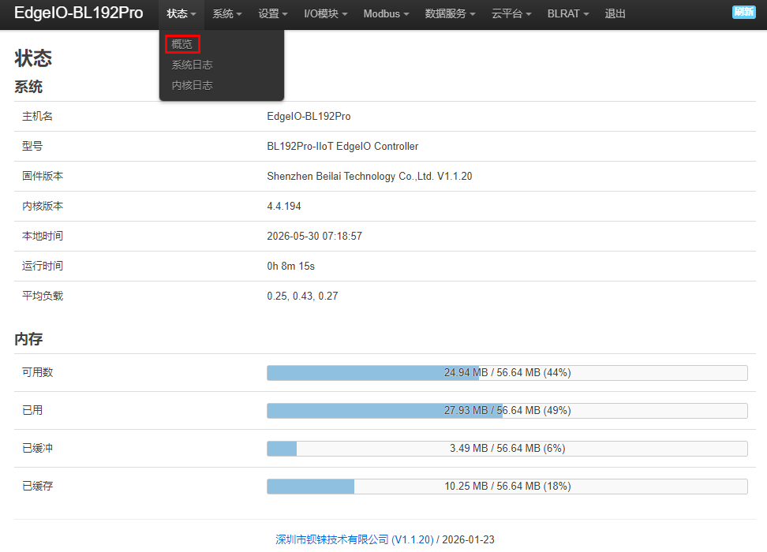

状态 > 系统日志

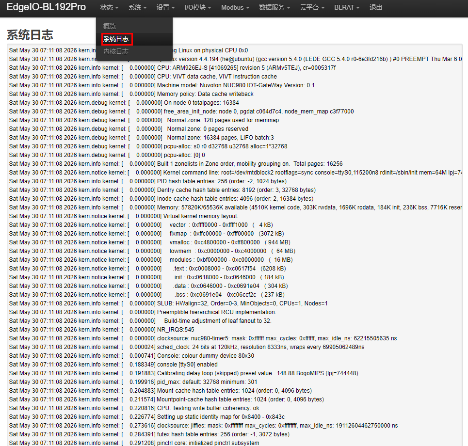

状态 > 内核日志

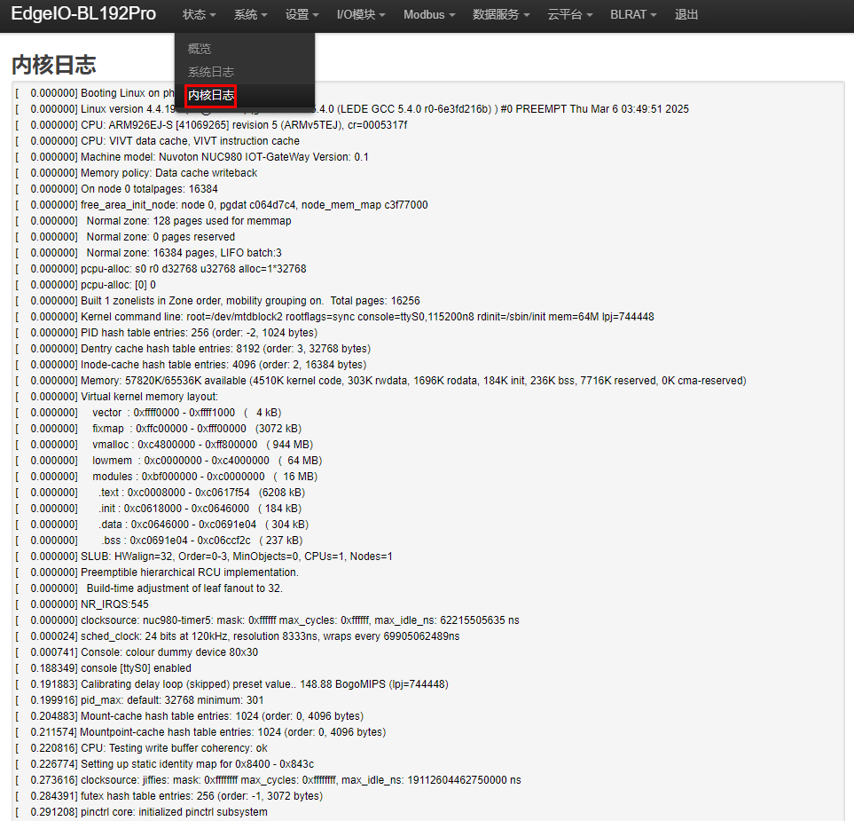

### 系统

#### 系统

系统属性 > 常规设置

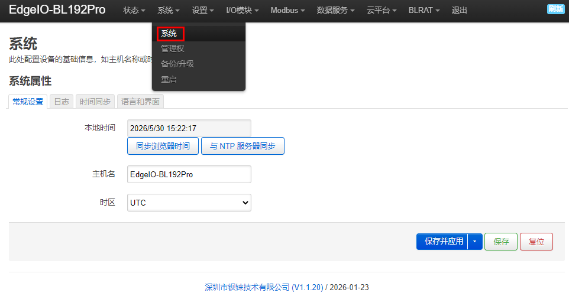

系统 > 系统属性 > 常规设置

| 项目 | 描述 | 默认 |
| --- | --- | --- |
| 本地时间 | 显示设备当前时间。可以点击“同步浏览器时间”或者“与NTP服务器同步”按钮更新设备时间。 | -- |
| 主机名 | 可以自定义设备名称，便于区分多个设备。 | EdgeIO-BL192Pro |
| 时区 | 可以通过下拉菜单选择时区 | UTC |

系统属性 > 日志

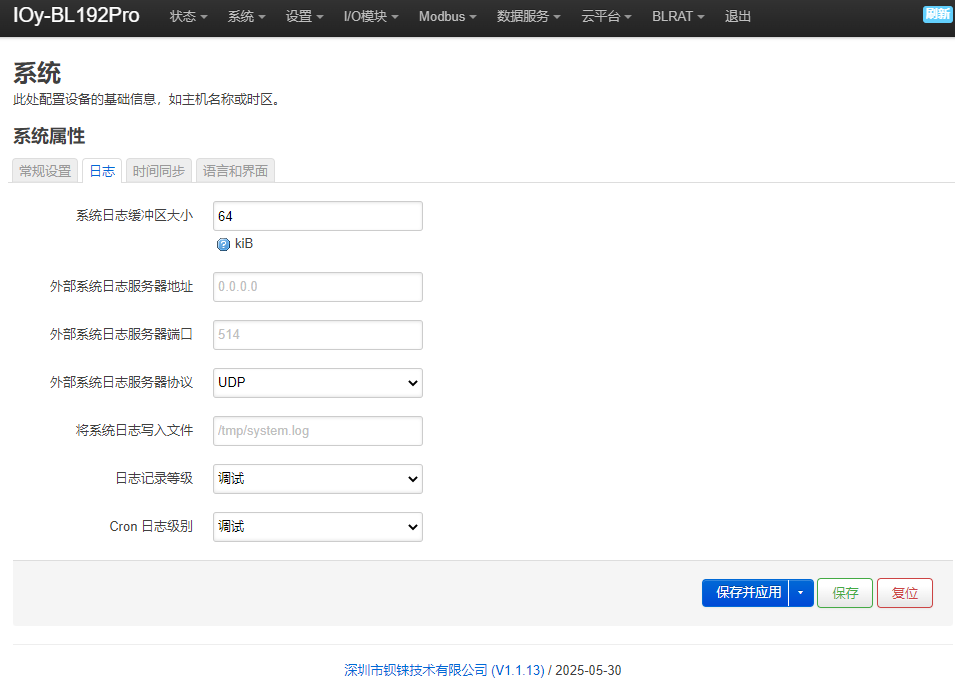

系统 > 系统属性 > 日志

| 项目 | 描述 | 默认 |
| --- | --- | --- |
| 系统日志缓冲区大小 |  | 64 |
| 外部系统日志服务器地址 |  |  |
| 外部系统日志服务器端口 |  |  |
| 外部系统日志服务器协议 |  |  |
| 将系统日志写入文件 |  |  |
| 日志记录等级 |  |  |
| Cron 日志级别 |  |  |

系统属性 > 时间同步

可以设置NTP服务器，用来同步时间。

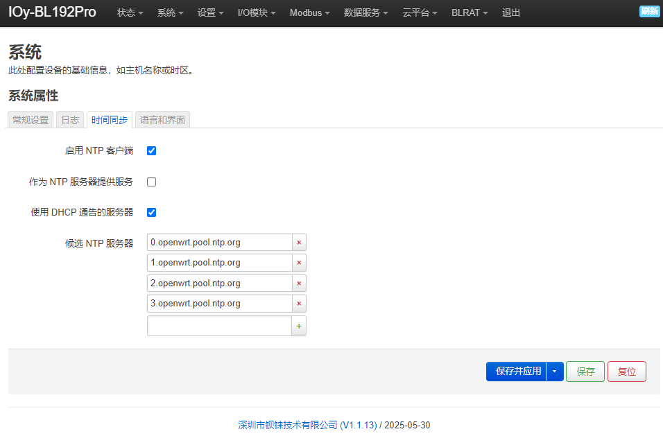

系统属性 > 语言和界面

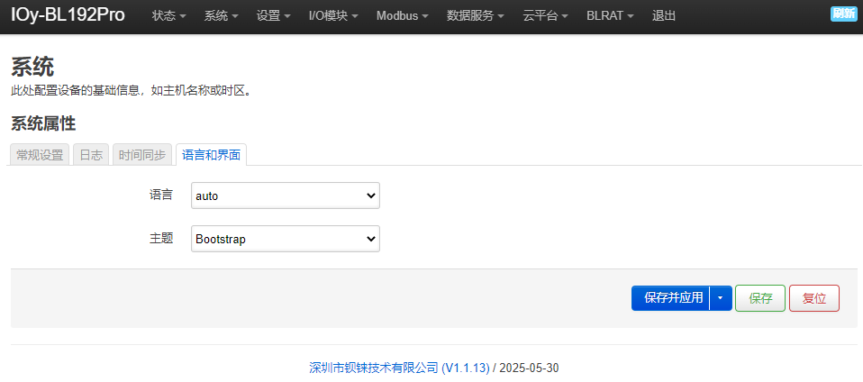

系统 > 系统属性 > 语言和界面

| 项目 | 描述 | 默认 |
| --- | --- | --- |
| 语言 | 可以在auto、 English、中文（Chinese）种选 | auto |
| 主题 | 目前只支持Bootstrap。 | Bootstrap |

#### 管理权

管理权 > 主机密码

更改访问设备的管理员密码

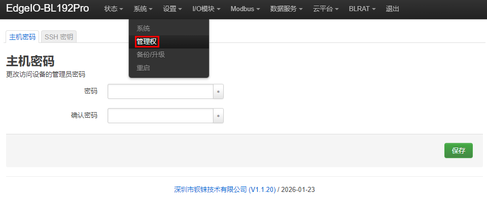

管理权 >  SSH密钥

与使用普通密码相比，公钥允许无密码 SSH 登录具有更高的安全性。要将新密钥上传到设备，请粘贴 OpenSSH 兼容的公钥行或将 .pub 文件拖到输入字段中。

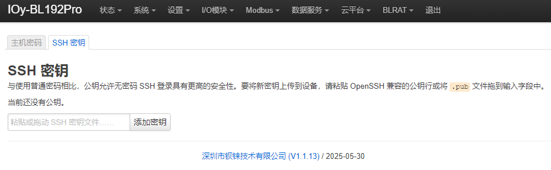

#### 备份/升级

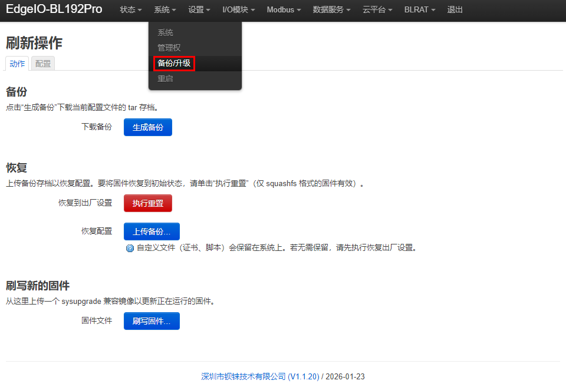

系统 > 备份/升级 > 动作

| 项目 | 描述 | 默认 |
| --- | --- | --- |
| 备份 | 点击“生成备份”下载当前配置文件的tar 存档。 | -- |
| 恢复 | 上传备份存档以恢复配置。要将固件恢复到初始状态，请单击“执行重置”（仅 squashfs 格式的固件有效）。 | -- |
| 刷写新的固件 | 从这里上传一个 sysupgrade 兼容镜像以更新正在运行的固件。 | -- |

#### 升级操作说明：

1、点击“系统”→点击“备份/升级”→“刷写固件”。

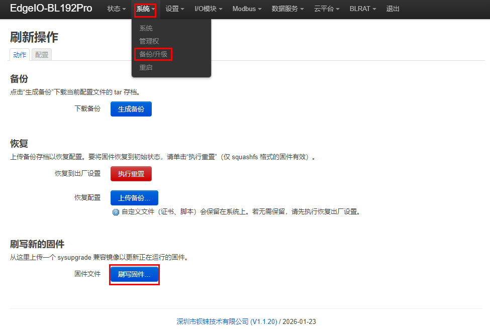

2、点击“浏览”，找到固件所在的目录，选择固件，点击“打开”。

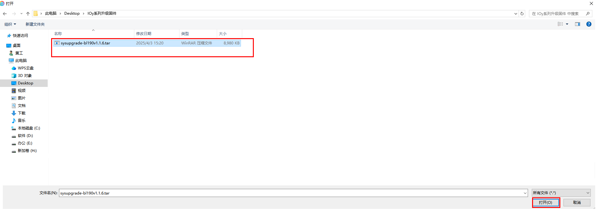

3、点击“上传”。

4、上传完后，点击“继续”，开始烧录固件。注意烧录过程中不要断电。

5、烧录完后，重新登录，在首页状态里面可以查看固件版本是否已变更。要注意IP是否改变，如果不保存当前配置烧录，IP会变化默认IP：192.168.3.2。

#### 重启

点击“执行重启”将重启您的设备。

### 设置

本机设置

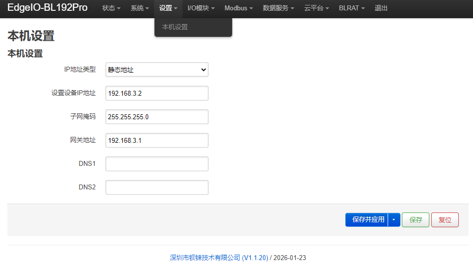

设置 > 本机设置

| 项目 | 描述 |
| --- | --- |
| IP地址类型 | 从“静态地址”、“动态地址”中选择。 |
| 设置设备IP地址 | 可以自定设置设备IP地址，设置后需要重启生效。 |
| 子网掩码 | 设置IP的子网掩码 |
| 网关地址 | 设置IP的网关地址 |
| DNS1 | 设置DNS |
| DNS2 | 设置DNS |

### I/O模块

EdgeIO控制器最多可以有 3个Y系列 I/O 模块，包括数字量输入输出，模拟量输入输出和特殊功能模块。

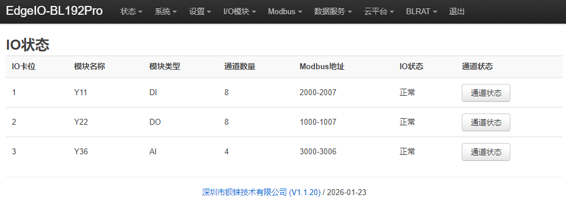

I/O模块 > I/O状态

| 项目 | 描述 |
| --- | --- |
| IO卡位 | 分别与外壳面板上X1、X2、X3对应。 |
| 模块名称 | IO模块的详细型号。 |
| 模块类型 | IO模块功能类型。 |
| 通道数量 | IO模块的数据宽度。 |
| Modbus地址 | IO模块的过程映射modbus地址。 |
| IO状态 | IO模块通信状况。 |
| 通道状态 | 点击后可以查看和设置不同类型IO模块的参数。 |

#### 数字量输入模块

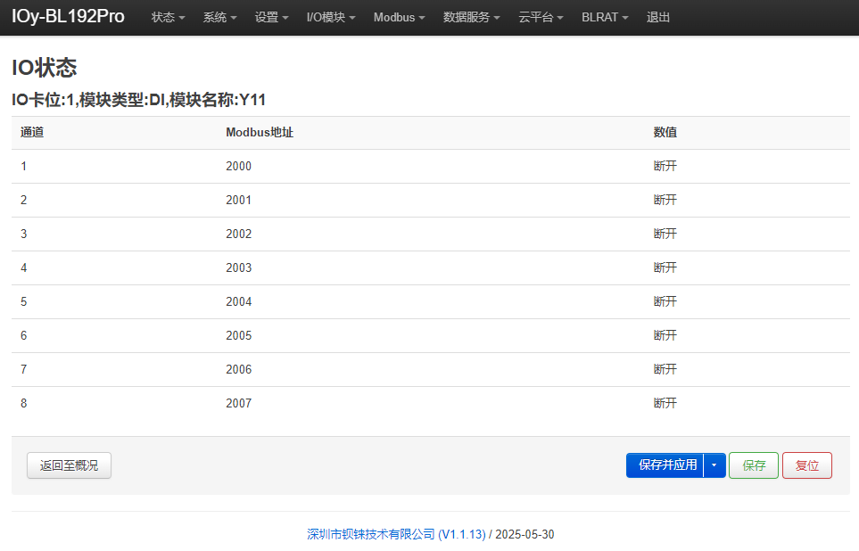

数字量输入模块 > IO状态

| 项目 | 描述 |
| --- | --- |
| 通道 | 数字量输入模块的通道编号 |
| Modbus地址 | 布尔状态数据在I/O模块内部的过程映射地址 |
| 数值 | 显示当前的输入状态，断开：逻辑0，闭合：逻辑1 |

#### 数字量输出模块

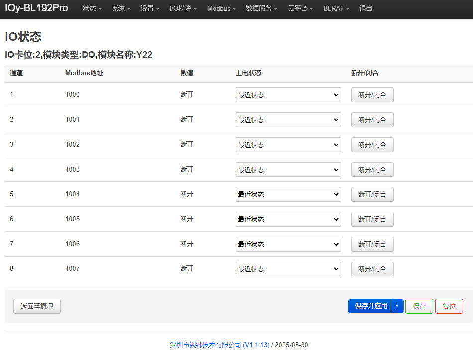

数字量输出模块

| 项目 | 描述 |
| --- | --- |
| 通道 | 数字量输出模块的通道编号。 |
| Modbus地址 | 数字量输出布尔数据在I/O模块内部的过程映射地址。 |
| 数值 | 显示当前的输出状态，断开：0，闭合：1。 |
| 上电状态 | “最近状态”，断电重新上电，DO保持上一次状态。 |
| 断开/闭合 | 可以控制当前通道输出状态。 |

#### 模拟量输入模块

模拟输入（AI）类型模块支持通过I/O模块web页面设置参数，这样模块内部自动实现数据换算，可以直接输出与传感器对应的实际工程数值。

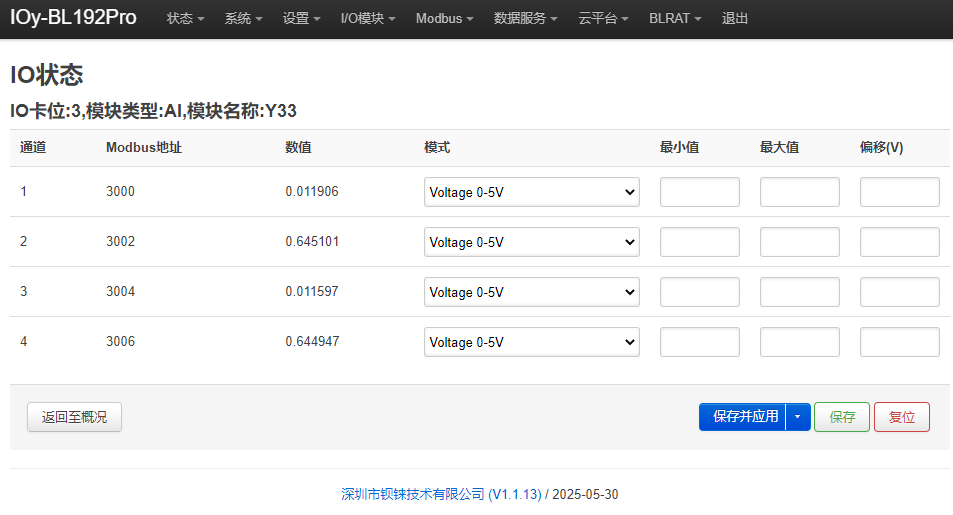

模拟量输入模块

| 项目 | 描述 |
| --- | --- |
| 通道 | 模拟量输入模块的通道编号 |
| Modbus地址 | 模拟量输入模块在I/O模块内部的过程映射地址 |
| 数值 | 显示当前通道输入的实际工程数值，32位单精度浮点型 |
| 模式 | 不同型号的模拟输入模块有不同的选项，详细参照具体模拟输入I/O模块手册。 |
| 最小值 | 传感器量程最小值 |
| 最大值 | 传感器量程最大值 |
| 偏移 | 通过偏移可以调整采集与实际的误差。 |

模拟量输入模块的电信号数值（一般是传感器）和实际工程数值存在线性关系，它们的公式如下（以4-20mA为例）：

实际工程数值 =（电流值 - 4）*（（最大值 – 最小值）/（20 - 4））+最小值

以 4-20mA 类型的水位传感器测量水塔深度为例：

已知水位传感器量程是0-100m，电流数据5.6mA，计算水塔深度：

代入公式：

(5.6 - 4) * ((100 - 0) / (20 - 4)) + 0 = 10

水塔深度是10m。

#### 模拟量输出模块

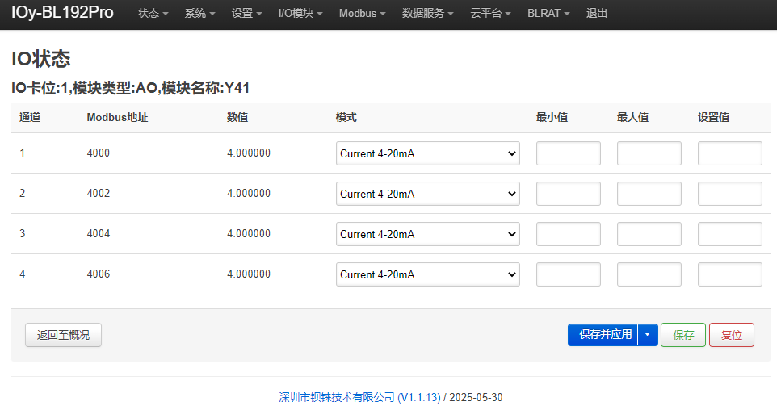

模拟量输出模块

| 项目 | 描述 |
| --- | --- |
| 通道 | 模拟量输出模块的通道编号 |
| Modbus地址 | 模拟量输出模块在I/O模块内部的过程映射地址 |
| 数值 | 显示当前通道输出的实际工程数值，32位单精度浮点型 |
| 模式 | 不同型号的模拟输出模块有不同的选项，详细参照具体模拟输出I/O模块手册。 |
| 最小值 | 实际工程数值最小值 |
| 最大值 | 实际工程数值最大值 |
| 设置值 | 可以设置输出所需要的实际工程数值 |

#### 热电阻输入模块

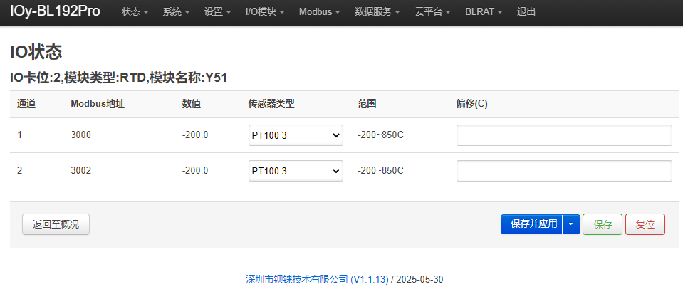

热电阻输入模块

| 项目 | 描述 |
| --- | --- |
| 通道 | 热电阻输入模块的通道编号。 |
| Modbus地址 | 热电阻输入模块在I/O模块内部的过程映射地址。 |
| 数值 | 显示当前热电阻采集到的温度值。 |
| 传感器类型 | 能接的热电阻传感器类型。 |
| 范围 | 热电阻传感器采集的温度范围。 |
| 偏移 | 可以通过偏移调整采集与实际的误差。 |

#### 热电偶输入模块

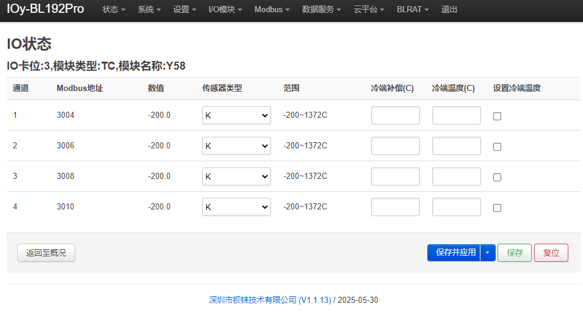

热电偶输入模块

| 项目 | 描述 |
| --- | --- |
| 通道 | 热电偶输入模块的通道编号。 |
| Modbus地址 | 热电偶输入模块在I/O模块内部的过程映射地址。 |
| 数值 | 显示当前热电偶采集到的温度值。 |
| 传感器类型 | 选择接的热电偶传感器类型。 |
| 范围 | 热电偶传感器采集的温度范围。 |
| 冷端补偿 | 设置热电偶传感器冷端补偿温度。 |
| 冷端温度 | 设置热电偶传感器冷端温度。 |
| 设置冷端温度 | 启用冷端温度设置。 |

#### DIDO混合模块

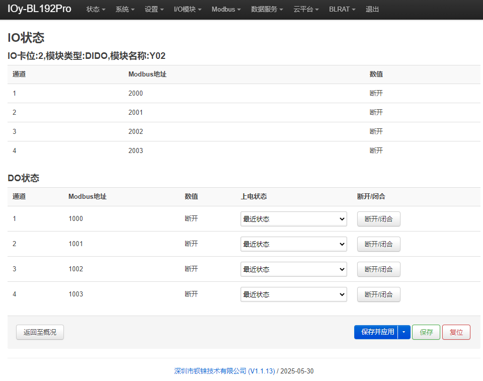

DIDO混合模块

| 项目 | 描述 |
| --- | --- |
| 通道 | 数字量输入输出模块的通道编号 |
| Modbus地址 | 布尔状态数据在I/O模块内部的过程映射地址 |
| 数值 | 显示当前的输入状态，断开：逻辑0，闭合：逻辑1 |
| 上电状态 | “最近状态”，断电重新上电，DO保持上一次状态。 |
| 断开/闭合 | 可以控制当前通道输出状态。 |

#### PWM输出和DI计数模块

PWM输出和DI计数模块

| 项目 | 描述 |  |
| --- | --- | --- |
| 通道 | PWM输出和DI计数模块的通道编号 |  |
| Modbus地址 | 模块在I/O模块内部的过程映射地址 |  |
| PWM输出 | 数值 | 显示当前占空比，32位无符号整型。 |
|  | 设置占空比 | 输入占空比的值，0~1000（0%~100%）自定义。 |
|  | 设置 | 确定占空比的设置。 |
|  | PWM频率 | modbus映射地址 |
|  |  | 填写频率（最大40KHz） |
|  |  | 设置频率 |
| DI计数 | 数值 | 显示当前的输入计数值，32位无符号整型。 |
|  | 计数模式 | 选择“上升沿”、“下降沿”、“上升沿和下降沿”触发计数方式 |
|  | 清除 | 可以清除当前通道计数器值 |

### Modbus

可以通过自带的1路RS485或Y61串口模块（4路RS485/RS232可选）接入各种支持Modbus RTU 协议的传感器，终端等设备。串口功能可以选择“Modbus主站”、“串口透传”、“Modbus从站”、“Modbus RTU转TCP”。

#### 串口设置

对串口的“波特率”、“数据位”、“校验位”、“停止位”进行设置，从“模式”里面选择串口的作用，点击“保存并应用”，串口属性和功能才生效。

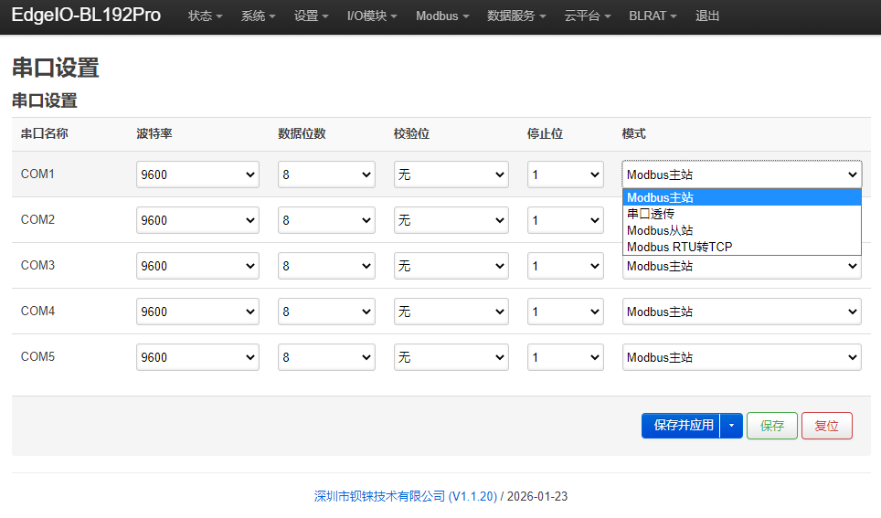

#### 串口透传

使用“串口透传”功能需要先在“串口设置”的“模式”选择透传。

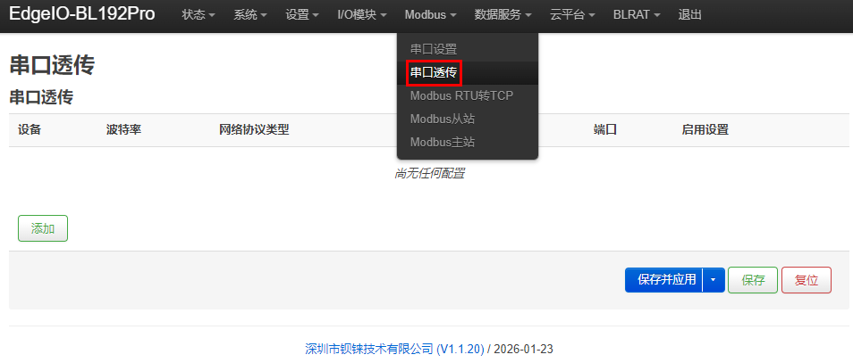

点击“添加”，弹出配置框，进行配置。

| 项目 | 描述 |
| --- | --- |
| 设备 | 选择哪路串口作透传使用 |
| 网络协议类型 | TCP客户端、TCP服务端，UDP客户端、UDP服务端 |
| 主机IP或域名 | 填写服务器IP或域名，I/O模块作客户端时填写 |
| 端口号 | 默认：“5000” |
| 注册包 | 发送端和接收端需要按照约定好的注册包格式和内容进行通信参数的协商和注册，以确保通信的稳定性和可靠性 |
| 心跳包 | 作用类似于心跳信号，用于检测通信连接是否正常，以及及时发现通信故障或断线情况 |
| 心跳响应包 | 这种机制可以用来确认心跳包的正常接收，并进一步确保通信连接的健壮性和稳定性 |
| 心跳周期（秒） | 默认“60” |
| 主机静默时间（秒） | 默认“3600” |

#### Modbus RTU转TCP

使用“Modbus RTU转TCP”功能需要先在“串口设置”的“模式”选择Modbus RTU转TCP。

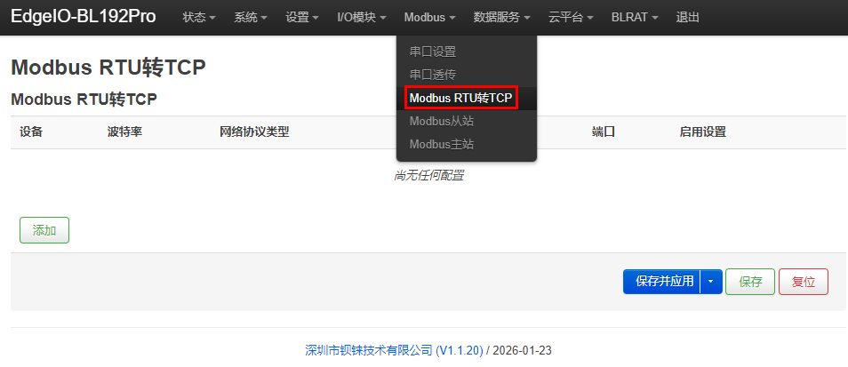

点击“添加”，弹出配置框，进行配置。

弹出配置框，进行配置

| 项目 | 描述 |
| --- | --- |
| 设备 | 选择哪路串口作Modbus RTU转TCP使用 |
| 网络协议类型 | TCP客户端、TCP服务端，UDP客户端、UDP服务端 |
| 主机IP或域名 | 填写服务器IP或域名，I/O模块作客户端时填写 |
| 端口号 | 默认：“5000” |
| 注册包 | 发送端和接收端需要按照约定好的注册包格式和内容进行通信参数的协商和注册，以确保通信的稳定性和可靠性 |
| 心跳包 | 作用类似于心跳信号，用于检测通信连接是否正常，以及及时发现通信故障或断线情况 |
| 心跳响应包 | 这种机制可以用来确认心跳包的正常接收，并进一步确保通信连接的健壮性和稳定性 |
| 心跳周期（秒） | 默认“60” |
| 主机静默时间（秒） | 默认“3600” |

#### Modbus从站设置

作TCP从站，只需要配置端口号，默认是“502”，如果串口需要作从站功能，需要先在“串口设置”的“模式”选择Modbus 从站。

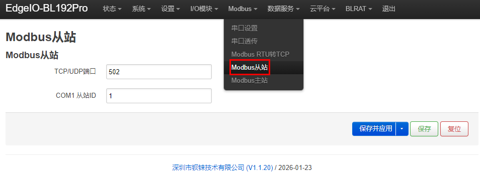

#### Modbus主站

Modbus主站用于串口通信添加 Modbus RTU 设备，也可以通过网口采集Modbus TCP设备。

说明：最多只能创建24条modbus命令。

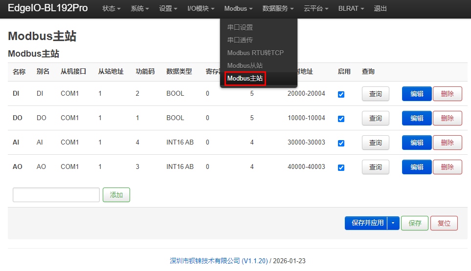

在输入框输入自定义数据名称，点击添加

弹出配置框，进行配置

Modbus 设置

| 项目 | 描述 |
| --- | --- |
| 别名 | 设备昵称可以用与区分数据 |
| 从机接口 | 选择串口通道 |
| 从机地址 | 从站设备地址，范围1-247 |
| 功能码 | 根据从站数据类型选择，包括：“01”、“02”、“03”、“04” |
| 寄存器首址 | 从站数据的寄存器起始地址 |
| 数据个数 | 从机数据的个数 |
| 映射地址分配 | 支持分配方式 自动 系统按照不同的数据类型，按照映射起始地址自动依次往下分配，地址是连续的。 手动 手动分配的方式可以让映射地址跨段分配 |
| 轮询周期(秒) | 相邻两条轮询指令之间的间隔时间 |
| 响应超时时间(秒) | 发送指令给从站后，等待从站返回数据的最长时间，超过该时间，将会认为从站无应答。 |

对建好的从机，可以进行修改、删除、查看数据功能，也可以不启用采集。

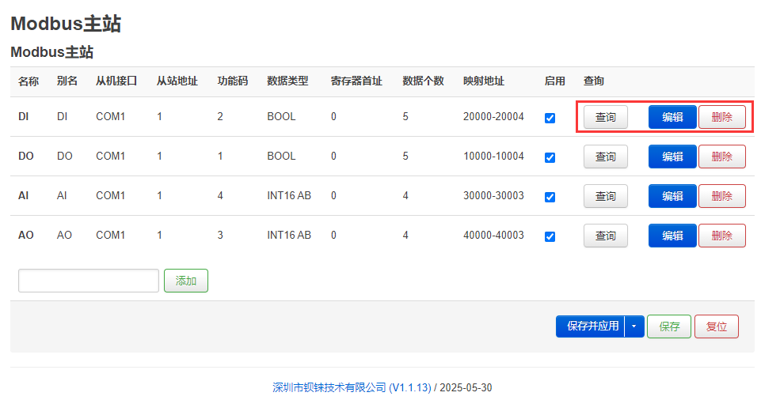

### OPC UA

BL192Pro支持OPC UA服务，BL192不支持。

点击“数据服务”选择“OPC UA设置”，配置完OPC UA参数后点击“保存并应用”，才能生效。

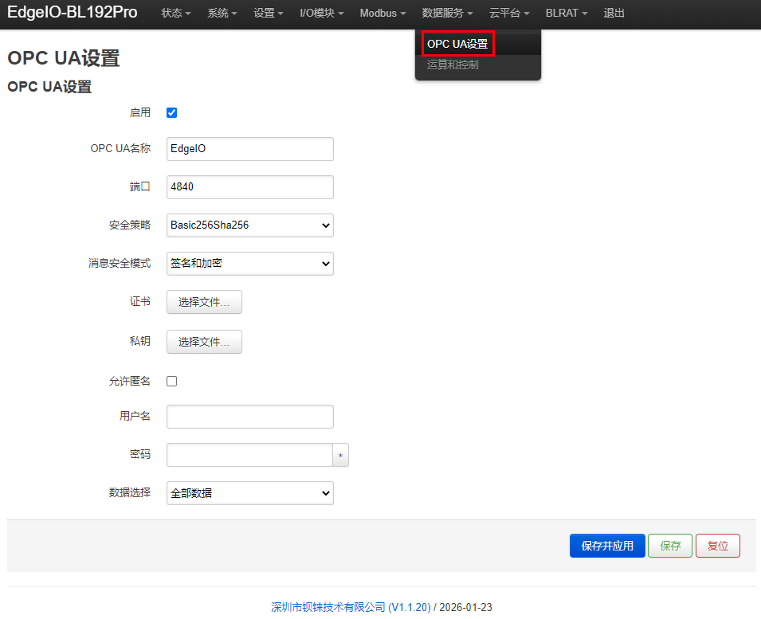

OPC UA设置

| 项目 | 描述 | 默认 |
| --- | --- | --- |
| OPC UA 名称 | 自定义OPC UA 服务器名称 |  |
| 端口 | OPC UA 服务端口号 | 4840 |
| 安全策略 | 无、 basic128rsa15 basic256 basic256sha256 aes128sha256rsaoaep 全部安全策略 | 无 |
| 消息安全模式 | 签名 签名和加密 |  |
| 证书 | OPC UA证书,点击上传的证书,加载到配置页面。 |  |
| 私钥 | OPC UA密钥,点击上传的证书,加载到配置页面。 |  |
| 允许匿名 | 是否开启用户名和密码登录 |  |
| 用户名 | 填写用户名 |  |
| 密码 | 填写用户名密码 |  |
| 数据选择 | 全部数据点 选择数据点 | 全部数据 |
| 选择数据点 | 可以选择你要读的数据点。“数据选择”项选择“选择数据点”才有这项 |  |

### 运算和控制

#### 算术运算

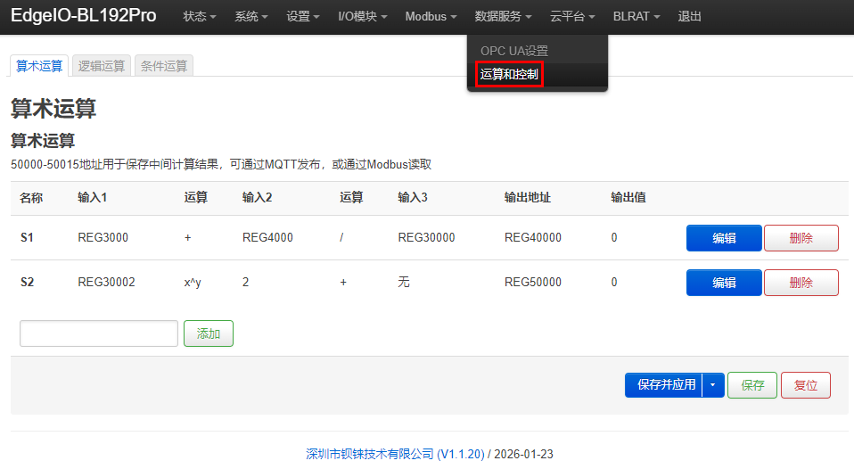

支持AI、AO或RS485从机数值类型数据之间的“加减乘除”运算，也可以“加减乘除”常数进行运算，自由搭配1个或2个条件组合输出结果。如果使用16位寄存器地址作为输出结果，则有小数的输出为整数。

注意：使用“x^y”、“ln”、“log10”时，请每一个都单独使用，不要和其他算术混合使用。

#### 逻辑运算

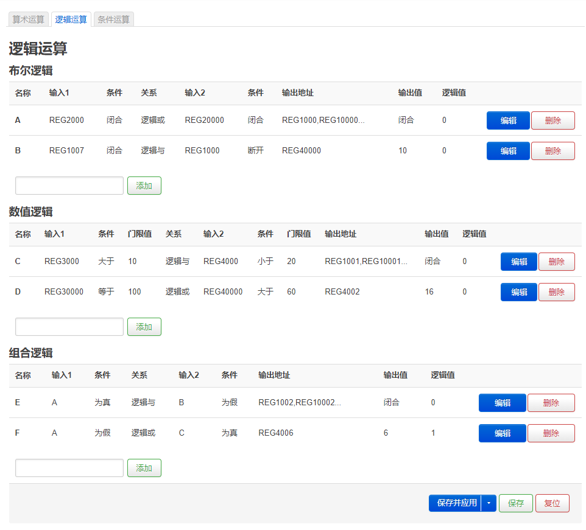

布尔量逻辑配置

数值逻辑配置

组合逻辑配置

提供强大的逻辑运算功能，可根据需要自由设置I/O（数字量输入输出、模拟量输入输出）或串口模块（Modbus从机数据）之间的各种组合联动。建好的逻辑是否触发，可以根据网页逻辑值项判断，“0”代表没触发，“1”代表已触发。逻辑值项不能自动更新，要手动刷新网页。注意：因中断不足，输出延时只可以用2个。

例：逻辑1（与），输入条件A与输入条件B同时满足触发条件，输出结果Y。

逻辑2（或），输入条件C或输入条件D任何一个满足触发条件，输出结果Y。

逻辑3：逻辑1+逻辑2可以组合出逻辑3或更多组合。

#### 条件运算

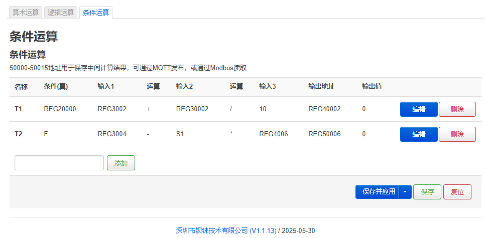

条件运算是算术运算基础上加上条件触发，既是当条件满足时，AI、AO或RS485从机数值类型数据或常数，这些数据可以自由选择1-3个条件互相“加减乘除”算术运算。

注意：使用“x^y”、“ln”、“log10”时，请每一个都单独使用，不要和其他算术混合使用。

#### 示例

以一个简单装箱系统为例

要求：（1）按下启动按钮后，传送带B先启动运行，拖动空箱前移至指定位置，达到指定位置后，由SQ2发出信号，使传送带B停止运行。

（2）传送带B停车后，传送带A启动运行，产品逐一落入箱子内，由SQ1传感器检测产品，检测到产品落入箱子，传送带A停止运行，传送带B启动运行，周而复始地进行，直到按下停止按钮，传送带A和B同时停止。

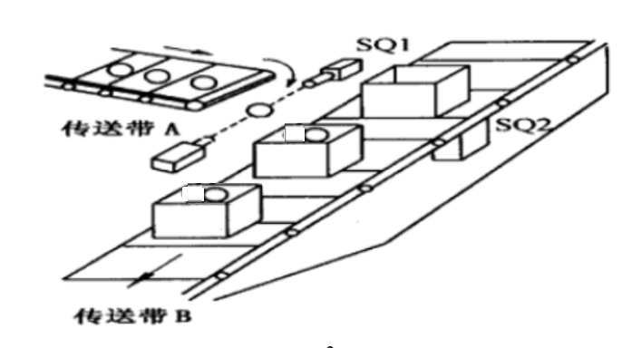

装箱系统

在S7-200SMART实现这样的功能，外围接线需要用到DI和DQ如下：

S7-200SMART接线

| 输入 | 输出 |  |  |
| --- | --- | --- | --- |
| I0.0 | 自动控制按钮 | Q0.1 | 传送带A输出 |
| I0.1 | 停止按钮 | Q0.2 | 传送带B输出 |
| I0.2 | B传送带点动 |  |  |
| I0.3 | A传送带点动 |  |  |
| I0.4 | SQ2输入 |  |  |
| I0.5 | SQ1输入 |  |  |

用BL192Pro运算和控制模拟要实现这样的要求，接线需要用到的DI和DO如下：

BL192Pro接线

| 输入 | 输出 |  |  |
| --- | --- | --- | --- |
| DI1 | A传送带点动 | DO1 | 传送带A输出 |
| DI2 | B传送带点动 | DO2 | 传送带B输出 |
| DI3 | 停止按钮 |  |  |
| DI4 | 自动控制按钮 |  |  |
| DI5 | 检测空箱子传感器, SQ2输入 |  |  |
| DI6 | 检测产品SQ1输入 |  |  |

#### 布尔逻辑配置举例说明

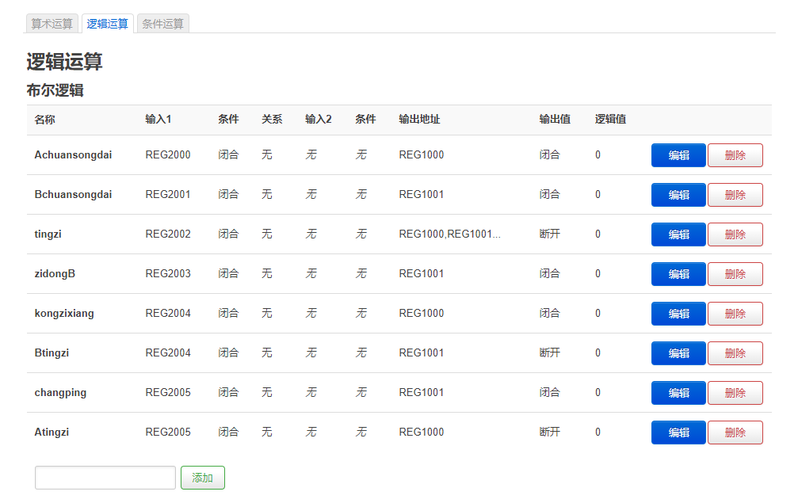

示例布尔量逻辑配置

示例布尔量逻辑配置说明

步骤说明：（1）输入Achuansongdai,点击添加，弹出配置框。（2）输入1：选择DI1寄存器REG2000。（3）条件：选择闭合。（4）关系：选择“无”，因是DI1直接控制A传送带运行，所以没有其他条件故选择“无”。（5）输出类型：选择布尔类型，因DO1控制是布尔量，所以选择布尔类型。（6）输出地址：REG1000，DI1只控制一个DO1，所以只选择DO1寄存器地址，如果DI控制多个，可以选择多个寄存器。如第三条逻辑“tingzi”,按下停止按钮,传送带A和B都停止。（7）布尔值：关闭，DI1控制DO1闭合，所以选择关闭。（8）输出延时（毫秒）：因是及时响应，不需要延时，故不填。（9）设置默认值：选择逻辑不成立时，DO1是否恢复默认状态，根据需求选择。（10）点击“保存”。（11）按同样的操作方法，把其他逻辑建好。（12）点击“保存并应用”写进BL192Pro。

#### 数值逻辑配置举例说明

AI1寄存器REG3000接温度传感器，监控电机的温度，当采集到的温度大于50时，风扇打开，风扇由DO3寄存器REG1002控制。

示例数值逻辑配置

示例数值逻辑配置说明

同理数值逻辑和布尔逻辑，逻辑原理一样，数值逻辑只是判断条件为“大于”、“小于”或“等于”某个数值，作为联动条件。

#### 组合逻辑举例说明

传送带没有运行，电机的温度超过50度，风扇开启，触发报警器DO4 寄存器REG1003。

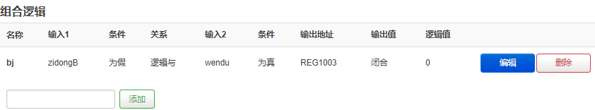

示例组合逻辑配置

示例组合逻辑配置说明

步骤说明：（1）在组合逻辑项，输入名称“bj”，点击添加，弹出配置框。（2）输入1：选择之前在布尔逻辑建的逻辑名称“zidongB”，这里可以根据需求选择，不规定是布尔逻辑或数值逻辑。（3）条件：选择“为假”，根据需求选择，输入1选择的逻辑是否触发作为条件。（4）关系：选择“逻辑与”，根据需求选择，条件1与条件2的逻辑关系。也可选择“无”条件2。（5）输入2：选择逻辑名称“wendu”，根据需求选择，不规定是布尔逻辑或数值逻辑。（6）条件：选择“为真”，根据需求选择，输入2选择的逻辑是否触发作为条件。（7）输出类型：选择“布尔类型”，根据“输出地址”是布尔或数值数据选择。（8）输出地址：选择要操作的寄存器地址。DO4寄存器REG1003。（9）布尔值：关闭，DO4闭合控制报警器（10）输出延时（毫秒）：因是及时响应，不需要延时，故不填。（11）设置默认值：选择逻辑不成立时，DO4是否恢复默认状态，根据需求选择。（12）点击“保存”。（（13）点击“保存并应用”写进BL192Pro。

#### 算术运算配置举例说明

传感器采集一天生产的数量存放到寄存器REG40002，通过算术运算功能计算一天8小时，每小时生产的数量存放到寄存器REG40004，这个寄存器REG40004的数据可以通过MQTT、OPC UA或Modbus 发送到你的平台或服务器。

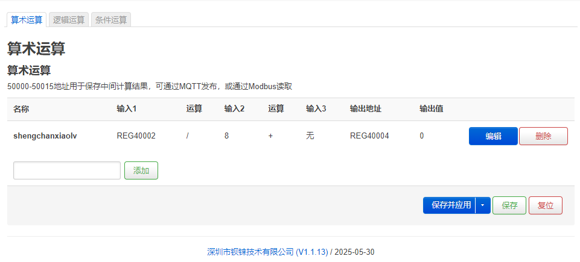

示例算术运算配置

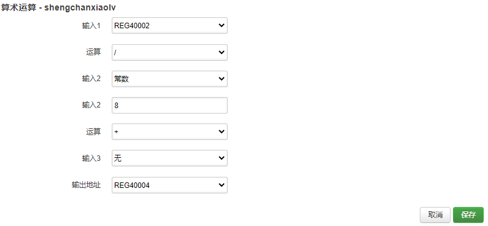

示例算术运算配置说明

步骤说明：（1）输入名称“shengchanxiaolv”，点击添加，弹出配置框。（2）输入1：选择产量寄存器REG40002。（3）运算：选择“/”，根据需求选择，这里可以选择“加减乘除”。（4）输入2：选择常数，根据需求选择，这可以选择其他寄存器地址。（5）输入2：因选择常数，故要填写常数，如果选择的是寄存器，没有这项。（6）运算：根据是否还有条件3选择，没有则随意。（7）输入3：选择“无”，因不需要这个条件选项，故选择“无”，这根据需求选择，可以选择寄存器、常数、无。（8）输出地址：选择运算结果存储到寄存器地址。（9）点击“保存”。（10）点击“保存并应用”写进BL192Pro。

### 云平台

#### 私有云(钡铼云和自定义云)

点击“云平台”-“私有云”，进入云平台设置界面。

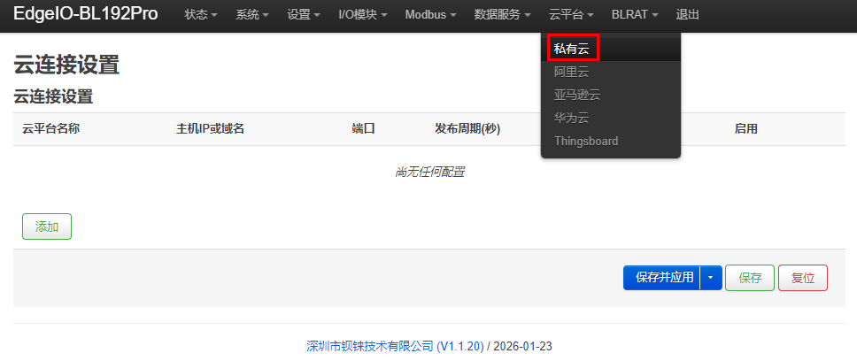

点击“添加”，云平台选择项选择“钡铼云V2”，弹出钡铼云MQTT配置。

钡铼云设置

| 钡铼云连接设置 |  |
| --- | --- |
| 项目 | 说明 |
| 云平台 | 选择“钡铼云V2” |
| MQTT客户端ID | 填写钡铼云序列号，联系销售提供。 |
| 发布周期 | MQTT数据上传间隔周期 |
| 启用数据补传 | 是否启用离线数据补传功能 |
| 数据变化时发布 | 是否启用IO模块数据或从机数据有变化时发布。 |
| 取消 | 取消钡铼云配置 |
| 保存 | 保存钡铼云配置 |

注意：配置钡铼云，点击“保存”后，还要点击“编辑”打开配置界面，再次点击“保存”，正常显示如下图。

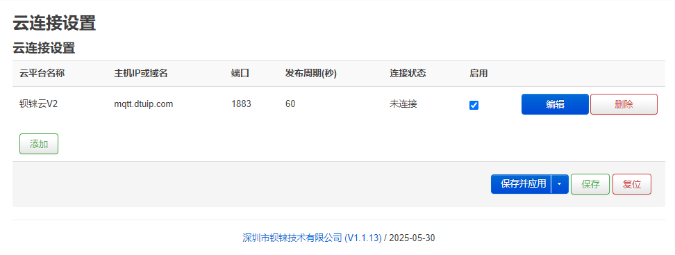

点击“添加”，云平台选择项选择“私有云”，就是配置自定义MQTT平台，MQTT数据格式有默认数据格式既是钡铼云格式和自定义的数据格式。

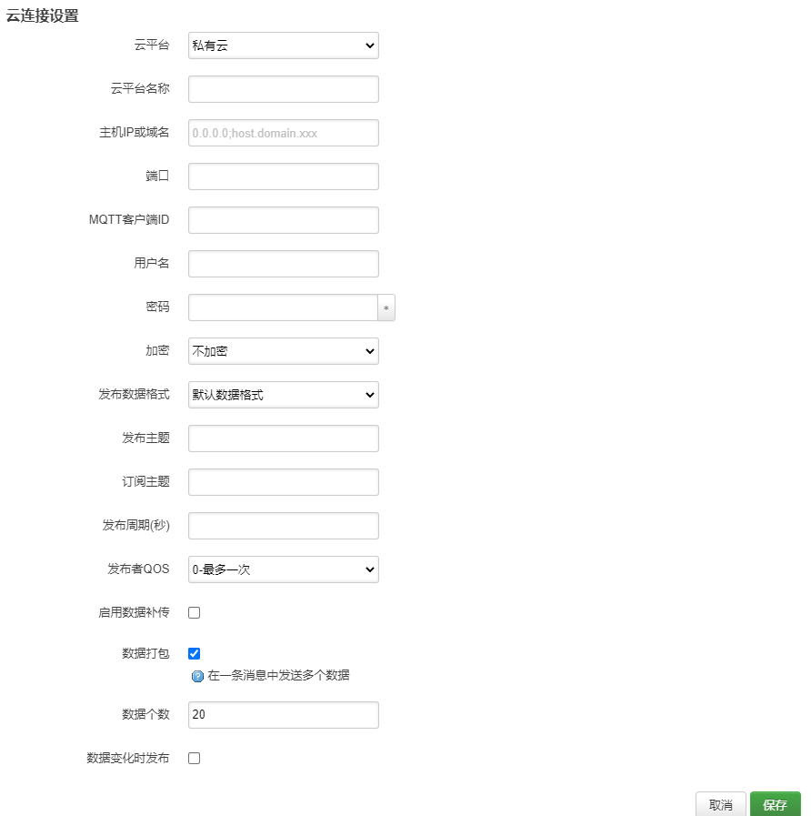

私有云设置

| 私有云连接设置 |  |
| --- | --- |
| 项目 | 说明 |
| 云平台 | 选择“私有云” |
| 云平台名称 | 自定义云平台名称 |
| 主机IP或域名 | 填写MQTT服务器IP或域名 |
| 端口 | 填写MQTT服务器端口号 |
| MQTT客户端ID | MQTT连接报文用到的客户端标识符，服务端使用客户端标识符识别客户端。 |
| 用户名 | MQTT连接报文用到的用户名，服务端可以将它用于身份验证和授权。 |
| 密码 | MQTT连接报文用到的密码，服务端可以将它用于身份验证和授权。 |
| 加密 | “不加密”、“加密（根证书）”、“加密（自签名）”选择 |
| 发布数据格式 | “默认数据格式”、“自定义数据格式”选择 |
| 发布主题 | MQTT发布报文用到的主题名，主题名用于识别有效载荷数据应该被发布到哪一个信息通道 |
| 订阅主题 | MQTT订阅报文用到的主题名，订阅后服务器可以向客户端发送发布报文实现控制。 |
| 发布周期 | MQTT数据发布间隔时间 |
| 发布者QOS | 发布服务质量“0-最多一次”、“1-至少一次”、“2-仅有一次”选择 |
| 启用数据补传 | 是否启用掉线数据补传 |
| 数据打包 | 是否启用数据打包，不启用是一条信息一个数据点发 |
| 数据个数 | 一条信息中发布多个数据点个数 |
| 数据变化时发布 | 是否启用数据有变化时发布 |
| 取消 | 取消自定义MQTT平台配置 |
| 保存 | 保存自定义MQTT平台配置 |

“发布数据格式”项选择“自定义数据格式”，弹出自定义数据格式编辑界面，点击“数据格式示例”可以查看编辑示例，编辑内容要符合JSON数据格式，订阅主题是发布主题/，编辑完成后要点击一下编辑框外空白地方。

#### 阿里云

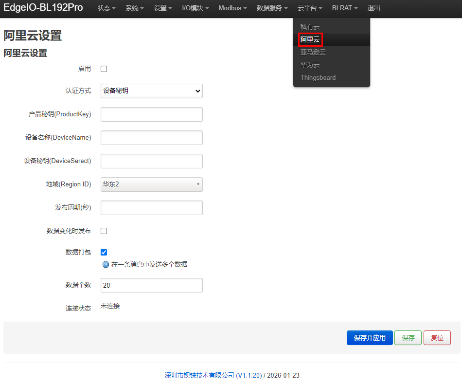

阿里云设置

| 阿里云连接设置 |  |
| --- | --- |
| 项目 | 说明 |
| 启用 | 勾选启用 |
| 认证方式 | 设备秘钥、X509证书 |
| 产品秘钥(ProductKey) | 设置阿里云上的产品秘钥 |
| 设备名称(DeviceName) | 设置阿里云上的设备名称 |
| 设备秘钥(DeviceSerect) | 设置阿里云上的设备秘钥 |
| 地域(Region ID) | 选择阿里云地域，需要填写IP地址的可以在自定义处填写。 |
| 发布周期（秒） | 需大于60秒 |
| 认证授权（根证书） | 选择文件上传，认证方式选择X509证书才显示 |
| 本地证书 | 选择文件上传，认证方式选择X509证书才显示 |
| 本地秘钥 | 选择文件上传，认证方式选择X509证书才显示 |
| 数据变化时发布 | 是否启用只有在周期内有变化的数据才发布 |
| 数据打包 | 是否启用数据打包，不启用是一条信息一个数据点发 |
| 数据个数 | 一条信息中发布多个数据点个数 |
| 连接状态 | 点击“保存并应用”后，可以在这显示是否连接阿里云成功 |

阿里云设备创建证书创建和详情参考：阿里云帮助文档指南

#### 亚马逊云

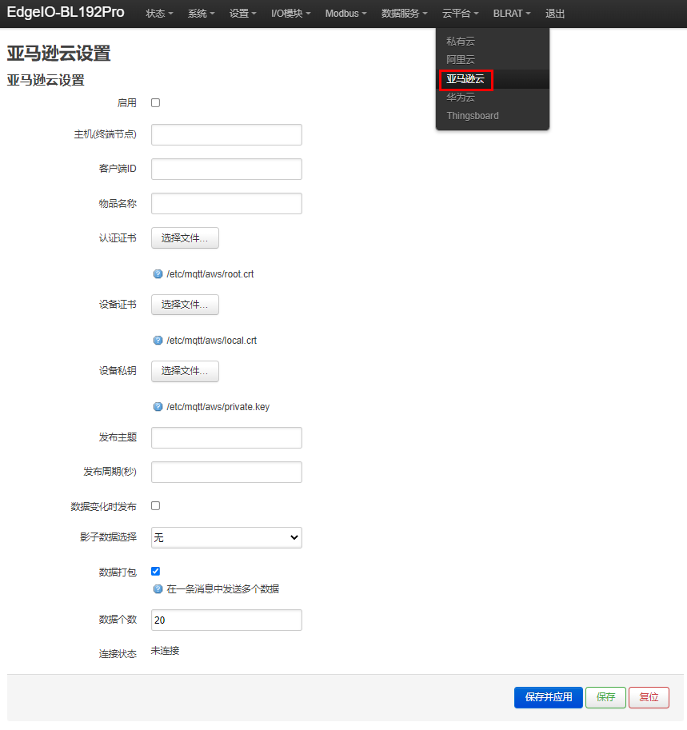

亚马逊云设置

| 亚马逊云连接设置 |  |
| --- | --- |
| 项目 | 说明 |
| 启用 | 勾选启用 |
| 主机（终端节点） | 设置终端节点 |
| 客户端ID | MQTT连接报文用到的客户端标识符，服务端使用客户端标识符识别客户端，连接服务端的每个客户端都有唯一的客户端标识符。 |
| 物品名称 | 设置物品名称 |
| 认证证书（根证书） | 选择文件上传 |
| 设备证书 | 选择文件上传 |
| 设备私钥 | 选择文件上传 |
| 发布主题 | MQTT发布报文用到的主题名，主题名用于识别有效载荷数据应该被发布到哪一个信息通道，发布报文中的主题名不能包含通配符。 |
| 发布周期（秒） | 需大于60秒 |
| 数据变化时发布 | 勾选启用功能是否启用只有在周期内有变化的数据才发布 |
| 影子数据选择 | 影子下发控制数据点选择，从“无”、“全部数据”、“选择数据点”中选择 |
| 数据打包 | 是否启用数据打包，不启用是一条信息一个数据点发 |
| 数据个数 | 一条信息中发布多个数据点个数 |
| 连接状态 | 点击“保存并应用”后，可以在这显示是否连接亚马逊成功 |

亚马逊设备创建证书创建设备接入请参考：亚马逊入门文档教程

#### 华为云

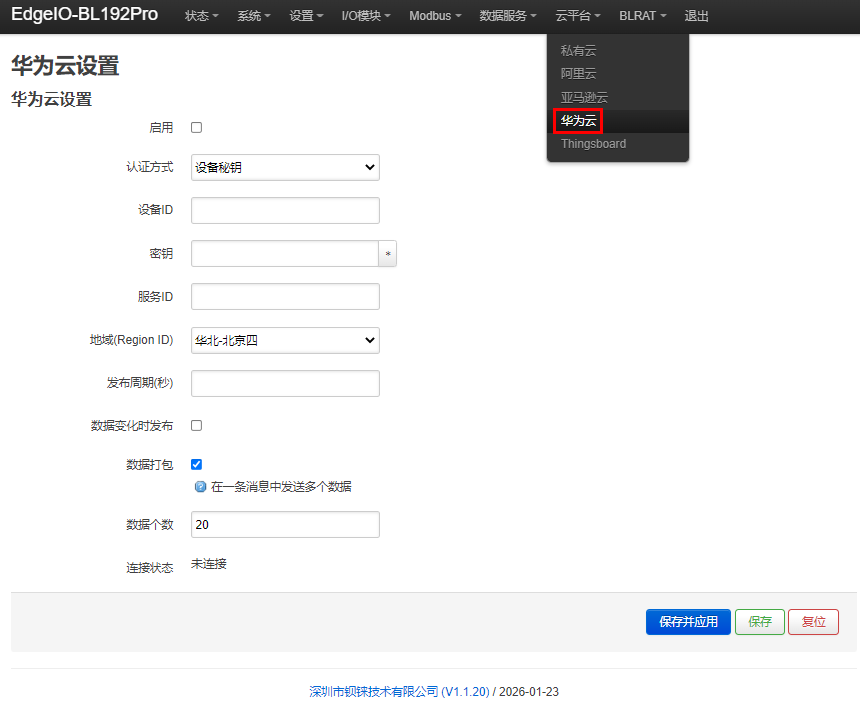

华为云设置

| 华为云连接设置 |  |
| --- | --- |
| 项目 | 说明 |
| 启用 | 勾选启用 |
| 认证方式 | 可选择设备秘钥方式和认证证书方式，认证证书方式需要上传证书 |
| 设备ID | 华为云创建设备时生成的设备ID |
| 密钥 | 华为云创建设备时输入的密码 |
| 服务ID | 产品需要创建服务才能上报数据 |
| 地域(Region ID) | 设备所在地域，可在华为云平台上查询，选择其他可以填写IP地址 |
| 发布周期（秒） | 需大于60秒 |
| 认证授权（根证书） | 华为提供的根证书，认证方式选择X509证书才显示 |
| 设备证书 | 设备证书deviceCert.pem，上传到/etc/conf目录并选定文件，可参考华为云帮助文档创建测试证书，认证方式选择X509证书才显示 |
| 设备秘钥 | 设备秘钥/deviceCert.key，上传到/etc/conf目录并选定文件，可参考华为云帮助文档创建测试证书，认证方式选择X509证书才显示 |
| 数据变化时发布 | 勾选启用功能是否启用只有在周期内有变化的数据才发布 |
| 数据打包 | 是否启用数据打包，不启用是一条信息一个数据点发 |
| 数据个数 | 一条信息中发布多个数据点个数 |
| 连接状态 | 点击“保存并应用”后，可以在这显示是否连接华为云成功 |

华为云产品创建设备注册和接入的步骤请参考华为云的帮助文档。

#### Thingsboard

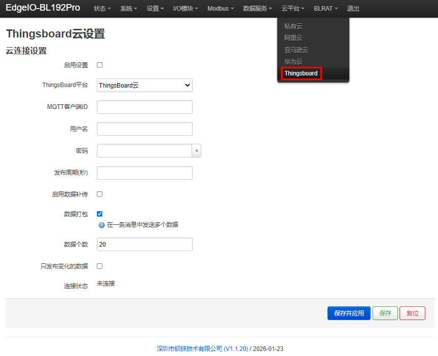

Thingsboard设置

| Thingsboard连接设置 |  |
| --- | --- |
| 项目 | 说明 |
| 启用设置 | 勾选启用平台 |
| ThingsBoard平台 | 从“ThingsBoard云”、“其他ThingsBoard服务器”中选择 |
| MQTT客户端ID | MQTT连接报文用到的客户端标识符，服务端使用客户端标识符识别客户端。 |
| 用户名 | MQTT连接报文用到的用户名，服务端可以将它用于身份验证和授权。 |
| 密码 | MQTT连接报文用到的密码，服务端可以将它用于身份验证和授权。 |
| 发布周期（秒） | 需大于60秒 |
| 启用数据补传 | 勾选启用数据补传功能 |
| 数据打包 | 是否启用数据打包，不启用是一条信息一个数据点发 |
| 数据个数 | 一条信息中发布多个数据点个数 |
| 只发布变化的数据 | 勾选启用功能是否启用只有在周期内有变化的数据才发布 |
| 连接状态 | 点击“保存并应用”后，可以在这显示是否连接Thingsboard云成功 |

Thingsboard云设备创建和接入请参考Thingsboard入门文档

### BLRAT

BLRAT（Beilai Remote Access Tool）是钡铼技术自主研发的一款专门为远程访问的工具，是钡铼技术BLRMS远程平台下的一个子服务。在EdgeIO控制器系列中BLRAT可以远程固件升级及参数配置。在EdgeIO控制器系列配置端只需点击启用，填写设备密钥。设备密钥是在BLRMS远程平台的通讯秘钥token码，每个注册用户的token码是唯一的。BLRAT使用操作请参考BLRAT使用说明书。

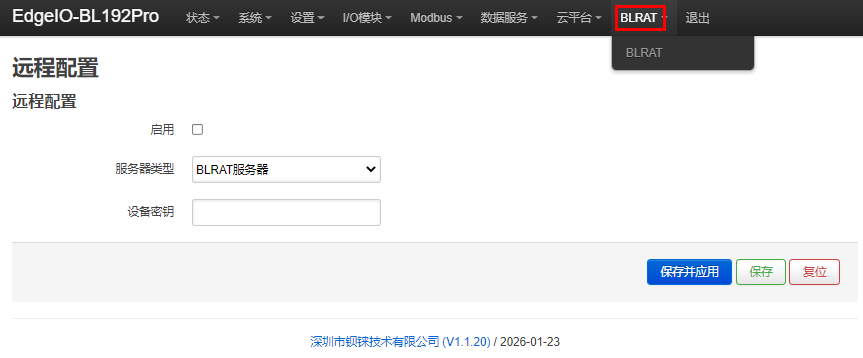

# EdgeIO控制器通信示例

## BL192 MQTT协议边缘I/O控制器示例

### 连接自定义MQTT云配置

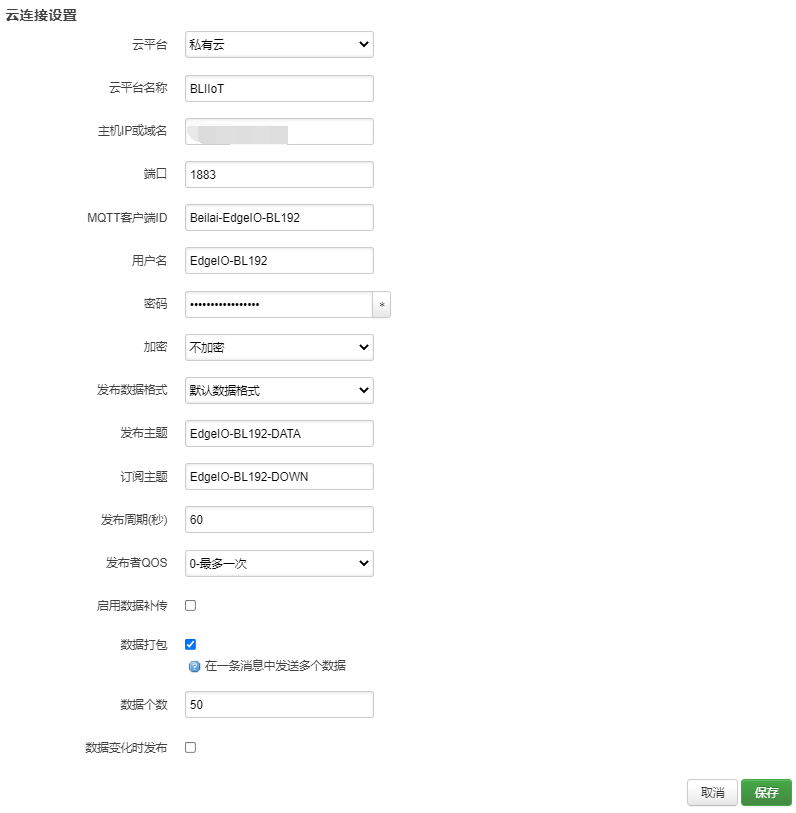

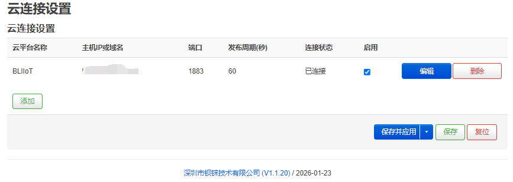

操作说明：1、点击“云平台”-“私有云”，进入云平台配置界面。2、点击“添加”按钮，弹出云平台配置框。3、配置云平台各项配置，各项说明参考4.8.8.1私有云(钡铼云和自定义云)。4、点击“保存”，保存配置。5、点击“保存并应用”，把配置下发到BL192，查看连接状态，可以查看是否连接成功。

### 用MQTT.fx查看和下发数据

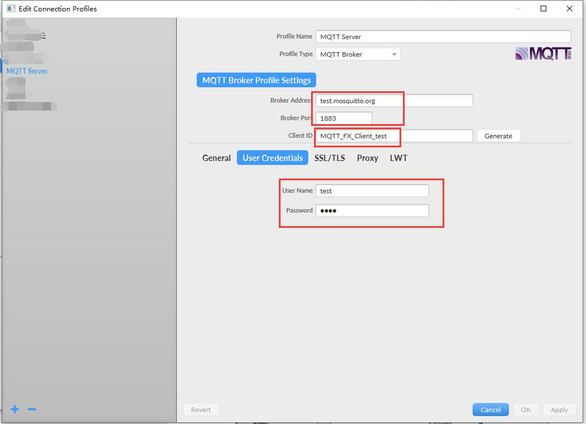

注：Client ID不能和BL192上填写的客户端ID相同。

点击“connect”，订阅BL192上自定义MQTT云配置的发布主题“EdgeIO-BL192-DATA”，示例数据是BL192-Y11-Y22-Y36、 RS485从机全部数据如下图。标识符说明和数据格式参考说明5.1.11.1设备发布数据格式。

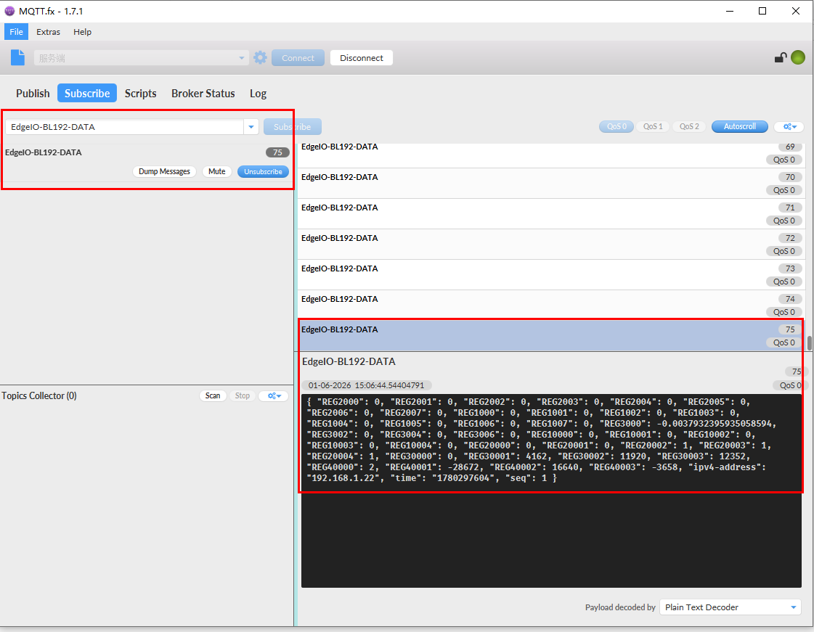

MQTT.fx发布控制BL192，发布主题是BL192自定义MQTT云配置的订阅主题“EdgeIO-BL192-DOWN”数据格式参考5.1.11.2设备订阅数据格式。

下发控制DO1闭合，既是REG1000为“1”，串口采集的数据，REG10001为“1”，REG40000为“8”。

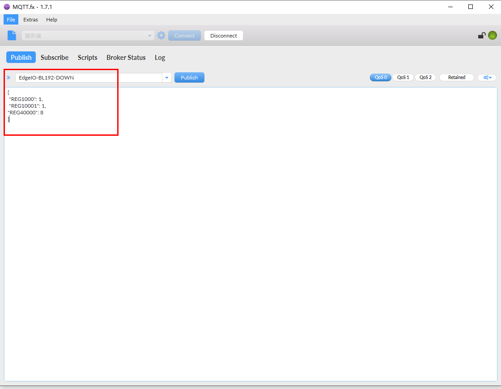

### 连接阿里云配置

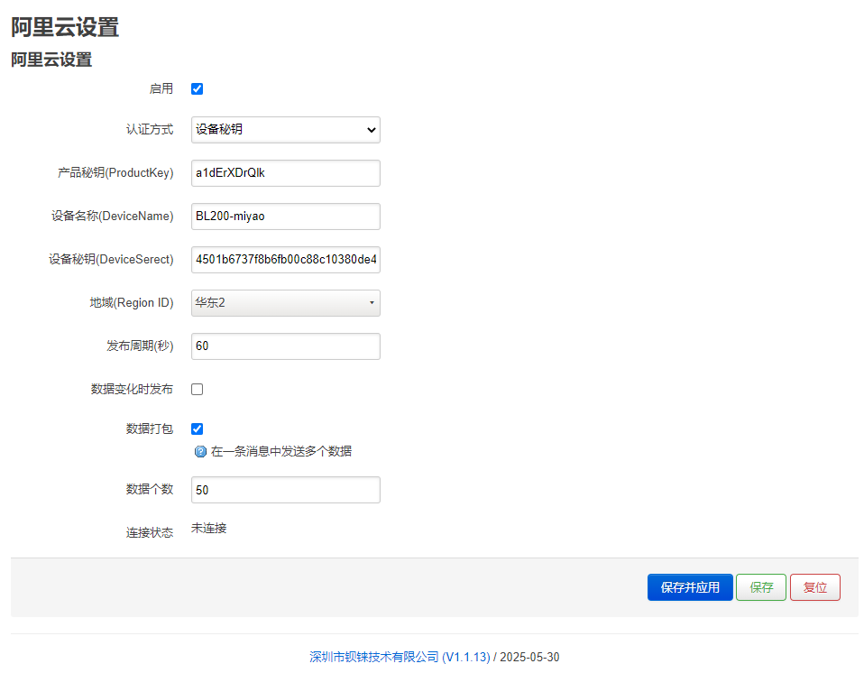

操作说明：1、点击“云平台”-“阿里云”，进入阿里云配置界面。2、点击“启用”，认证方式选择“设备秘钥”。3、“产品秘钥”、“设备名称”、 “设备秘钥”和阿里云平台设备证书的内容一致。4、地域选择华东2，发布周期填写60s，数据打包50个每包，自定义。5、点击“保存并应用”，把配置下发到BL192。连接状态可以查看是否连接成功。

### 阿里云平台查看和下发数据

登录阿里云，点击“物模型数据”查看数据，数据点读写标识可以参考5.1.11.1设备发布数据格式说明。本机I/O和串口从机部分数据如下：

数据下发：I/O REG1003 闭合，串口从机REG4000由“1”改为“20”。

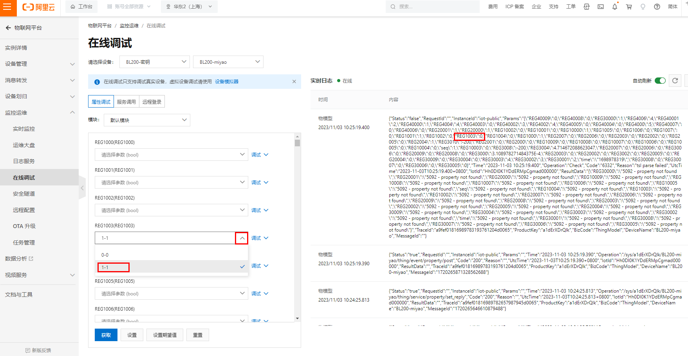

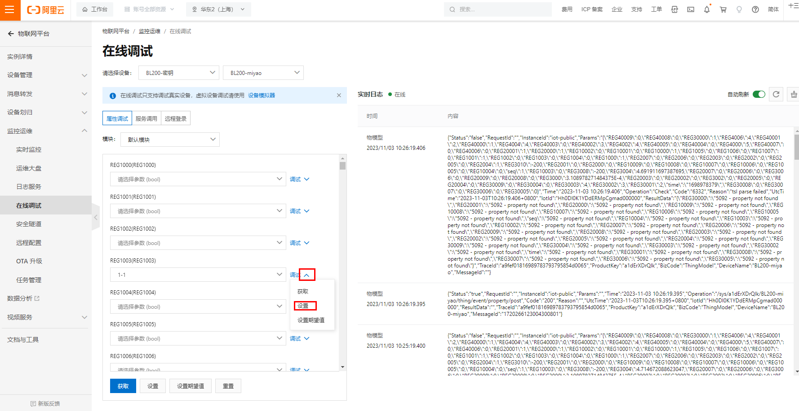

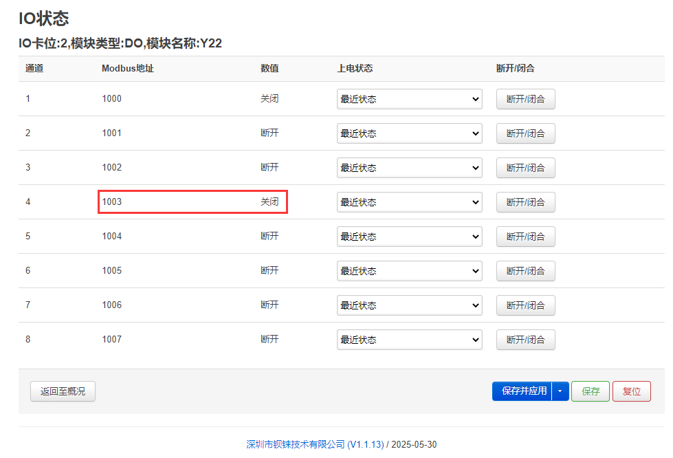

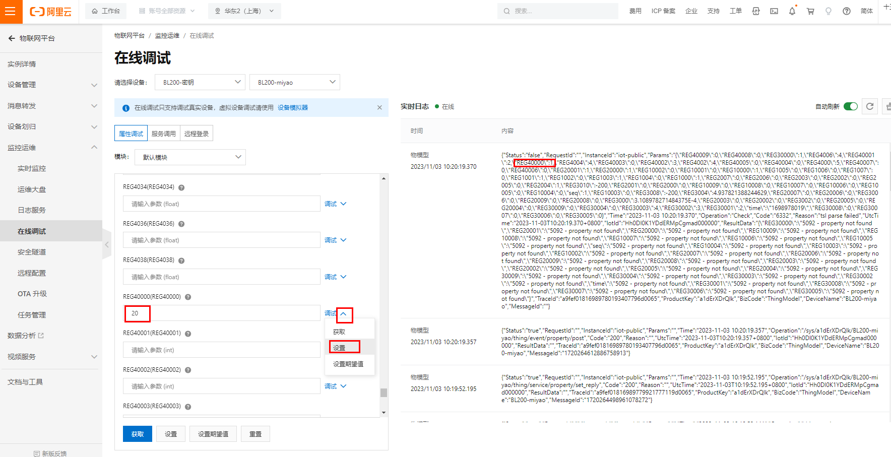

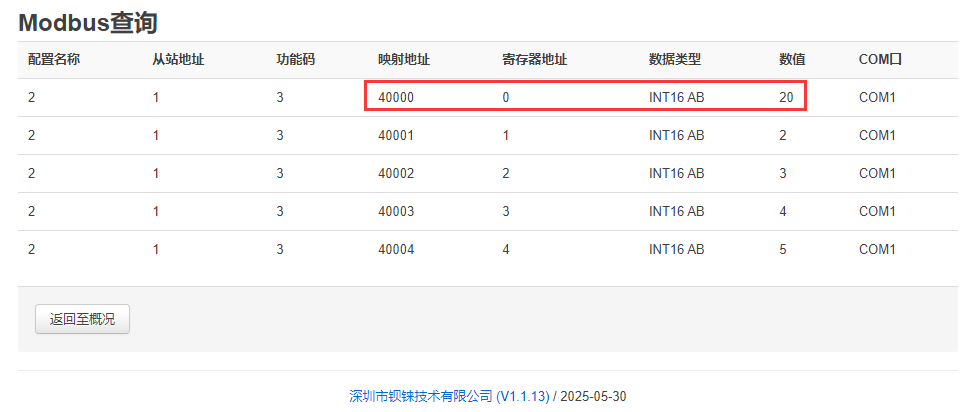

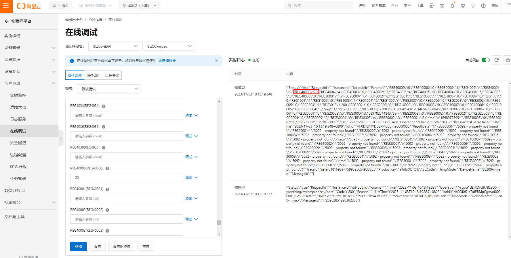

### 连接亚马逊云配置

操作说明：1、点击“云平台”-“亚马逊云”，进入亚马逊云配置界面。2、点击“启用”。3、终端节点：填写和亚马逊云平台的“设置”-“设备数据终端节点”的终端节点一致。

4、客户端ID：填写用户ID，物品名称：填写亚马逊平台创建物品时的名称。5、认证证书、设备证书、设备私钥是上传亚马逊平台创建物品时生成的证书，从亚马逊平台下载。上传操作方法：点击“选择文件”-“上传文件”，找到你存放的证书，点击证书，点击弹出窗口的打开按键，点击配置界面的“上传文件”上传到配置方框，在方框内选择你需要的证书点击。6、发布主题：填写亚马逊平台规则配置的主题，如iot/topic。7、发布周期：60s。8、影子数据选择：是亚马逊平台影子下发控制BL192，不需要下发控制，选择“无” ，下发控制数据可以选择全部数据支持或个别数据可以控制。9、数据打包50个每包，自定义。10、点击“保存并应用”，把配置下发到BL192，连接状态可以查询是否连接成功。

### 亚马逊云平台查看和下发数据

点击“MQTT测试客户端”订阅BL192亚马逊云配置的发布主题“iot/topic”。

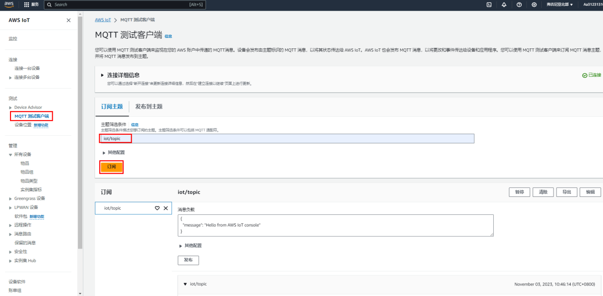

影子下发控制REG1000闭合，从机REG40000由“1”改为“20”。

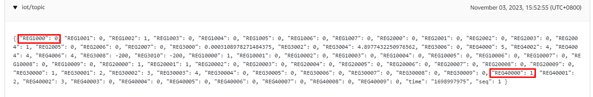

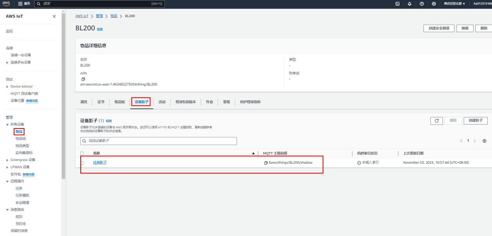

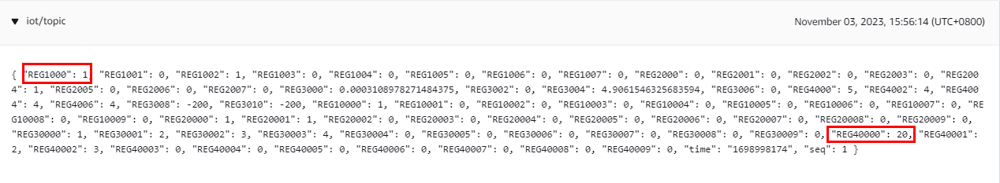

### 连接华为云配置

操作说明：1、点击“云平台”-“华为云”，进入华为云配置界面。2、点击“启用”，认证方式选择“设备秘钥”。3、设备ID与华为云平台设备ID一致，密钥是华为云平台创建设备输入的密码。4、服务ID与华为云平台创建产品时的服务ID一致。5、地域：选择华北-北京四，选择其他可以填写IP地址。6、发布周期：60s。7、数据打包50个每包，自定义。8、点击“保存并应用”，把华为云配置下发到BL192，连接状态可以查询是否连接成功。

### 华为云平台查看和下发数据

登录华为云，点击“设备”-“设备信息”查看数据，点击“查看全部属性”或“设备影子”也可查看数据，数据点读写标识可以参考5.1.11.1设备发布数据格式说明。本机I/O和串口从机部分数据如下：

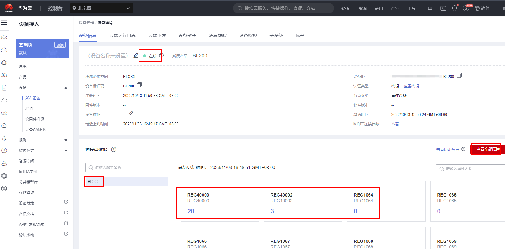

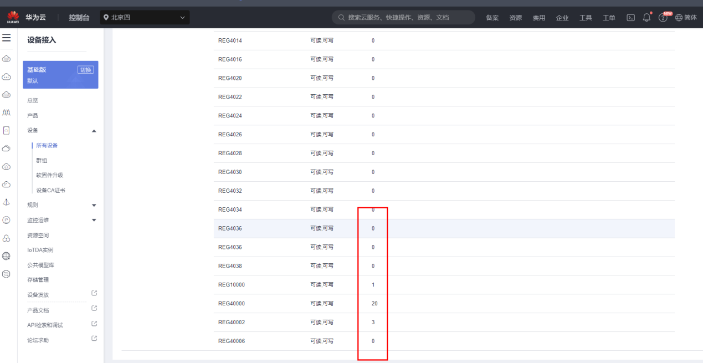

影子下发：控制REG1000闭合、REG1001断开、 REG1002断开。影子下发控制AO和控制DO同原理，需要输出多少数值，填写数值就可以，AO下发控制不做演示。BL192华为云暂时不支持消息下发和命令下发方式控制。

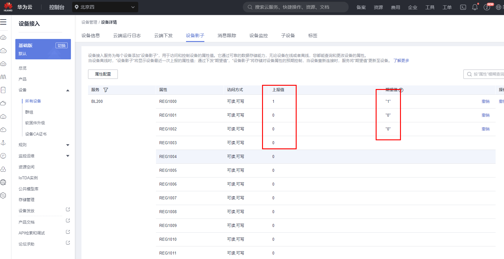

### 连接thingsboard配置

Thingsboard云连接的是专业版云服务，域名为：thingsboard.cloud，即是北美地区。连接其他thingsboard云平台选择“其他thingsboard服务器”。

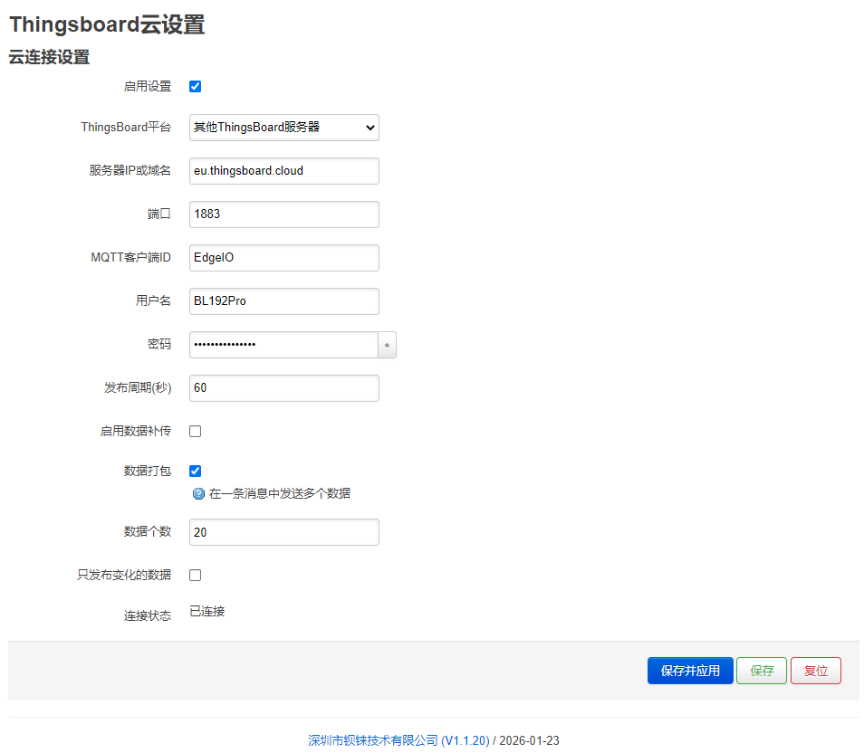

操作说明：1、点击“云平台”-“Thingsboard”，进入thingsboard云配置界面。2、点击“启用”，ThingsBoard平台选择“其他ThingBboard服务器”。3、填写服务器IP或域名和端口。4、MQTT客户端ID、用户名、密码填写与thingsboard平台创建设备时选择MQTT Basic填写的内容一致。5、发布周期：60s。6、数据打包20个每包，自定义。7、点击“保存并应用”把thingsboard云配置下发到BL192，连接状态可以查询是否连接成功。

### Thingsboard平台查看和下发数据

下发控制只支持本机I/O，不支持从机数据。

下发控制：如控制DO（REG1000）闭合，AO（REG4000）：8.08。从机数据不支持下发控制，仪表盘不支持获取数据。

下发控制格式：setValue-modbus地址，如setValue-1000。

### 钡铼MQTT报文格式

#### 设备发布数据格式

如果在配置时勾选了数据打包将会在一条消息中发送多个I/O数据点（数据点很多时会分开发送多条消息，每条消息包含多个数据点），不勾选时一条消息只对应一个I/O数据点，两种发布格式有少许区别，需要注意。

设备发布消息中有效载荷数据格式（数据打包）

MQTT发布数据格式

| 发布主题：对应配置的发布主题设置项 |
| --- |
| { "REG1000": 1, //本机DO读写标识和值 "REG2000": 1, //本机DI读写标识和值 "REG3000": 2, //本机AI读写标识和值 "REG4000": 3, //本机AO读写标识和值 "REG10000": 1, //串口采集从机01功能码读写标识和值 "REG20000": 1, //串口采集从机02功能码读写标识和值 "REG30000": 8, //串口采集从机04功能码读写标识和值 "REG40000": 10, //串口采集从机03功能码读写标识和值 "ipv4-address": "192.168.3.2", //本机IP地址 "time": "1698910380", //时间标识，数据发布时间戳UTC格式 "seq": 1 //数据包数，第几包 "retransmit":"enable"//重传标识，表示历史数据（重传历史数据才有此标识，实时数据无此标识） } |

注：

本机I/O数据点读写标识：

MQTT本机I/O标识符

| 数据名称 | 读写标识 | 数据类型 | 说明 |
| --- | --- | --- | --- |
| 开关量输出DO | REG1000~1999 | Switcher | 0为断开，1为闭合 |
| 开关量输入DI | REG2000~2999 | Switcher | 0为断开，1为闭合 |
| 模拟量输入AI | REG3000~3999 | Value | 真实值=原值 |
| 模拟量输出AO | REG4000~4999 | Value | 真实值=原值 |

串口模块从机I/O数据点读写标识：

MQTT从机数据点标识符

| 数据名称 | 读写标识 | 数据类型 | 说明 |
| --- | --- | --- | --- |
| 线圈状态 | REG10000~19999 | Switcher | 根据从机数据定义 |
| 输入线圈 | REG20000~29999 | Switcher | 根据从机数据定义 |
| 保持寄存器 | REG40000~49999 | Value | 根据从机数据定义 |
| 输入寄存器 | REG30000~39999 | Value | 根据从机数据定义 |

#### 设备订阅数据格式

设备订阅消息中有效载荷数据格式

MQTT下发数据格式

| 订阅主题：对应配置的订阅主题设置项 （钡铼2.0下行发布报文用的主题名为“序列号/传感器ID”，所以设备订阅主题需要加上通配符“/+”，这样才能收到平台下发数据实现控制） |
| --- |
| { "REG1000":1,  //本机DO下发控制 "REG4000":5,  //本机AO下发控制 "REG10001": 1, //串口从机DO下发控制 "REG40008":8  //串口从机AO下发控制 } |

## BL192Pro工业物联网边缘I/O控制器通信示例

BL192Pro支持Modbus TCP、OPC UA、MQTT连接。MQTT连接通信示例可以参考BL192的通信示例。

### Modbus TCP通信示例

#### 概述

Modbus 是一种独立于制造商的开放式现场总线标准协议，适用于制造和过程自动化中的各种应用。

MODBUS 是一种应用层消息传递协议，位于 OSI 模型的第 7 层，可以在不同类型的总线或网络上连接的设备之间进行客户端/服务器通信。

几种常用的网络如下：

TCP/IP over Ethernet。

多种媒体异步串行传输（有线：EIA/TIA-232-E、EIA-422、EIA/TIA-485-A；光纤、无线电等）。

MODBUS PLUS，高速令牌。

MODBUS 是一种请求/应答协议，提供由功能代码指定的服务。

MODBUS 协议允许在所有类型的网络架构内轻松通信。

Modbus 网络架构

MODBUS 协议定义了一个独立于底层通信层的简单协议数据单元 (PDU)。 MODBUS 协议在特定总线或网络上的映射可以在应用数据单元（ADU）上引入一些附加字段。

Modbus 数据帧

更多关于 Modbus 开放协议规范的细节可以在网站www.modbus.org查看。

#### Modbus TCP

Modbus TCP协议是Modbus协议的一种变体，该协议经过优化，可通过TCP/IP连接进行通信。该协议设计用于现场级的数据交换（即用于过程映像中的 I/O 数据交换）。在服务端，所有数据包都通过端口号为 502 的 TCP 连接发送。

一般 Modbus TCP 报文如下：

Modbus TCP 报文

| 字节 | 0 | 1 | 2 | 3 | 4 | 5 | 6 | 7 | 8 - n |
| --- | --- | --- | --- | --- | --- | --- | --- | --- | --- |
| 定义 | 事务标识符 | 协议标识符 (始终为00) | 字段长度 | 从机地址 | Modbus 功能码 | 数据 |  |  |  |

#### Modbus数据编码

MODBUS对地址和数据项使用“大端”表示。这意味着当传输大于单个字节的数字量时，首先发送最高有效字节。

#### Modbus数据类型

modbus协议基于以下基础数据类型：

Modbus基础数据类型

| 数据类型 | 对象类型 | 访问类型 | 描述 |
| --- | --- | --- | --- |
| 数字输入 | 1 bit | 只读 | 数字输入 |
| 线圈 | 1 bit | 读/写 | 数字输出 |
| 输入寄存器 | 16 bit (word) | 只读 | 模拟输入 |
| 保持寄存器 | 16 bit (word) | 读/写 | 模拟输出 |

对于每个基础数据类型，都定义了一个或多个功能码。这些功能码允许数字或模拟的输入和输出数据，以及内部变量被设置或直接从现场总线节点中读取。

#### Modbus 功能码描述

BL192Pro 现场总线节点支持的功能码如下表所示，要执行所需的功能，请指定各自的功能码和所选的输入或输出通道或寄存器的地址。

Modbus功能码列表

| 功能码 | 功能 | 访问类型 | 描述 |
| --- | --- | --- | --- |
| 0x02 | 读数字输入 | 只读 | 按1 bit 访问 |
| 0x01 | 读线圈 | 读/写 |  |
| 0x05 | 写单个线圈 | 读/写 |  |
| 0x0F | 写多个线圈 | 读/写 |  |
| 0x04 | 读输入寄存器 | 只读 | 按16 Bit访问 |
| 0x03 | 读多个寄存器 | 读/写 |  |
| 0x06 | 写单个寄存器 | 读/写 |  |
| 0x10 | 写多个寄存器 | 读/写 |  |

MODBUS 功能执行如下：

MODBUS TCP 主站（例如PC）使用特定功能码向BL192Pro现场总线节点发出请求；

BL192Pro现场总线节点接收数据报文，然后根据主站的请求，以正确的数据响应主站。

如果现场总线节点收到不正确的请求，它会向主站发送错误数据报文（异常）。

异常中包含的异常代码含义如下：

Modbus异常代码

| 异常代码 | 描述 |
| --- | --- |
| 0x01 | 非法功能 |
| 0x02 | 非法数据地址 |
| 0x03 | 非法数据值 |
| 0x04 | 从机设备故障 |

#### 功能码0x02（读数字输入）

此功能码用于读取单个或多个数字输入连续状态。

请求

该请求指定了起始地址和要读取的数量。

功能码0x02-请求报文

| 字段名称 | 字节数 | 示例 | 说明 |
| --- | --- | --- | --- |
| 事务标识符 | 2 Byte | 0x00 01 | Modbus请求/响应事务处理的识别 |
| 协议标识符 | 2 Byte | 0x00 00 | 0x00 00 ：Modbus协议 |
| 报文长度 | 2 Byte | 0x00 06 | 后面数据的字节数 |
| 设备地址 | 1 Byte | 0x01 | 从站的地址识别 |
| 功能码 | 1 Byte | 0x02 | 读数字输入，用功能码0x02 |
| 起始地址 | 2 Byte | 0x07 D0 | 地址详见“Modbus 寄存器映射”章节 |
| 输入数量 | 2 Byte | 0x08 | 读 8 个数字输入 |

响应

数据字段表明了输入状态的值。二进制1对应开启状态，0对应关闭状态。第一个数据字节的最低有效位（LSB）包含请求的第一位，其他的则按升序排列。如果响应数据不是8的倍数，则最后一个数据字节的其余位将填充零（朝向字节的高位）。

功能码0x02-响应报文

| 字段名称 | 字节（Byte） | 示例 | 说明 |
| --- | --- | --- | --- |
| 事务标识符 | 2 Byte | 0x00 01 | Modbus请求/响应事务处理的识别 |
| 协议标识符 | 2 Byte | 0x00 00 | 0x00 00 ：Modbus协议 |
| 报文长度 | 2 Byte | 0x00 04 | 后面数据的字节数 |
| 设备地址 | 1 Byte | 0x01 | 从站的地址识别 |
| 功能码 | 1 Byte | 0x02 | 读数字输入，用功能码0x02 |
| 数据字节数 | 1 Byte | 0x01 | 数据的字节数 |
| 数据 | 1 Byte | 0x89 | 响应的数据 |

异常

功能码0x02-响应异常

| 字段名称 | 字节（Byte） | 示例 | 说明 |
| --- | --- | --- | --- |
| … |  |  |  |
| 功能码 | 1 Byte | 0x82 | Modbus功能码 + 0x80 |
| 异常编码 | 1 Byte | 0x01 | 0x01 或 0x02 |

示例

从地址2000到2007读8个数字输入的值。

请求

0x00 01 00 00 00 06 01 02 07 D0 00 08

功能码0x02-请求报文-示例

| Byte | 1 | 2 | 3 | 4 | 5 | 6 | 7 | 8 | 9 | 10 | 11 | 12 |
| --- | --- | --- | --- | --- | --- | --- | --- | --- | --- | --- | --- | --- |
| Data | 00 01 | 00 00 | 00 06 | 01 | 01 | 07 D0 | 00 08 |  |  |  |  |  |
| 说明 | 事务标识符 | 协议标识符 | 报文长度 | 设备地址 | 功能码 | 起始地址 | 线圈数量 |  |  |  |  |  |

响应

0x00 01 00 00 00 04 01 02 01 89

功能码0x02-响应报文-示例

| Byte | 1 | 2 | 3 | 4 | 5 | 6 | 7 | 8 | 9 | 10 |
| --- | --- | --- | --- | --- | --- | --- | --- | --- | --- | --- |
| Data | 00 01 | 00 00 | 00 04 | 01 | 01 | 01 | 89 |  |  |  |
| 说明 | 事务标识符 | 协议标识符 | 报文长度 | 设备地址 | 功能码 | 数据字节数 | 数据 |  |  |  |

从2007到2000的状态显示为字节值0x89或二进制1000 1001。地址2007是该字节最高有效位MSB，2000是最低有效位LSB，从高位到低位的分布如下：

数字输入数据

| Bit | 7 | 6 | 5 | 4 | 3 | 2 | 1 | 0 |
| --- | --- | --- | --- | --- | --- | --- | --- | --- |
| 地址 | 2007 | 2006 | 2005 | 2004 | 2003 | 2002 | 2001 | 2000 |
| 状态 | 1 | 0 | 0 | 0 | 1 | 0 | 0 | 1 |
| 说明 | 闭合 | 断开 | 断开 | 断开 | 闭合 | 断开 | 断开 | 闭合 |

#### 功能码0x01（读线圈）

此功能码用于读取远程设备中单个或多个线圈的连续状态。

请求

该请求指定了起始地址，即指定第一个线圈的地址，以及线圈的数量。

功能码0x01-请求报文

| 字段名称 | 字节数 | 示例 | 说明 |
| --- | --- | --- | --- |
| 事务标识符 | 2 Byte | 0x00 01 | Modbus请求/响应事务处理的识别 |
| 协议标识符 | 2 Byte | 0x00 00 | 0x00 00 ：Modbus协议 |
| 报文长度 | 2 Byte | 0x00 06 | 后面数据的字节数 |
| 设备地址 | 1 Byte | 0x01 | 从站的地址识别 |
| 功能码 | 1 Byte | 0x01 | 读线圈，用功能码0x01 |
| 起始地址 | 2 Byte | 0x03 E8 | 地址详见“Modbus 寄存器映射”章节 |
| 线圈数量 | 2 Byte | 0x00 08 | 读 8 个线圈状态 |

响应

数据字段表明了输入状态的值。二进制1对应开启状态，0对应关闭状态。第一个数据字节的最低有效位（LSB）包含请求的第一位，其他的则按升序排列。如果响应数据不是8的倍数，则最后一个数据字节的其余位将填充零（朝向字节的高位）。

功能码0x01-响应报文

| 字段名称 | 字节（Byte） | 示例 | 说明 |
| --- | --- | --- | --- |
| 事务标识符 | 2 Byte | 0x00 01 | Modbus请求/响应事务处理的识别 |
| 协议标识符 | 2 Byte | 0x00 00 | 0x00 00 ：Modbus协议 |
| 报文长度 | 2 Byte | 0x00 04 | 后面数据的字节数 |
| 设备地址 | 1 Byte | 0x01 | 从站的地址识别 |
| 功能码 | 1 Byte | 0x01 | 读线圈，用功能码0x01 |
| 数据字节数 | 1 Byte | 0x01 | 数据的字节数 |
| 数据 | 1 Byte | 0x89 | 响应的数据 |

异常

功能码0x01-异常

| 字段名称 | 字节（Byte） | 示例 | 说明 |
| --- | --- | --- | --- |
| … |  |  |  |
| 功能码 | 1 Byte | 0x81 | Modbus功能码 + 0x80 |
| 异常编码 | 1 Byte | 0x01 | 0x01 或 0x02 |

示例

从地址1000到1007读8个线圈的状态值。

请求

0x00 01 00 00 00 06 01 01 03 E8 00 08

功能码0x01-请求报文-示例

| Byte | 1 | 2 | 3 | 4 | 5 | 6 | 7 | 8 | 9 | 10 | 11 | 12 |
| --- | --- | --- | --- | --- | --- | --- | --- | --- | --- | --- | --- | --- |
| Data | 00 01 | 00 00 | 00 06 | 01 | 01 | 03 E8 | 00 08 |  |  |  |  |  |
| 说明 | 事务标识符 | 协议标识符 | 报文长度 | 设备地址 | 功能码 | 起始地址 | 线圈数量 |  |  |  |  |  |

响应

0x00 01 00 00 00 04 01 01 01 89

功能码0x01-响应报文

| Byte | 1 | 2 | 3 | 4 | 5 | 6 | 7 | 8 | 9 | 10 |
| --- | --- | --- | --- | --- | --- | --- | --- | --- | --- | --- |
| Data | 00 01 | 00 00 | 00 04 | 01 | 01 | 01 | 89 |  |  |  |
| 说明 | 事务标识符 | 协议标识符 | 报文长度 | 设备地址 | 功能码 | 数据字节数 | 数据 |  |  |  |

从1007到1000的状态显示为字节值0x89或二进制1000 1001。地址1007是该字节最高有效位MSB，1000是最低有效位LSB，从高位到低位的分布如下：

线圈数据

| Bit | 7 | 6 | 5 | 4 | 3 | 2 | 1 | 0 |
| --- | --- | --- | --- | --- | --- | --- | --- | --- |
| 地址 | 1007 | 1006 | 1005 | 1004 | 1003 | 1002 | 1001 | 1000 |
| 状态 | 1 | 0 | 0 | 0 | 1 | 0 | 0 | 1 |
| 说明 | 闭合 | 断开 | 断开 | 断开 | 闭合 | 断开 | 断开 | 闭合 |

#### 功能码0x05（写单个线圈）

此功能将向从站设备写单个线圈状态。

请求

功能码0x05-请求报文

| 字段名称 | 字节数 | 示例 | 说明 |
| --- | --- | --- | --- |
| 事务标识符 | 2 Byte | 0x00 01 | Modbus请求/响应事务处理的识别 |
| 协议标识符 | 2 Byte | 0x00 00 | 0x00 00 ：Modbus协议 |
| 报文长度 | 2 Byte | 0x00 06 | 后面数据的字节数 |
| 设备地址 | 1 Byte | 0x01 | 从站的地址识别 |
| 功能码 | 1 Byte | 0x05 | 写单个线圈，用功能码0x05 |
| 寄存器地址 | 2 Byte | 0x03 E8 | 地址详见“Modbus 寄存器映射”章节 |
| 写入数据 | 2 Byte | 0xFF 00 | 此值为：0xFF 00 或者0x00 00。0xFF 00 表示写入1，0x00 00 表示写入0。 |

响应

功能码0x05-响应报文

| 字段名称 | 字节（Byte） | 示例 | 说明 |
| --- | --- | --- | --- |
| 事务标识符 | 2 Byte | 0x00 01 | Modbus请求/响应事务处理的识别 |
| 协议标识符 | 2 Byte | 0x00 00 | 0x00 00 ：Modbus协议 |
| 报文长度 | 2 Byte | 0x00 06 | 后面数据的字节数 |
| 设备地址 | 1 Byte | 0x01 | 从站的地址识别 |
| 功能码 | 1 Byte | 0x05 | 写单个线圈，用功能码0x05 |
| 数据字节数 | 2 Byte | 0x03 E8 | 写入线圈的寄存器地址 |
| 写入数据 | 2 Byte | 0xFF 00 | 此值为：0xFF 00 或者0x00 00。0xFF 00 表示写入1，0x00 00 表示写入0。 |

异常

功能码0x05-异常

| 字段名称 | 字节（Byte） | 示例 | 说明 |
| --- | --- | --- | --- |
| … |  |  |  |
| 功能码 | 1 Byte | 0x85 | Modbus功能码 + 0x80 |
| 异常编码 | 1 Byte | 0x81 | 0x01 或 0x02 |

示例

把地址1000的线圈的状态值写为1，即闭合状态。

请求

0x00 01 00 00 00 06 01 05 03 E8 FF 00

功能码0x05-请求报文-示例

| Byte | 1 | 2 | 3 | 4 | 5 | 6 | 7 | 8 | 9 | 10 | 11 | 12 |
| --- | --- | --- | --- | --- | --- | --- | --- | --- | --- | --- | --- | --- |
| Data | 00 01 | 00 00 | 00 06 | 01 | 05 | 03 E8 | FF 00 |  |  |  |  |  |
| 说明 | 事务标识符 | 协议标识符 | 报文长度 | 设备地址 | 功能码 | 线圈地址 | 写“1” |  |  |  |  |  |

响应

0x00 01 00 00 00 06 01 05 03 E8 FF 00

功能码0x05-响应报文-示例

| Byte | 1 | 2 | 3 | 4 | 5 | 6 | 7 | 8 | 9 | 10 | 11 | 12 |
| --- | --- | --- | --- | --- | --- | --- | --- | --- | --- | --- | --- | --- |
| Data | 00 01 | 00 00 | 00 06 | 01 | 05 | 03 E8 | FF 00 |  |  |  |  |  |
| 说明 | 事务标识符 | 协议标识符 | 报文长度 | 设备地址 | 功能码 | 线圈地址 | 写“1” |  |  |  |  |  |

#### 功能码0x0F（写多个线圈）

此功能码用于把连续的多个线圈设置为断开或闭合。请求的开/关状态由请求数据字段的内容指定。逻辑“1”请求闭合相应的输出，逻辑上的“0”请求其断开。正常响应返回功能码、起始地址和执行的线圈数量。

请求

功能码0x0f-请求报文

| 字段名称 | 字节数 | 示例 | 说明 |
| --- | --- | --- | --- |
| 事务标识符 | 2 Byte | 0x00 01 | Modbus请求/响应事务处理的识别 |
| 协议标识符 | 2 Byte | 0x00 00 | 0x00 00 ：Modbus协议 |
| 报文长度 | 2 Byte | 0x00 08 | 后面数据的字节数 |
| 设备地址 | 1 Byte | 0x01 | 从站的地址识别 |
| 功能码 | 1 Byte | 0x0F | 写多个线圈，用功能码0x0F |
| 起始地址 | 2 Byte | 0x03 E8 | 地址详见“Modbus 寄存器映射”章节 |
| 线圈数量 | 2 Byte | 0x00 08 |  |
| 数据字节数 | 1 Byte | 0x01 |  |
| 数据 | 1 Byte | 0xFF |  |

响应

功能码0x0f-响应报文

| 字段名称 | 字节（Byte） | 示例 | 说明 |
| --- | --- | --- | --- |
| 事务标识符 | 2 Byte | 0x00 00 | Modbus请求/响应事务处理的识别 |
| 协议标识符 | 2 Byte | 0x00 00 | 0x00 00 ：Modbus协议 |
| 报文长度 | 2 Byte | 0x00 06 | 后面数据的字节数 |
| 设备地址 | 1 Byte | 0x01 | 从站的地址识别 |
| 功能码 | 1 Byte | 0x0F | 写多个线圈，用功能码0x0F |
| 起始地址 | 2 Byte | 0x03 E8 |  |
| 线圈数量 | 2 Byte | 0x00 08 |  |

异常

功能码0x0f-异常

| 字段名称 | 字节（Byte） | 示例 | 说明 |
| --- | --- | --- | --- |
| … |  |  |  |
| 功能码 | 1 Byte | 0x8F | Modbus功能码 + 0x80 |
| 异常编码 | 1 Byte |  | 0x01 或 0x02 |

示例

从地址1000开始，将8个线圈全部闭合，即将8个线圈的值写为0xFF。

请求

0x00 01 00 00 00 08 01 0F 03 E8 00 08 01 FF

功能码0x0f-请求报文-示例

| Byte | 1 | 2 | 3 | 4 | 5 | 6 | 7 | 8 | 9 | 10 | 11 | 12 | 13 | 14 |
| --- | --- | --- | --- | --- | --- | --- | --- | --- | --- | --- | --- | --- | --- | --- |
| Data | 00 01 | 00 00 | 00 08 | 01 | 0F | 03 E8 | 00 08 | 01 | FF |  |  |  |  |  |
| 说明 | 事务标识符 | 协议标识符 | 报文长度 | 设备地址 | 功能码 | 起始地址 | 线圈数量 | 字节数 | 数据 |  |  |  |  |  |

响应

0x00 01 00 00 00 06 01 0F 03 E8 00 08

功能码0x0f-响应报文-示例

| Byte | 1 | 2 | 3 | 4 | 5 | 6 | 7 | 8 | 9 | 10 | 11 | 12 |
| --- | --- | --- | --- | --- | --- | --- | --- | --- | --- | --- | --- | --- |
| Data | 00 01 | 00 00 | 00 06 | 01 | 0F | 03 E8 | 00 08 |  |  |  |  |  |
| 说明 | 事务标识符 | 协议标识符 | 报文长度 | 设备地址 | 功能码 | 起始地址 | 线圈数量 |  |  |  |  |  |

#### 功能码0x04（读输入寄存器）

此功能码用于读取多个远程设备中的连续输入寄存器。请求PDU指定起始寄存器的地址和寄存器的数量。响应消息中的寄存器数据被打包为每个寄存器两个字节，每个字节内的二进制内容靠右对齐。

请求

功能码0x04-请求报文

| 字段名称 | 字节数 | 示例 | 说明 |
| --- | --- | --- | --- |
| 事务标识符 | 2 Byte | 0x00 01 | Modbus请求/响应事务处理的识别 |
| 协议标识符 | 2 Byte | 0x00 00 | 0x00 00 ：Modbus协议 |
| 报文长度 | 2 Byte | 0x00 06 | 后面数据的字节数 |
| 设备地址 | 1 Byte | 0x01 | 从站的地址识别 |
| 功能码 | 1 Byte | 0x04 | 读输入寄存器，用功能码0x04 |
| 起始地址 | 2 Byte | 0x0B B8 | 地址详见“Modbus 寄存器映射”章节 |
| 寄存器数量 | 2 Byte | 0x00 08 |  |

响应

功能码0x04-响应报文

| 字段名称 | 字节（Byte） | 示例 | 说明 |
| --- | --- | --- | --- |
| 事务标识符 | 2 Byte | 0x00 00 | Modbus请求/响应事务处理的识别 |
| 协议标识符 | 2 Byte | 0x00 00 | 0x00 00 ：Modbus协议 |
| 报文长度 | 2 Byte | 0x00 13 | 后面数据的字节数 |
| 设备地址 | 1 Byte | 0x01 | 从站的地址识别 |
| 功能码 | 1 Byte | 0x04 | 读输入寄存器，用功能码0x04 |
| 字节数 | 1 Byte | 0x10 |  |
| 数据 | 16 Byte | 0x 3F 8E 38 86 40 0E 38 86 40 55 54 CA 40 8E 35 3F |  |

异常

功能码0x04-异常

| 字段名称 | 字节（Byte） | 示例 | 说明 |
| --- | --- | --- | --- |
| … |  |  |  |
| 功能码 | 1 Byte | 0x84 | Modbus功能码 + 0x80 |
| 异常编码 | 1 Byte | 0x01 | 0x01 或 0x02 |

示例

从地址3000开始，读4个模拟输入的值。由于BL192Pro I/O模块节点寄存器映射数据类型是32Bit Float，即1个模拟输入数据 = 2个寄存器 = 4个字节 ，因此需要读8个输入寄存器。

请求

0x00 01 00 00 00 06 01 04 0B B8 00 08

功能码0x04-请求报文-示例

| Byte | 1 | 2 | 3 | 4 | 5 | 6 | 7 | 8 | 9 | 10 | 11 | 12 |
| --- | --- | --- | --- | --- | --- | --- | --- | --- | --- | --- | --- | --- |
| Data | 00 01 | 00 00 | 00 06 | 01 | 04 | 0B B8 | 00 08 |  |  |  |  |  |
| 说明 | 事务标识符 | 协议标识符 | 报文长度 | 设备地址 | 功能码 | 起始地址 | 寄存器数量 |  |  |  |  |  |

响应

0x00 01 00 00 00 13 01 04 10 3F 9D 70 A4 40 15 C2 8F 40 5C CC CD 40 91 EB 85

功能码0x04-响应报文-示例

| Byte | 1 | 2 | 3 | 4 | 5 | 6 | 7 | 8 | 9 | 10…25 |
| --- | --- | --- | --- | --- | --- | --- | --- | --- | --- | --- |
| Data | 00 01 | 00 00 | 00 13 | 01 | 04 | 10 | xxx |  |  |  |
| 说明 | 事务标识符 | 协议标识符 | 报文长度 | 设备地址 | 功能码 | 字节数 | 数据 |  |  |  |

其中数据部分共16个字节，转换成十进制如下：

读取输入寄存器 - 转换数据十进制

| Byte | 10 | 11 | 12 | 13 | 14 | 15 | 16 | 17 | 18 | 19 | 20 | 21 | 22 | 23 | 24 | 25 |
| --- | --- | --- | --- | --- | --- | --- | --- | --- | --- | --- | --- | --- | --- | --- | --- | --- |
| Data | 3F 9D 70 A4 | 40 15 C2 8F | 40 5C CC CD | 40 91 EB 85 |  |  |  |  |  |  |  |  |  |  |  |  |
| 十进制 | 1.23 | 2.34 | 3.45 | 4.56 |  |  |  |  |  |  |  |  |  |  |  |  |
| 说明 | 第一个数据 | 第二个数据 | 第三个数据 | 第四个数据 |  |  |  |  |  |  |  |  |  |  |  |  |

#### 功能码0x03（读保持寄存器）

此功能码用于读取多个远程设备中的连续保持寄存器。请求PDU指定起始寄存器的地址和寄存器的数量。响应消息中的寄存器数据被打包为每个寄存器两个字节，每个字节内的二进制内容靠右对齐。

请求

功能码0x03-请求报文

| 字段名称 | 字节数 | 示例 | 说明 |
| --- | --- | --- | --- |
| 事务标识符 | 2 Byte | 0x00 01 | Modbus请求/响应事务处理的识别 |
| 协议标识符 | 2 Byte | 0x00 00 | 0x00 00 ：Modbus协议 |
| 报文长度 | 2 Byte | 0x00 06 | 后面数据的字节数 |
| 设备地址 | 1 Byte | 0x01 | 从站的地址识别 |
| 功能码 | 1 Byte | 0x03 | 读保持寄存器，用功能码0x03 |
| 起始地址 | 2 Byte | 0x0F A0 | 地址详见“Modbus 寄存器映射”章节 |
| 寄存器数量 | 2 Byte | 0x00 08 | 需要读取的保持寄存器数量 |

响应

功能码0x03-响应报文

| 字段名称 | 字节（Byte） | 示例 | 说明 |
| --- | --- | --- | --- |
| 事务标识符 | 2 Byte | 0x00 00 | Modbus请求/响应事务处理的识别 |
| 协议标识符 | 2 Byte | 0x00 00 | 0x00 00 ：Modbus协议 |
| 报文长度 | 2 Byte | 0x00 13 | 后面数据的字节数 |
| 设备地址 | 1 Byte | 0x01 | 从站的地址识别 |
| 功能码 | 1 Byte | 0x03 | 读保持寄存器，用功能码0x03 |
| 字节数 | 1 Byte | 0x10 | 数据字节数 |
| 数据 | 16 Byte | 0x 3F 9D 70 A4 40 15 C2 8F 40 5C CC CD 40 91 EB 85 | 响应的数据 |

异常

功能码0x03-异常

| 字段名称 | 字节（Byte） | 示例 | 说明 |
| --- | --- | --- | --- |
| … |  |  |  |
| 功能码 | 1 Byte | 0x83 | Modbus功能码 + 0x80 |
| 异常编码 | 1 Byte | 0x01 | 0x01 或 0x02 |

示例

从地址4000开始，读4个模拟输出（属于保持寄存器）的值。由于模拟输出I/O模块寄存器映射数据类型是32Bit Float，即1个模拟输出数据 = 2个寄存器 = 4个字节 ，所以需要读取8个保持寄存器。

请求

0x00 01 00 00 00 06 01 03 0F A0 00 08

功能码0x03-请求报文-示例

| Byte | 1 | 2 | 3 | 4 | 5 | 6 | 7 | 8 | 9 | 10 | 11 | 12 |
| --- | --- | --- | --- | --- | --- | --- | --- | --- | --- | --- | --- | --- |
| Data | 00 01 | 00 00 | 00 06 | 01 | 03 | 0F A0 | 00 08 |  |  |  |  |  |
| 说明 | 事务标识符 | 协议标识符 | 报文长度 | 设备地址 | 功能码 | 起始地址 | 寄存器数量 |  |  |  |  |  |

响应

0x00 01 00 00 00 13 01 03 10 3F 9D 70 A4 40 15 C2 8F 40 5C CC CD 40 91 EB 85

功能码0x03-响应报文-示例

| Byte | 1 | 2 | 3 | 4 | 5 | 6 | 7 | 8 | 9 | 10…25 |
| --- | --- | --- | --- | --- | --- | --- | --- | --- | --- | --- |
| Data | 00 01 | 00 00 | 00 13 | 01 | 03 | 10 | xxx |  |  |  |
| 说明 | 事务标识符 | 协议标识符 | 报文长度 | 设备地址 | 功能码 | 字节数 | 数据 |  |  |  |

其中数据部分共16个字节，转换成十进制如下：

读取保持寄存器 - 转换数据十进制

| Byte | 10 | 11 | 12 | 13 | 14 | 15 | 16 | 17 | 18 | 19 | 20 | 21 | 22 | 23 | 24 | 25 |
| --- | --- | --- | --- | --- | --- | --- | --- | --- | --- | --- | --- | --- | --- | --- | --- | --- |
| Data | 3F 9D 70 A4 | 40 15 C2 8F | 40 5C CC CD | 40 91 EB 85 |  |  |  |  |  |  |  |  |  |  |  |  |
| 十进制 | 1.23 | 2.34 | 3.45 | 4.56 |  |  |  |  |  |  |  |  |  |  |  |  |
| 说明 | 第一个数据 | 第二个数据 | 第三个数据 | 第四个数据 |  |  |  |  |  |  |  |  |  |  |  |  |

#### 功能码0x06（写单个寄存器）

此功能码用于写入单个远程设备中的保持寄存器。请求PDU指定起始寄存器的地址和寄存器的数量。响应消息中的寄存器数据被打包为每个寄存器两个字节，每个字节内的二进制内容靠右对齐。

该功能码只适用读取串口I/O模块寄存器映射数据，地址范围： 40000 ... 49999 。模拟输入输出 I/O模块的数据类型是32Bit Float 格式，无法读取完整数据，不可以使用该功能。

请求

功能码0x06-请求报文

| 字段名称 | 字节数 | 示例 | 说明 |
| --- | --- | --- | --- |
| 事务标识符 | 2 Byte | 0x00 01 | Modbus请求/响应事务处理的识别 |
| 协议标识符 | 2 Byte | 0x00 00 | 0x00 00 ：Modbus协议 |
| 报文长度 | 2 Byte | 0x00 06 | 后面数据的字节数 |
| 设备地址 | 1 Byte | 0x01 | 从站的地址识别 |
| 功能码 | 1 Byte | 0x06 | 写单个保持寄存器，用功能码0x06 |
| 寄存器地址 | 2 Byte | 0x9C 40 | 地址详见“Modbus 寄存器映射”章节 |
| 数据 | 2 Byte | 0x04 D2 |  |

响应

功能码0x06-响应报文

| 字段名称 | 字节（Byte） | 示例 | 说明 |
| --- | --- | --- | --- |
| 事务标识符 | 2 Byte | 0x00 00 | Modbus请求/响应事务处理的识别 |
| 协议标识符 | 2 Byte | 0x00 00 | 0x00 00 ：Modbus协议 |
| 报文长度 | 2 Byte | 0x00 06 | 后面数据的字节数 |
| 设备地址 | 1 Byte | 0x01 | 从站的地址识别 |
| 功能码 | 1 Byte | 0x06 | 写单个保持寄存器，用功能码0x06 |
| 寄存器地址 | 2 Byte | 0x75 30 |  |
| 数据 | 2 Byte | 0x04 D2 |  |

异常

功能码0x06-异常

| 字段名称 | 字节（Byte） | 示例 | 说明 |
| --- | --- | --- | --- |
| … |  |  |  |
| 功能码 | 1 Byte | 0x86 | Modbus功能码 + 0x80 |
| 异常编码 | 1 Byte | 0x01 | 0x01 或 0x02 |

示例

将寄存器地址40000的值写入1234 (0x04 D2).

请求

0x00 01 00 00 00 06 01 06 9C 40 04 D2

功能码0x06-请求报文-示例

| Byte | 1 | 2 | 3 | 4 | 5 | 6 | 7 | 8 | 9 | 10 | 11 | 12 |
| --- | --- | --- | --- | --- | --- | --- | --- | --- | --- | --- | --- | --- |
| Data | 00 01 | 00 00 | 00 06 | 01 | 06 | 9C 40 | 04 D2 |  |  |  |  |  |
| 说明 | 事务标识符 | 协议标识符 | 报文长度 | 设备地址 | 功能码 | 寄存器地址 | 数据 |  |  |  |  |  |

响应

0x00 01 00 00 00 06 01 06 9C 40 04 D2

功能码0x06-响应报文-示例

| Byte | 1 | 2 | 3 | 4 | 5 | 6 | 7 | 8 | 9 | 10 | 11 | 12 |
| --- | --- | --- | --- | --- | --- | --- | --- | --- | --- | --- | --- | --- |
| Data | 00 01 | 00 00 | 00 06 | 01 | 0F | 9C 40 | 04 D2 |  |  |  |  |  |
| 说明 | 事务标识符 | 协议标识符 | 报文长度 | 设备地址 | 功能码 | 寄存器地址 | 数据 |  |  |  |  |  |

#### 功能码0x10（写多个寄存器）

此功能码用于写入多个远程设备中的连续保持寄存器。请求PDU指定起始寄存器的地址和寄存器的数量。响应消息中的寄存器数据被打包为每个寄存器两个字节，每个字节内的二进制内容靠右对齐。

请求

功能码0x10-请求报文

| 字段名称 | 字节数 | 示例 | 说明 |
| --- | --- | --- | --- |
| 事务标识符 | 2 Byte | 0x00 01 | Modbus请求/响应事务处理的识别 |
| 协议标识符 | 2 Byte | 0x00 00 | 0x00 00 ：Modbus协议 |
| 报文长度 | 2 Byte | 0x00 17 | 后面数据的字节数 |
| 设备地址 | 1 Byte | 0x01 | 从站的地址识别 |
| 功能码 | 1 Byte | 0x10 | 写多个保持寄存器，用功能码0x10 |
| 起始地址 | 2 Byte | 0x0F A0 | 地址详见“Modbus 寄存器映射”章节 |
| 寄存器数量 | 2 Byte | 0x00 08 |  |
| 数据字节数 | 1 Byte | 0x10 |  |
| 数据 | 16 Byte | 0x 3F 9D 70 A4 40 15 C2 8F 40 5C CC CD 40 91 EB 85 |  |

响应

功能码0x10-响应报文

| 字段名称 | 字节（Byte） | 示例 | 说明 |
| --- | --- | --- | --- |
| 事务标识符 | 2 Byte | 0x00 00 | Modbus请求/响应事务处理的识别 |
| 协议标识符 | 2 Byte | 0x00 00 | 0x00 00 ：Modbus协议 |
| 报文长度 | 2 Byte | 0x00 13 | 后面数据的字节数 |
| 设备地址 | 1 Byte | 0x01 | 从站的地址识别 |
| 功能码 | 1 Byte | 0x10 | 写多个保持寄存器，用功能码0x10 |
| 起始地址 | 2 Byte | 0x0F A0 |  |
| 寄存器数量 | 2 Byte | 0x00 08 |  |

异常

功能码0x10-异常

| 字段名称 | 字节（Byte） | 示例 | 说明 |
| --- | --- | --- | --- |
| … |  |  |  |
| 功能码 | 1 Byte | 0x90 | Modbus功能码 + 0x80 |
| 异常编码 | 1 Byte | 0x01 | 0x01 或 0x02 |

示例

从地址4000开始，写4个模拟输出的值。由于BL192Pro I/O模块节点寄存器映射数据类型是32Bit Float，即1个模拟输出数据 = 2个保持寄存器 = 4个字节 ，所以需要写入8个保持寄存器。

请求

0x00 01 00 00 00 17 01 10 0F A0 00 08 10 3F 9D 70 A4 40 15 C2 8F 40 5C CC CD 40 91 EB 85

功能码0x10-请求报文-示例

| Byte | 1 | 2 | 3 | 4 | 5 | 6 | 7 | 8 | 9 | 10 | 11 | 12 | 13 | 14…29 |
| --- | --- | --- | --- | --- | --- | --- | --- | --- | --- | --- | --- | --- | --- | --- |
| Data | 00 01 | 00 00 | 00 17 | 01 | 10 | 0F A0 | 00 08 | 10 | xxx |  |  |  |  |  |
| 说明 | 事务标识符 | 协议标识符 | 报文长度 | 设备地址 | 功能码 | 起始地址 | 寄存器数量 | 字节数 | 数据 |  |  |  |  |  |

其中数据部分共16个字节，转换成十进制如下：

写入保持寄存器 - 转换数据十进制

| Byte | 14 | 15 | 16 | 17 | 18 | 19 | 20 | 21 | 22 | 23 | 24 | 25 | 26 | 27 | 28 | 29 |
| --- | --- | --- | --- | --- | --- | --- | --- | --- | --- | --- | --- | --- | --- | --- | --- | --- |
| Data | 3F 9D 70 A4 | 40 15 C2 8F | 40 5C CC CD | 40 91 EB 85 |  |  |  |  |  |  |  |  |  |  |  |  |
| 十进制 | 1.23 | 2.34 | 3.45 | 4.56 |  |  |  |  |  |  |  |  |  |  |  |  |
| 说明 | 第一个数据 | 第二个数据 | 第三个数据 | 第四个数据 |  |  |  |  |  |  |  |  |  |  |  |  |

响应

0x00 01 00 00 00 06 01 10 0F A0 00 08

功能码0x10-响应报文-示例

| Byte | 1 | 2 | 3 | 4 | 5 | 6 | 7 | 8 | 9 | 10 | 11 | 12 |
| --- | --- | --- | --- | --- | --- | --- | --- | --- | --- | --- | --- | --- |
| Data | 00 01 | 00 00 | 00 06 | 01 | 10 | 0F A0 | 00 08 |  |  |  |  |  |
| 说明 | 事务标识符 | 协议标识符 | 报文长度 | 设备地址 | 功能码 | 起始地址 | 寄存器数量 |  |  |  |  |  |

### OPC UA通信示例

BL192Pro的OPC UA连接操作说明和BL191 OPC UA连接操作一样，所以这里通信示例直接引用BL191的OPC UA操作示例。

#### UaExpert与BL191通信示例

以BL191搭配Y01+Y31+Y41（4DIDO+4AI+4AO），自带RS485采集01、02、03、04功能码数据为例。RS485配置参考4.8.5.5Modbus设置。

#### OPC UA网页配置

步骤：（1）点击“数据服务”选择“OPC UA设置”。（2）点击“启用”。（3）填写OPC UA服务端名称，可以自定义，方便OPC UA客户端搜索区分不同的OPC UA服务器。如：填写“EdgeIO”。（4）OPC UA 服务端的端口号，默认：4840。（5）安全策略选择。如选择“无”。（6）是否允许匿名，因使用签名方式，则允许匿名不打钩。（7）填写用户名和密码，客户端连接时需要填写这个用户名和密码。（8）选择数据，可以选择需要上传的数据，默认选择全部数据上传。（9）点击“保存并应用”。

#### 用UaExpert客户端连接收发数据

打开UaExpert（OPC UA客户端），输入OPC UA服务器IP和端口。

点击搜索，点击搜索到的OPC UA服务器，输入设置的用户名和密码，点击OK。

点击连接，连接成功后可以查看到数据节点。

把数据拖到显示框查看采集到的数据如下：上面部分是串口数据，下面部分是Y版I/O模块数据。具体对应可以看名称或Node ID。

OPC UA客服端数据下发

以下发Y01的DO1这个数据点为例。在网页和OPC UA查看到DO1为断开状态。

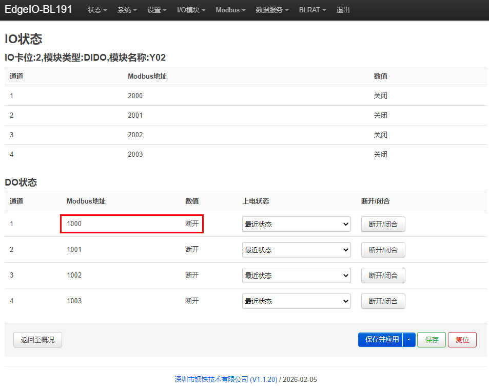

点击REG1000数据点的值，原来是false，点击一下，在空白的地方点击鼠标左键或按键盘上的【Enter】键。同理数值类型的数据下发是双击原来的值，填写下发的数值，确定就可以。

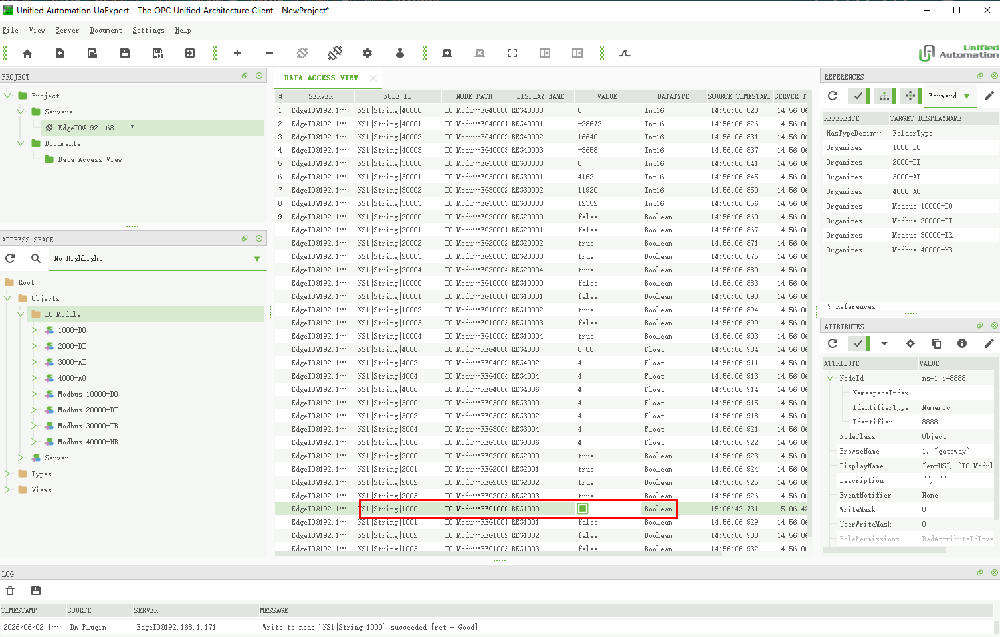

OPC UA客户端下发成功会有报文，因服务器响应也很快，可以在上面看到值已经变为“true”。

在BL191的网页配置查看DO的状态。DO1也是由原来的断开变成闭口。

# 保修条款

1) 此设备从购买之日算起，为期一年内有任何材料或质量问题，免费维修。

2) 此一年保修不包括任何人为损坏、操作不当等造成的产品故障问题。

# 技术支持

深圳市钡铼技术有限公司

电话：0755-29451836

网址：http:// www.bliiot.cn
